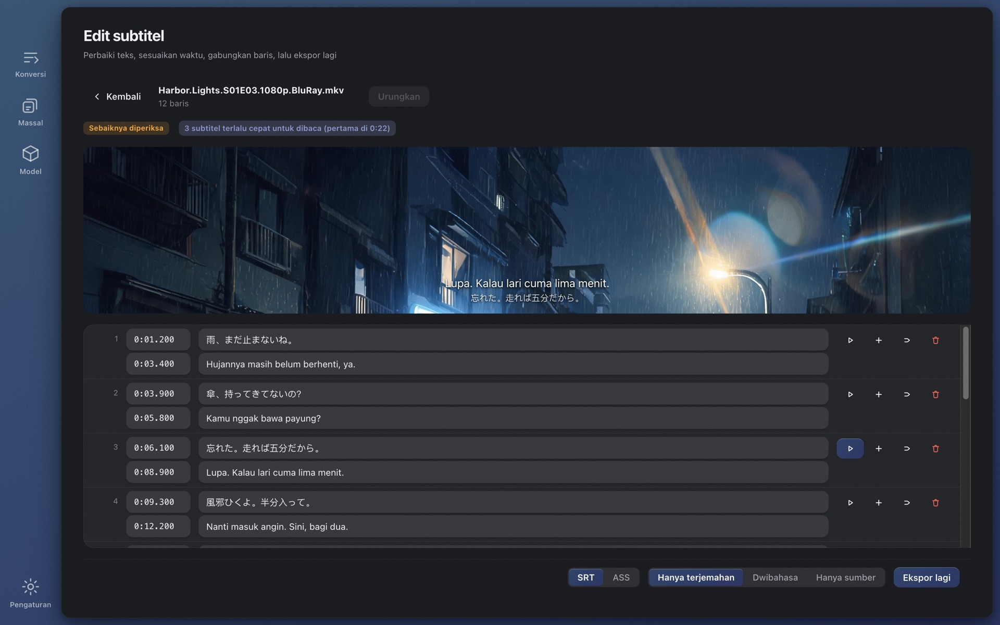

# Wave Subs

[English](./README.md) · [简体中文](./README.zh-CN.md) · [日本語](./README.ja.md) · [한국어](./README.ko.md) · [Français](./README.fr.md) · [Deutsch](./README.de.md) · [Русский](./README.ru.md) · **Bahasa Indonesia** · [Bahasa Melayu](./README.ms.md) · [Tiếng Việt](./README.vi.md) · [ไทย](./README.th.md)

**Tak menemukan subtitle untuk sebuah video?** Wave Subs membuat subtitle SRT / ASS dari video apa pun dengan AI lokal dan menerjemahkannya ke bahasa Anda. Pengenalan, pewaktuan, terjemahan, teks di layar, dan penyuntingan semuanya berjalan di komputer Anda sendiri: tidak ada yang diunggah, tidak perlu akun, gratis dan sumber terbuka. macOS (Apple Silicon) dan Windows.

**Situs web:** https://wavesubs.com (11 bahasa) · [Unduh](https://github.com/jason-jm/wavesubs/releases/latest) · [Catatan perubahan](CHANGELOG.md) (Inggris) · [Kebijakan privasi](https://wavesubs.com/en/privacy.html) (Inggris)

## Cara kerja

1. **Seret video, berkas subtitle, atau satu folder penuh.** MKV, MP4, MOV, TS, AVI, dan apa pun yang bisa dibaca ffmpeg, termasuk berkas audio saja. Jika video sudah punya trek subtitle teks, trek itu terdeteksi dan langsung dipakai.
2. **AI lokal mengenali dialog dan menyelaraskannya.** whisper.cpp mengenali ucapan di komputer Anda dengan deteksi bahasa otomatis. Setiap baris lalu ditempatkan tepat pada saat kalimatnya benar-benar diucapkan.
3. **Terjemahkan dan ekspor.** Model Qwen3 lokal menerjemahkan ke bahasa Anda (atau layanan cloud, jika Anda memasangnya). Hasilnya ditulis sebagai SRT atau ASS di samping video, dengan penilaian kualitas yang memberi tahu baris mana yang perlu dilihat.

Film dua jam butuh sekitar 3–6 menit untuk dikenali dengan Large v3 Turbo di Mac seri M, ditambah beberapa menit terjemahan lokal. Seret satu musim dan biarkan berjalan.

## Yang Anda dapatkan

### Tiga sumber subtitle

- **Pengenalan suara.** Keluarga model Whisper (Tiny hingga Large v3) lewat whisper.cpp, dipercepat Metal di Apple Silicon. Pengenalan mencakup hampir 100 bahasa yang didukung Whisper. Bahasa yang diucapkan dideteksi dengan mengambil lima cuplikan 20 detik di bagian yang paling padat ucapannya lalu memungut suara, sehingga lagu pembuka tidak bisa membuat satu episode salah label; Anda juga bisa menetapkan bahasanya sendiri.
- **Trek subtitle tertanam.** Trek teks di dalam berkas MKV / MP4 terdeteksi dan diutamakan daripada pengenalan (lebih cepat dan persis); Anda memilih trek per berkas jika ada beberapa. Subtitle bitmap (PGS, VobSub, DVB) tidak bisa dipakai sebagai sumber.
- **Berkas subtitle eksternal.** 18 format, termasuk SRT, ASS / SSA, WebVTT, SAMI, MicroDVD, SubViewer, MPL2, VPlayer, JACOsub, RealText, STL, PJS, LRC, TTML / DFXP, dan SBV. Pengodean berkas dideteksi otomatis (UTF-8, UTF-16, GBK, Big5, Shift-JIS, EUC-KR, Windows-1252).

### Pewaktuan yang mengikuti ucapan

- Batas setiap baris diselaraskan dengan ucapan sebenarnya memakai deteksi aktivitas suara (Silero VAD) dan analisis kenyaringan. Parameternya dikalibrasi dengan subtitle resmi enam film panjang, bukan ditebak.
- Baris yang dikarang Whisper saat tidak ada yang bicara dibuang, baris ♪ yang hanya musik dihapus, dan pengulangan tergagap (やばいやばいやばい) dipadatkan.
- Baris panjang dipotong pada batas alami, dengan aturan khusus untuk bahasa Jepang.

### Terjemahan

- **29 bahasa target:** Indonesia, Inggris, Mandarin (sederhana dan tradisional), Jepang, Korea, Prancis, Jerman, Spanyol, Portugis, Italia, Belanda, Rusia, Ukraina, Polandia, Ceko, Hungaria, Swedia, Denmark, Norwegia, Finlandia, Yunani, Turki, Ibrani, Arab, Hindi, Thai, Vietnam, dan Melayu. Saat pertama dibuka, targetnya adalah bahasa sistem Anda.
- **Lokal secara bawaan.** Model Qwen3 dari 1.7B hingga 32B berjalan di komputer Anda lewat llama.cpp, diunduh di dalam aplikasi. Gratis, offline, tanpa kuota.
- **Cloud jika Anda mau.** API apa pun yang kompatibel dengan OpenAI memakai kunci Anda sendiri, dengan preset isi-cepat untuk OpenAI, Anthropic Claude, Google Gemini, DeepSeek, Qwen, Zhipu GLM, Moonshot, Volcano Ark, SiliconFlow, OpenRouter, dan Azure OpenAI. Kunci disimpan terenkripsi di penyimpanan kredensial sistem operasi. Hanya teks subtitle yang dikirim, tidak pernah videonya.
- **Glosarium.** Kunci terjemahan nama dan istilah sekali, dan satu musim tetap konsisten. Hanya entri yang muncul di batch saat ini yang disuntikkan, dan glosarium berlaku untuk dialog maupun teks di layar.
- **Satu nama, satu ejaan.** Tahap akhir mengelompokkan setiap nama diri yang berulang dan menyamakan ejaan minoritas dengan mayoritas, jadi seorang tokoh tidak menjadi "Weber" di episode 3 dan "Webber" di episode 4.
- **Dibuat untuk subtitle, bukan paragraf.** Baris diterjemahkan per batch dengan jangkar penyelarasan sehingga terjemahan tak pernah melompat ke baris tetangga; setengah kalimat tetap setengah kalimat; transkrip yang kacau tetap mendapat terjemahan yang paling masuk akal, bukan kosong; model yang mengembalikan sumber tanpa diterjemahkan ditangkap di setiap putaran ulang.
- **Keluaran:** terjemahan saja, dwibahasa, atau sumber saja, sebagai SRT atau ASS.

### Teks di layar

Nyalakan "Terjemahkan teks di layar" dan papan nama, catatan, pesan teks dan gelembung obrolan, pengumuman, dokumen, kartu judul, judul episode, serta papan nama orang ikut dibaca dari gambar dan diterjemahkan.

- Memakai pengenalan teks bawaan sistem operasi: Vision di macOS, Windows.Media.Ocr di Windows. Tak ada model tambahan yang diunduh; episode 24 menit butuh dua sampai tiga menit lebih lama, sejalan dengan pengenalan suara.
- Setiap terjemahan diletakkan di samping teks asli: tepat di bawahnya, lalu di sebelahnya, lalu di bagian atas layar, dan menutupi teks asli hanya sebagai jalan terakhir. Ia tidak pernah masuk ke ruang subtitle dialog, dan hurufnya mengecil sebelum ada yang tertutup. Hanya layar yang penuh teks (surel, percakapan pesan, dokumen) yang diganti dengan pelat buram.
- Yang tidak ikut: kredit pembuka dan penutup (termasuk daftar pemeran dan pengisi suara), subtitle yang sudah terbakar di gambar, logo stasiun dan tanda air, label rapat seperti penanda peta dan punggung buku, papan pintu yang berulang sepanjang film, emotikon yang rusak saat dikenali, dan terjemahan yang sama persis dengan aslinya.
- Di keluaran ASS teks ditempatkan pada posisi aslinya; SRT menaruhnya di atas. Editor memisahkan subtitle ucapan dan teks di layar di tab berbeda, dan berkas yang sama selalu menghasilkan hasil yang sama.

### Editor dengan pratinjau video

- Sunting teks dan waktu di tabel; sisipkan, hapus, gabungkan, urungkan; perubahan disimpan otomatis.
- Klik baris mana pun untuk mendengar persis bagaimana kalimat itu diucapkan. Format yang tak bisa diputar browser (HEVC, DTS, TrueHD) dipratinjau lewat ffmpeg bawaan.
- Temuan kualitas bisa diklik. Baris yang sumbernya Anda sunting ditandai, dan terjemah ulang hanya menyentuh baris itu.
- Ekspor lagi kapan saja: SRT atau ASS, terjemahan saja, dwibahasa, atau sumber saja.

### Laporan kualitas untuk setiap berkas

Setiap berkas yang selesai mendapat penilaian (lolos, perlu ditinjau, ada masalah) beserta alasannya: cakupan ucapan, celah, baris terlalu panjang, kecepatan baca terlalu tinggi, terjemahan hilang, teks sumber tertinggal di terjemahan, waktu terbalik. Ambang batasnya berasal dari tolok ukur film penuh, dan setiap temuan tertaut ke barisnya di editor.

### Satu musim sekaligus

- Seret satu folder. Berkas diproses satu per satu; satu kegagalan tidak menghentikan batch; batalkan kapan saja.
- Semua berkas mengikuti pengaturan bersama, dan berkas mana pun bisa menimpa sumber subtitle, trek audio, bahasa, layanan terjemahan, atau format.
- Kemajuan menampilkan tahap saat ini dan perkiraan sisa waktu; kartu selesai memberi tahu perangkat mana yang melakukan pengenalan (GPU Apple seri M, GPU Vulkan, atau CPU).
- Tidak ada yang dikerjakan dua kali. Pengenalan disimpan di cache berdasarkan identitas berkas dan setiap parameter yang memengaruhinya, jadi mengekspor ulang atau mengganti format hanya butuh beberapa detik. Terjemahan dipakai ulang hanya jika mesin dan model, bahasa target, versi prompt, dan glosarium semuanya cocok; jika tidak, dikerjakan ulang seluruhnya, dan hasil lama tidak pernah dicampur.

### Model diunduh di dalam aplikasi

- Saat pertama dibuka, halaman Konversi merekomendasikan model untuk komputer Anda dan menawarkan "Unduh dan lanjutkan"; Anda bisa mulai begitu unduhan selesai.
- Halaman Model menandai setiap model cocok, bisa dipakai, atau terlalu berat untuk memori Anda dan menunjukkan seberapa akurat untuk bahasa Anda (lihat di bawah). Unduhan berasal dari Hugging Face atau ModelScope (dicoba lebih dulu di Tiongkok daratan), diverifikasi dengan SHA-256, dan jika semua sumber gagal, aplikasi menampilkan URL langsung agar Anda bisa mengunduh sendiri dan menaruhnya di folder model.

### Antarmuka

32 bahasa antarmuka (Arab, Bengali, Mandarin sederhana dan tradisional, Ceko, Denmark, Belanda, Inggris, Finlandia, Prancis, Jerman, Yunani, Ibrani, Hindi, Hungaria, Indonesia, Italia, Jepang, Korea, Melayu, Norwegia, Persia, Polandia, Portugis, Rumania, Rusia, Spanyol, Swedia, Thai, Turki, Ukraina, Vietnam), mode terang dan gelap, sepuluh palet warna, fokus keyboard penuh. Aplikasi memeriksa versi baru sekali saat dibuka (sakelar di Pengaturan mematikannya) dan menawarkan tombol unduh; salinan yang dipasang lewat Homebrew atau Scoop mendapat perintah pembaruan yang sesuai.

## Memilih model pengenalan

Model Whisper jauh lebih berbeda menurut bahasa daripada menurut ukuran. Tabel ini menunjukkan retensi makna: porsi baris yang dikenali dengan makna tetap utuh, dinilai buta pada 50 kalimat dari cuplikan 30 menit film Inggris (*Spotlight*), film Jerman (*Ballon*), dan drama Jepang (NHK, *The 13 Lords of the Shogun*), dijalankan lewat alur produk yang sebenarnya. Korea dan Mandarin berada di tingkat yang sama dengan Jepang dalam tolok ukur publik; Spanyol, Italia, dan Portugis sedikit lebih baik dari Jerman, sedangkan Prancis, Belanda, dan Polandia sedikit lebih rendah.

| Model | Unduhan | RAM saat dipakai | Inggris | Bahasa Eropa | Jepang · Korea · Mandarin |
|---|---|---|---|---|---|
| Tiny | 75 MB | 0,5 GB | 68 % | 49 % | 37 % |
| Base | 142 MB | 0,7 GB | 79 % | 61 % | 57 % |
| Small | 466 MB | 1,2 GB | 92 % | 81 % | 66 % |
| Medium | 1,5 GB | 2,6 GB | 91 % | 81 % | 79 % |
| Large v3 Turbo | 1,6 GB | 2,2 GB | 95 % | 96 % | 89 % |
| Large v3 | 3,0 GB | 4,5 GB | 96 % | 94 % | 88 % |

Aplikasi menandai 85 % ke atas sebagai *disarankan*, 75 % *bisa dipakai*, 60 % *pas-pasan*, dan di bawahnya *tidak disarankan*. Singkatnya: Small cukup untuk bahasa Inggris, bisa dipakai untuk bahasa Eropa, sedangkan Jepang, Korea, dan Mandarin butuh Large v3 Turbo atau lebih baik. Large v3 Turbo hanya terpaut satu poin dari Large v3 pada film penuh sambil berjalan sekitar tiga kali lebih cepat, jadi ia rekomendasi bawaan di kebanyakan mesin.

| Komputer Anda | Pengenalan | Terjemahan | Catatan |
|---|---|---|---|
| Mac 8 GB | Small atau Large v3 Turbo | Qwen3 1.7B | Jalan; tutup aplikasi lain untuk Turbo |
| Mac 16 GB | Large v3 Turbo | Qwen3 8B | Keseimbangan bawaan antara kualitas dan kecepatan |
| Mac 32 GB | Large v3 | Qwen3 14B | Pengenalan terbaik, terjemahan lebih akurat |
| Mac 48 GB ke atas | Large v3 | Qwen3 32B | Kualitas terjemahan terbaik, lebih lambat |
| PC Windows 16 GB | Large v3 Turbo | Qwen3 4B | Pengenalan di CPU; siapkan waktu beberapa kali lipat Apple Silicon |
| PC Windows 32 GB | Large v3 Turbo | Qwen3 8B | Model besar jalan; sediakan waktu ekstra |

Model terjemahan lokal: Qwen3 1.7B (unduhan 1,8 GB, RAM 2,5 GB), 4B (2,4 GB, 3,5 GB), 8B (4,9 GB, 6 GB), 14B (9,0 GB, 10,5 GB), 32B (19,7 GB, 22 GB). Pengenalan dan terjemahan berjalan bergantian, tidak pernah bersamaan.

## Akurasi terukur

Dari korpus 70 film panjang (trek subtitle resmi dan rilis fansub ternama sebagai acuan; 36 Jepang, 21 Inggris, 13 lainnya), September 2026:

- **Pengenalan (Whisper Large v3):** Inggris, 19 film, rata-rata tingkat kesalahan kata 17,4 % (dokumenter dan wawancara sekitar 6 %, serial resmi 10–13 %). Jepang, 18 film, tingkat kesalahan karakter 19,1 %, pada tingkat bacaan 13,8 %; sekitar sepertiga "kesalahan" adalah variasi ejaan (分かった / わかった). Subtitle resmi Jerman, Norwegia, dan Italia adalah tulisan ulang yang dipadatkan sehingga tak bisa dinilai kata per kata.
- **Terjemahan (Jepang → Mandarin, Qwen3 lokal):** dengan transkrip manusia sebagai masukan, akurasi mempertahankan makna adalah 93,5 % untuk 8B, 94,4 % untuk 14B, dan 93,9 % untuk 32B, jadi 8B bawaan adalah pilihan yang aman. Ujung ke ujung (pengenalan → terjemahan) sekitar 83–85 %; hampir semua selisihnya berasal dari kesalahan pengenalan.
- **Pewaktuan:** F1 mask per bingkai 81,8 %; 57 % awal baris jatuh dalam ±250 ms dari subtitle manusia. Subtitle manusia dari rilis yang berbeda sendiri selisih 100–300 ms dalam jeda awal.

## Privasi

Tidak ada akun, tidak ada analitik, tidak ada server. Video tidak pernah meninggalkan komputer Anda; pengenalan, penyelarasan, terjemahan, teks di layar, dan penyuntingan semuanya berjalan lokal, dan setelah model diunduh aplikasi bekerja dengan jaringan mati.

Tepat tiga hal yang menyentuh jaringan, dan semuanya di bawah kendali Anda:

1. **Unduhan model**, dari Hugging Face atau ModelScope, saat Anda meminta model.
2. **Terjemahan cloud**, hanya jika Anda memasang penyedianya sendiri; ia menerima teks subtitle, dan penyedia itu menagih Anda langsung.
3. **Pemeriksaan pembaruan** saat dibuka, yang mengambil berkas JSON kecil dari GitHub Release repositori ini. Bisa dimatikan di Pengaturan, dan versi App Store tidak memeriksa sama sekali.

Kebijakan lengkap (Inggris): https://wavesubs.com/en/privacy.html

## Spesifikasi dan pemasangan

| | macOS | Windows |
|---|---|---|
| Spesifikasi | macOS 12 atau lebih baru, Apple Silicon (M1 ke atas) | Windows 10 atau lebih baru, x64, RAM 16 GB disarankan |
| Unduhan | [DMG atau ZIP](https://github.com/jason-jm/wavesubs/releases/latest), dinotarisasi Apple | [Installer atau ZIP portabel](https://github.com/jason-jm/wavesubs/releases/latest) |
| Pengelola paket | `brew install --cask jason-jm/wavesubs/wavesubs` | `scoop bucket add wavesubs https://github.com/jason-jm/scoop-wavesubs` `scoop install wavesubs` |
| Akselerasi | Metal (pengenalan dan terjemahan) | Pengenalan di CPU; terjemahan di GPU mana pun dengan driver Vulkan, jika tidak CPU |

ffmpeg, whisper.cpp, dan llama.cpp sudah disertakan: pasang dan langsung pakai. Model pengenalan suara berukuran 75 MB sampai 3 GB, model terjemahan lokal 1,8 sampai 20 GB; keduanya diunduh sesuai kebutuhan di dalam aplikasi. Mac Intel tidak didukung: pengenalan lokal bergantung pada Metal, dan di Intel akan terlalu lambat untuk berguna.

**Windows:** installer belum ditandatangani, jadi SmartScreen menampilkan "Windows protected your PC" saat pertama dijalankan. Klik *More info → Run anyway*. Checksum setiap berkas ada di `SHA256SUMS.txt` di halaman rilis. Untuk teks di layar, pasang paket bahasa Windows untuk bahasa yang diucapkan dengan *Optical character recognition* dicentang.

## Keterbatasan yang diketahui

- Di Windows, pengenalan teks di layar lebih lemah daripada di macOS; teks Jepang vertikal kebanyakan terlewat.
- Deretan nama di luar kredit (nama aktor di poster teater, nama pemeran utama yang tampil setengah menit sebelum daftar kru) masih diterjemahkan.
- Model lokal hingga 8B tidak andal untuk nama diri seperti nama lembaga dan istilah sejarah. Glosarium adalah solusi yang pasti.
- Rilis yang sudah membakar terjemahan teks di layarnya sendiri ke gambar akan menampilkan keduanya.
- Tidak ada build untuk Mac Intel atau Windows ARM64; pengenalan di Windows hanya memakai CPU.

## Pertanyaan umum

**Video apa saja yang bisa diberi subtitle?** MKV, MP4, MOV, TS, AVI, dan format umum lainnya; stream HEVC, DTS, dan TrueHD yang tak bisa diputar browser juga bisa, karena ffmpeg bawaan mendekode semuanya. Berkas audio saja juga bisa.

**Bahasa apa saja?** Pengenalan mencakup hampir 100 bahasa Whisper dengan deteksi otomatis; 29 bahasa target terjemahan; antarmuka dalam 32 bahasa.

**Benar-benar bisa tanpa internet?** Ya. Hanya unduhan model sekali, terjemahan cloud yang Anda pasang sendiri, dan pemeriksaan pembaruan opsional yang memakai jaringan.

**Seberapa akurat?** Lihat *Memilih model pengenalan* dan *Akurasi terukur* di atas. Pilih model menurut bahasa Anda, dan setiap berkas datang dengan penilaian kualitas.

**Videonya sudah punya trek subtitle.** Trek teks tertanam terdeteksi dan diutamakan, langsung ke terjemahan. Trek bitmap (PGS / VobSub) adalah pengecualian.

**Unduhan model gagal di Tiongkok daratan.** Semua model tersedia di ModelScope, yang dicoba aplikasi lebih dulu jika bahasa sistem adalah Mandarin sederhana atau zona waktunya di Tiongkok. Jika semua sumber gagal, pesan kesalahan mencantumkan URL langsung untuk browser atau pengelola unduhan.

**Apa bedanya dengan pembuat subtitle daring?** Alat daring mengharuskan Anda mengunggah seluruh film, menagih per menit, dan membatasi durasi. Wave Subs tidak mengunggah apa pun, tidak berbiaya, dan tanpa batas durasi; kecepatannya bergantung pada komputer Anda.

## Masukan dan dukungan

- [Laporan bug dan permintaan fitur](https://github.com/jason-jm/wavesubs/issues) di GitHub, atau [formulir masukan](https://wavesubs.com/id/feedback.html) jika Anda tidak punya akun GitHub. Tugas yang gagal punya tombol *Salin log*; tempelkan log itu ke laporan.
- [Discussions](https://github.com/jason-jm/wavesubs/discussions) untuk pertanyaan dan berbagi pengaturan.
- [Catatan perubahan](CHANGELOG.md) (Inggris) untuk apa yang berubah di setiap versi.

## Lisensi

Wave Subs dirilis di bawah [Lisensi MIT](./LICENSE). Komponen pihak ketiga yang disertakan (ffmpeg di bawah LGPL, whisper.cpp dan llama.cpp di bawah MIT, model Whisper dan Qwen, dan lainnya) membawa lisensinya masing-masing, tercantum di [THIRD-PARTY-LICENSES.md](./THIRD-PARTY-LICENSES.md).

*Membangun dari sumber, antarmuka baris perintah, dan tata letak kode dijelaskan di [DEVELOPMENT.md](./DEVELOPMENT.md) (Inggris).*
