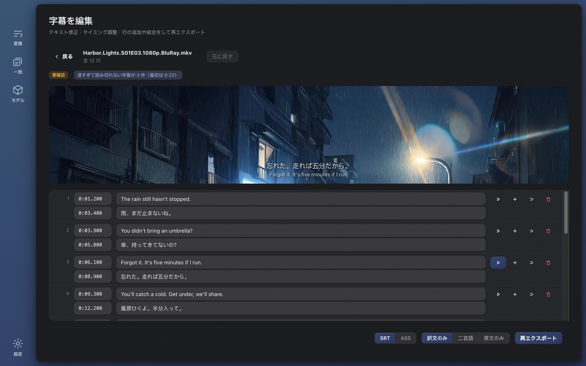

# Wave Subs

[English](./README.md) · [简体中文](./README.zh-CN.md) · **日本語** · [한국어](./README.ko.md) · [Français](./README.fr.md) · [Deutsch](./README.de.md) · [Русский](./README.ru.md) · [Bahasa Indonesia](./README.id.md) · [Bahasa Melayu](./README.ms.md) · [Tiếng Việt](./README.vi.md) · [ไทย](./README.th.md)

**字幕が見つからない？** Wave Subs はローカル AI で動画から直接 SRT / ASS 字幕を生成し、あなたの言語に翻訳します。認識、タイミング、翻訳、画面内テキスト、編集のすべてがあなたのパソコンの中で完結します。アップロードなし、アカウント不要、無料でオープンソース。macOS（Apple Silicon）と Windows に対応。

**公式サイト：** https://wavesubs.com （11 言語） · [ダウンロード](https://github.com/jason-jm/wavesubs/releases/latest) · [更新履歴](CHANGELOG.md)（英語） · [プライバシーポリシー](https://wavesubs.com/en/privacy.html)（英語）

## 使い方

1. **動画、字幕ファイル、またはフォルダごとドロップ。** MKV、MP4、MOV、TS、AVI など ffmpeg が読める形式ならすべて対応、音声のみのファイルも可。動画にテキスト字幕トラックが入っていれば、自動検出してそのまま使います。
2. **ローカル AI がセリフを認識して同期。** whisper.cpp があなたのパソコン上で音声を認識し、言語を自動判定。各字幕は実際に話された瞬間に合わせられます。
3. **翻訳して書き出し。** ローカルの Qwen3 モデルがあなたの言語に翻訳（クラウドサービスを自分で接続することも可能）。結果は SRT または ASS として動画の隣に保存され、どの行を確認すべきかを示す品質判定が付きます。

M シリーズの Mac では、2 時間の映画を Large v3 Turbo で約 3〜6 分で認識し、ローカル翻訳にさらに数分。シーズンまるごとドロップして放置できます。

## できること

### 3 種類の字幕ソース

- **音声認識。** Whisper モデル群（Tiny から Large v3 まで）を whisper.cpp で実行、Apple Silicon では Metal で高速化。Whisper が対応する約 100 言語を認識。話されている言語は、音声が最も密な 5 か所から 20 秒ずつ取って多数決で判定するため、オープニング曲のせいで 1 話まるごと誤判定されることはありません。言語を手動で指定することもできます。
- **内蔵字幕トラック。** MKV / MP4 内のテキストトラックを検出し、認識より優先して使います（速くて正確）。複数ある場合はファイルごとに選択。ビットマップ字幕（PGS、VobSub、DVB）はソースにできません。
- **外部字幕ファイル。** SRT、ASS / SSA、WebVTT、SAMI、MicroDVD、SubViewer、MPL2、VPlayer、JACOsub、RealText、STL、PJS、LRC、TTML / DFXP、SBV など 18 形式。文字コードは自動判定（UTF-8、UTF-16、GBK、Big5、Shift-JIS、EUC-KR、Windows-1252）。

### 話し声に合わせたタイミング

- 音声区間検出（Silero VAD）と音量解析で、各字幕の開始・終了を実際の発話に合わせます。パラメータは長編 6 作品の公式字幕で校正済みで、勘ではありません。
- 誰も話していない箇所で Whisper が作り出した行は除去、音符だけの ♪ 行は削除、どもりのような繰り返し（やばいやばいやばい）は畳み込みます。
- 長い行は自然な境界で分割。日本語には仮名 / 漢字の境界を使う専用ルールがあります。

### 翻訳

- **29 の翻訳先言語：** 日本語、英語、中国語（簡体・繁体）、韓国語、フランス語、ドイツ語、スペイン語、ポルトガル語、イタリア語、オランダ語、ロシア語、ウクライナ語、ポーランド語、チェコ語、ハンガリー語、スウェーデン語、デンマーク語、ノルウェー語、フィンランド語、ギリシャ語、トルコ語、ヘブライ語、アラビア語、ヒンディー語、タイ語、ベトナム語、インドネシア語、マレー語。初回起動時はシステム言語が翻訳先になります。
- **標準はローカル。** Qwen3 の 1.7B から 32B までのモデルを llama.cpp であなたのパソコン上で実行。アプリ内でダウンロード。無料、オフライン、回数制限なし。
- **必要ならクラウドも。** 自分のキーで OpenAI 互換 API を接続。OpenAI、Anthropic Claude、Google Gemini、DeepSeek、Qwen、Zhipu GLM、Moonshot、Volcano Ark、SiliconFlow、OpenRouter、Azure OpenAI のクイック入力プリセット付き。キーは OS の資格情報ストアで暗号化して保存。送信されるのは字幕テキストだけで、動画は送られません。
- **用語集。** 人名や用語の訳を一度決めれば、シーズン全体で統一されます。そのバッチに登場する項目だけを注入し、セリフと画面内テキストの両方に適用。
- **一つの名前に一つの表記。** 最後のパスで繰り返し登場する固有名詞をまとめ、少数派の表記を多数派に揃えます。3 話で「ウェーバー」、4 話で「ウェバー」にはなりません。
- **段落ではなく字幕のために。** バッチ翻訳には位置合わせ用のアンカーがあり、訳文が隣の行にずれることはありません。半分の文は半分のまま。文字起こしが乱れていても空欄にせず、最も自然な意味で訳します。原文をそのまま返してきたモデル出力は、どの再試行ラウンドでも弾かれます。
- **出力：** 訳文のみ、二言語、または原文のみ。SRT または ASS。

### 画面内テキスト

「画面内のテキストを翻訳」をオンにすると、看板、メモ、メッセージやチャットの吹き出し、掲示、書類、タイトルカード、話数タイトル、ネームプレートも画面から読み取って翻訳します。

- OS 内蔵の文字認識を使用：macOS の Vision、Windows の Windows.Media.Ocr。追加モデルのダウンロード不要。24 分の 1 話で 2〜3 分長くなる程度で、音声認識と並行して処理。
- 訳文は原文の隣に配置：まず真下、次に左右、次に画面上部、原文の上に重ねるのは最後の手段。セリフ字幕の領域には決して入り込まず、何かを隠す前に文字を小さくします。メール、メッセージ画面、書類のように画面全体が文字の場合だけ、不透明なプレートで置き換えます。
- 出さないもの：オープニングとエンディングのクレジット（キャスト・声優一覧を含む）、映像に焼き込まれた字幕、放送局ロゴやウォーターマーク、地図の記号や本の背表紙のような密集した小さな文字、映画の中で何度も映るドアの表示、認識で崩れた顔文字、原文と同一の訳文。
- ASS では原文の位置に配置、SRT では上部に表示。エディタではセリフ字幕と画面内テキストが別タブになり、同じファイルからは常に同じ結果が出ます。

### 動画プレビュー付きエディタ

- 表でテキストとタイミングを編集。挿入、削除、結合、取り消し、自動保存。
- 行をクリックすると、そのセリフがどう話されたかをその場で聞けます。ブラウザで再生できない形式（HEVC、DTS、TrueHD）は同梱の ffmpeg でプレビュー。
- 品質チェックの指摘はクリックで該当行へ。原文を編集した行にはマークが付き、再翻訳はその行だけ。
- いつでも再書き出し：SRT または ASS、訳文のみ・二言語・原文のみ。

### ファイルごとの品質レポート

完了した各ファイルに判定（問題なし / 要確認 / 問題あり）と理由が付きます：音声のカバー率、抜け、長すぎる行、読む速度が速すぎる行、訳文の欠落、訳文に残った原文、開始と終了の逆転。しきい値は長編作品のベンチマークに基づき、各指摘はエディタの該当行にリンクします。

### シーズンまるごと一括

- フォルダをドロップ。ファイルは順番に処理され、1 つが失敗しても残りは止まらず、いつでもキャンセルできます。
- 全ファイルが共通設定に従い、任意のファイルで字幕ソース、音声トラック、言語、翻訳サービス、形式を個別に上書きできます。
- 進捗には現在の段階と残り時間の見積もりを表示。完了カードには認識に使ったデバイス（Apple M シリーズ GPU、Vulkan GPU、CPU）が示されます。
- 同じ処理は二度としません。認識結果はファイルの同一性と影響するすべてのパラメータでキャッシュされるため、再書き出しや形式変更は数秒。訳文の再利用は、エンジンとモデル、翻訳先言語、プロンプトのバージョン、用語集がすべて一致する場合のみ。それ以外は全面的にやり直し、古い出力が混ざることはありません。

### モデルはアプリ内でダウンロード

- 初回起動時、変換ページがお使いの機種に合うモデルを提案し、「ダウンロードして続行」を表示。ダウンロードが終わればすぐ開始できます。
- モデルページでは各モデルをメモリに応じて「最適 / 使用可 / 重すぎる」と表示し、あなたの言語での精度も示します（下記参照）。ダウンロード元は Hugging Face または ModelScope（中国本土では優先）、SHA-256 で検証。すべてのソースに失敗した場合は直接 URL を表示するので、自分でダウンロードしてモデルフォルダに入れられます。

### インターフェース

32 のインターフェース言語（アラビア語、ベンガル語、中国語簡体・繁体、チェコ語、デンマーク語、オランダ語、英語、フィンランド語、フランス語、ドイツ語、ギリシャ語、ヘブライ語、ヒンディー語、ハンガリー語、インドネシア語、イタリア語、日本語、韓国語、マレー語、ノルウェー語、ペルシャ語、ポーランド語、ポルトガル語、ルーマニア語、ロシア語、スペイン語、スウェーデン語、タイ語、トルコ語、ウクライナ語、ベトナム語）、ライト / ダークモード、10 種類のカラーパレット、完全なキーボードフォーカス対応。起動時に一度だけ新バージョンを確認し（設定でオフにできます）、ダウンロードボタンを表示。Homebrew や Scoop でインストールした場合は対応するアップグレードコマンドを表示します。

## 認識モデルの選び方

Whisper のモデル間の差は、サイズよりも言語によるところがはるかに大きいです。下の表は意味の保持率：認識されたセリフのうち意味が正しく残った割合で、英語映画『スポットライト』、ドイツ語映画『バルーン』、日本語の NHK 大河ドラマ『鎌倉殿の 13 人』からそれぞれ 30 分を切り出して実際の製品パイプラインで処理し、各 50 文をブラインド評価したものです。公開ベンチマークでは韓国語と中国語（普通話）は日本語と同じ階層、スペイン語・イタリア語・ポルトガル語はドイツ語よりやや良く、フランス語・オランダ語・ポーランド語はやや劣ります。

| モデル | ダウンロード | 使用メモリ | 英語 | ヨーロッパ言語 | 日本語 · 韓国語 · 中国語 |
|---|---|---|---|---|---|
| Tiny | 75 MB | 0.5 GB | 68 % | 49 % | 37 % |
| Base | 142 MB | 0.7 GB | 79 % | 61 % | 57 % |
| Small | 466 MB | 1.2 GB | 92 % | 81 % | 66 % |
| Medium | 1.5 GB | 2.6 GB | 91 % | 81 % | 79 % |
| Large v3 Turbo | 1.6 GB | 2.2 GB | 95 % | 96 % | 89 % |
| Large v3 | 3.0 GB | 4.5 GB | 96 % | 94 % | 88 % |

アプリでは 85 % 以上を「おすすめ」、75 % 以上を「使える」、60 % 以上を「ぎりぎり」、それ未満を「非推奨」と表示します。要するに、英語は Small で十分、ヨーロッパ言語は Small が使える程度、日本語・韓国語・中国語は Large v3 Turbo 以上が必要です。Large v3 Turbo は長編での品質が Large v3 と 1 ポイント差で、速度は約 3 倍。ほとんどの機種で標準のおすすめです。

| お使いの機種 | 認識 | 翻訳 | 備考 |
|---|---|---|---|
| Mac 8 GB | Small または Large v3 Turbo | Qwen3 1.7B | 動作します。Turbo 使用時は他のアプリを閉じて |
| Mac 16 GB | Large v3 Turbo | Qwen3 8B | 標準のおすすめ。品質と速度のバランス点 |
| Mac 32 GB | Large v3 | Qwen3 14B | 認識品質が最高、翻訳もより正確 |
| Mac 48 GB 以上 | Large v3 | Qwen3 32B | 翻訳品質が最高、速度は遅め |
| Windows PC 16 GB | Large v3 Turbo | Qwen3 4B | CPU 認識。Apple Silicon の数倍の時間を見込んで |
| Windows PC 32 GB | Large v3 Turbo | Qwen3 8B | 大きなモデルも動きますが時間に余裕を |

ローカル翻訳モデル：Qwen3 1.7B（ダウンロード 1.8 GB、使用メモリ 2.5 GB）、4B（2.4 GB、3.5 GB）、8B（4.9 GB、6 GB）、14B（9.0 GB、10.5 GB）、32B（19.7 GB、22 GB）。認識と翻訳は順に実行され、同時にメモリを占有することはありません。

## 実測精度

2026 年 9 月、長編 70 作品のコーパス（公式字幕トラックと有名ファンサブを正解データとして使用。日本語 36 作、英語 21 作、その他 13 作）での結果：

- **認識（Whisper Large v3）：** 英語 19 作の平均単語誤り率 17.4 %（ドキュメンタリーやインタビューは約 6 %、公式ドラマシリーズは 10〜13 %）。日本語 18 作は文字誤り率 19.1 %、読み単位では 13.8 %。「誤り」の約 3 分の 1 は表記ゆれ（分かった / わかった）です。ドイツ語、ノルウェー語、イタリア語の公式字幕は要約的に書き換えられているため、逐語比較はできません。
- **翻訳（日本語→中国語、ローカル Qwen3）：** 人手の書き起こしを入力にした場合の意味保持精度は 8B が 93.5 %、14B が 94.4 %、32B が 93.9 %。標準の 8B で十分です。エンドツーエンド（認識→翻訳）では約 83〜85 % で、差のほぼすべては認識誤りに起因します。
- **タイミング：** フレーム単位マスクの F1 81.8 %、字幕開始点の 57 % が人手字幕の ±250 ms 以内。異なるリリースの人手字幕同士でも先行量は 100〜300 ms 違います。

## プライバシー

アカウントも、解析も、サーバーもありません。動画があなたのパソコンから出ることはなく、認識、同期、翻訳、画面内テキスト、編集はすべてローカルで実行。モデルをダウンロードした後はネットワークを切っても動きます。

ネットワークを使うのは次の 3 つだけで、いずれもあなたの選択次第です：

1. **モデルのダウンロード。** あなたが要求したときに Hugging Face または ModelScope から。
2. **クラウド翻訳。** 自分でプロバイダーを設定した場合のみ。送られるのは字幕テキストで、料金はそのプロバイダーから直接請求されます。
3. **起動時の更新確認。** このリポジトリの GitHub Release から小さな JSON ファイルを取得します。設定でオフにでき、App Store 版はそもそも確認しません。

ポリシー全文（英語）：https://wavesubs.com/en/privacy.html

## 動作環境とインストール

| | macOS | Windows |
|---|---|---|
| 動作環境 | macOS 12 以降、Apple Silicon（M1 以降） | Windows 10 以降、x64、メモリ 16 GB 推奨 |
| ダウンロード | [DMG または ZIP](https://github.com/jason-jm/wavesubs/releases/latest)、Apple 公証済み | [インストーラまたはポータブル版 ZIP](https://github.com/jason-jm/wavesubs/releases/latest) |
| パッケージマネージャ | `brew install --cask jason-jm/wavesubs/wavesubs` | `scoop bucket add wavesubs https://github.com/jason-jm/scoop-wavesubs` `scoop install wavesubs` |
| 高速化 | Metal（認識と翻訳） | 認識は CPU。翻訳は Vulkan ドライバのある GPU、なければ CPU |

ffmpeg、whisper.cpp、llama.cpp は同梱済み。インストールしてすぐ使えます。音声認識モデルは 75 MB〜3 GB、ローカル翻訳モデルは 1.8〜20 GB で、どちらもアプリ内で必要に応じてダウンロード。Intel Mac は非対応です。ローカル認識は Metal に依存しており、Intel では実用にならない速度になります。

**Windows：** インストーラはまだコード署名されていないため、初回起動時に SmartScreen が「Windows によって PC が保護されました」と表示します。「詳細情報」→「実行」をクリックしてください。各ファイルのチェックサムはリリースページの `SHA256SUMS.txt` にあります。画面内テキストを使うには、話されている言語の Windows 言語パックを「光学式文字認識」にチェックを入れてインストールしてください。

## 既知の制限

- Windows の画面内テキスト認識は macOS より弱く、縦書きの日本語はほとんど読み取れません。
- クレジット以外に並んだ人名（舞台ポスターの出演者名、スタッフロールより 30 秒ほど前に単独で出る主演名）はまだ翻訳されてしまいます。
- 8B 以下のローカルモデルは、機関名や歴史用語などの固有名詞が不安定です。用語集が確実な対策です。
- 画面内テキストの訳を映像に焼き込んでいるリリースでは、両方が表示されます。
- Intel Mac 版と Windows ARM64 版はありません。Windows の認識は CPU のみです。

## よくある質問

**どんな動画に字幕を付けられますか？** MKV、MP4、MOV、TS、AVI などの一般的な形式。ブラウザで再生できない HEVC、DTS、TrueHD も、同梱の ffmpeg がすべてデコードするので問題ありません。音声のみのファイルも可。

**対応言語は？** 認識は Whisper が対応する約 100 言語で自動判定。翻訳先は 29 言語、インターフェースは 32 言語。

**本当にネットなしで動きますか？** はい。ネットワークを使うのは、初回のモデルダウンロード、自分で設定したクラウド翻訳、オフにできる更新確認だけです。

**精度は？** 上の「認識モデルの選び方」と「実測精度」を参照してください。言語に合わせてモデルを選べば、各ファイルに品質判定が付きます。

**動画にすでに字幕トラックがある場合は？** 内蔵のテキストトラックを検出して優先し、翻訳へ直行します。ビットマップトラック（PGS / VobSub）は例外です。

**中国本土でモデルのダウンロードに失敗する。** すべてのモデルは ModelScope から入手でき、システム言語が簡体字中国語またはタイムゾーンが中国の場合はそちらを先に試します。すべてのソースに失敗した場合、エラーにブラウザやダウンローダー用の直接 URL が表示されます。

**オンラインの字幕生成サービスとの違いは？** オンラインツールは映画全体のアップロードを求め、分単位で課金し、長さに上限があります。Wave Subs は何もアップロードせず、無料で、長さの制限もありません。速度はお使いのパソコン次第です。

## フィードバックとサポート

- [バグ報告と機能要望](https://github.com/jason-jm/wavesubs/issues)は GitHub へ。GitHub アカウントがなければ[フィードバックフォーム](https://wavesubs.com/ja/feedback.html)を。失敗したタスクには「ログをコピー」ボタンがあるので、そのログを報告に貼り付けてください。
- 質問や設定の共有は [Discussions](https://github.com/jason-jm/wavesubs/discussions) へ。
- 各バージョンの変更点は[更新履歴](CHANGELOG.md)（英語）で。

## ライセンス

Wave Subs は [MIT ライセンス](./LICENSE)で公開されています。同梱のサードパーティコンポーネント（LGPL の ffmpeg、MIT の whisper.cpp と llama.cpp、Whisper と Qwen のモデルなど）はそれぞれのライセンスに従い、[THIRD-PARTY-LICENSES.md](./THIRD-PARTY-LICENSES.md) に一覧があります。

*ソースからのビルド、コマンドラインの使い方、コード構成は [DEVELOPMENT.md](./DEVELOPMENT.md)（英語）を参照してください。*
