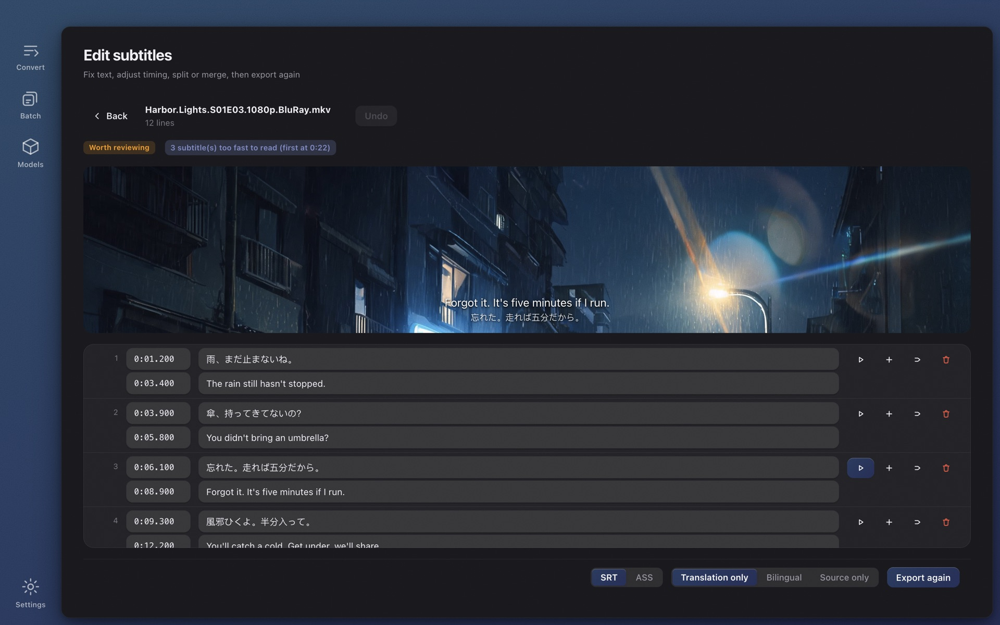

# Wave Subs

**Can't find subtitles for a video?** Wave Subs generates SRT / ASS subtitles from any video with local AI and auto-translates them into your language. Recognition, alignment, translation and editing all run on your own machine — **no internet needed, free forever, no in-app purchases**. macOS (Apple Silicon) and Windows.

[中文说明](./README.zh-CN.md) · **Website:** https://wavesubs.com (11 languages, follows your browser language) · [Download](https://github.com/jason-jm/wavesubs/releases/latest) · [Changelog](CHANGELOG.md)

[](https://github.com/jason-jm/wavesubs/releases/latest)
[](LICENSE)




## What it does

1. **Drop in a video** — MKV / MP4 / MOV / TS and more. An embedded text subtitle track is detected and used directly.
2. **Local AI recognizes and aligns** — whisper.cpp (Metal-accelerated on Apple Silicon) recognizes the dialogue with automatic language detection. Timing is refined to when lines are actually spoken, tuned against the official subtitles of six full-length films.
3. **Translate and export** — 29 target languages. A local Qwen3 model by default (free, offline), or any OpenAI-compatible API. Export SRT / ASS with a quality verdict attached.

Also: a subtitle editor with video preview (HEVC / DTS preview too), batch runs for a whole season with per-file overrides, a glossary, layered caches for recognition and translation (a model change forces a strict retranslation), and a 32-language interface.

**Privacy:** no account, no analytics, no server. Videos are never uploaded. Subtitle text leaves your machine only if you configure a cloud translation provider yourself.

## Install

| | macOS | Windows |
|---|---|---|
| Download | [DMG](https://github.com/jason-jm/wavesubs/releases/latest) | [Installer or portable ZIP](https://github.com/jason-jm/wavesubs/releases/latest) |
| Package manager | `brew install --cask jason-jm/wavesubs/wavesubs` | `scoop bucket add wavesubs https://github.com/jason-jm/scoop-wavesubs`<br>`scoop install wavesubs` |
| Requirements | macOS 12+, Apple Silicon | Windows 10+, x64, 16 GB RAM recommended |

ffmpeg and whisper.cpp are bundled. On first launch you are guided to download a recognition model (1.6–3 GB); nothing else touches the network afterwards. Model and memory requirements per model are listed on the [website](https://wavesubs.com/en/#requirements).

## Platform support

| | macOS | Windows |
|---|---|---|
| Architecture | Apple Silicon (arm64) | x64 |
| Minimum version | macOS 12 | Windows 10 |
| Package | DMG | NSIS installer / portable ZIP |
| Bundled dependencies | self-built LGPL ffmpeg + static whisper/llama | official prebuilt LGPL ffmpeg + whisper/llama |
| Acceleration | Metal | CPU (BLAS) |
| Signing | Developer ID + notarization | Authenticode (not yet) |

Feature set is identical: three subtitle sources, 18 subtitle formats, local/cloud translation, batch queue with per-file settings, 32 interface languages. The Windows build cross-compiles on macOS without Wine.

The platforms differ in three places, each branched in code:
- Window chrome: macOS uses `hiddenInset` with the traffic lights inside the sidebar; Windows uses `titleBarOverlay` (button colours follow the theme).
- Binary lookup: Windows appends `.exe`; whisper and llama each get their own directory because both ship a `ggml.dll` of a different version and Windows resolves DLLs from the executable's directory first.
- Font stacks: both system font stacks live in the same CSS.

## Development setup

```bash
brew install ffmpeg whisper-cpp
npm install
# Download a Whisper model (kept in models/ during development)
curl -L -o models/ggml-base.bin \
  https://huggingface.co/ggerganov/whisper.cpp/resolve/main/ggml-base.bin
```

Other models (`ggml-small.bin`, `ggml-medium.bin`, `ggml-large-v3.bin` — better and slower) go in `models/` as well.

## Usage

```bash
# GUI (development mode)
npm run dev

# CLI: transcribe to a source-language SRT next to the video
npm run cli -- /path/to/movie.mkv

# List audio and subtitle tracks in a file
npm run cli -- /path/to/movie.mkv --list-tracks

# Use embedded subtitle track 3, translate to bilingual Chinese ASS
npm run cli -- /path/to/movie.mkv --sub-track 3 --translate --content bilingual --format ass

# Translate an existing subtitle file (format and encoding auto-detected)
npm run cli -- /path/to/movie.chs.ass --translate --target zh

# Type check
npm run typecheck
```

## Packaging and signing

```bash
npm run dist          # electron-vite build → electron-builder → scripts/sign.ts
```

electron-builder is configured with `identity: null`; all signing is done inside-out by `scripts/sign.ts`, which picks an identity in this order: `WAVESUBS_SIGN_IDENTITY` (or `CSC_NAME`) → a Developer ID Application certificate in the keychain → a self-signed certificate whose name contains `Wave Subs` → ad-hoc.

**Ad-hoc signing makes the keychain prompt repeatedly**: its designated requirement is the executable's cdhash, which changes with every build, and keychain items record exactly that requirement. After each rebuild, the first use of cloud translation (safeStorage decrypting the API key) prompts "Wave Subs wants to use your confidential information stored in 'Wave Subs Safe Storage'".

For local development, create a fixed certificate once: Keychain Access → Certificate Assistant → Create a Certificate…, name `Wave Subs Self-Signed`, identity type "Self-Signed Root", certificate type "Code Signing". Public releases use a Developer ID Application certificate, which never prompts on the user's side.

## Migrating user data from the SubFlow name

The product was called SubFlow until 2026-08-23.

`app.getPath('userData')` derives from `app.getName()`, so the rename moves it from `~/Library/Application Support/subflow` to `.../Wave Subs`. `src/main/migrate.ts` moves the old settings on startup (**before** `new SettingsStore()`), renaming the model directory instead of copying it — it is several GB.

**The one thing that cannot migrate is the cloud API key.** safeStorage's master key lives in the keychain item `subflow Safe Storage`, whose name also follows `app.getName()`; after the rename Electron creates a fresh `Wave Subs Safe Storage` with a new random key, so the old ciphertext is mathematically unrecoverable. Migration therefore drops the `apiKeyEnc` field — keeping ciphertext that can never be decrypted would only make the settings page claim a key is configured. `hasApiKey` then honestly returns false and the existing "configure a key" prompt appears.

## Self-checks

All must be green before a release (see RELEASE.md). Each one pins a class of silent failure — wrong output without an error:

| Script | What it pins |
|---|---|
| `check-i18n` | all 32 languages have every key, placeholders match |
| `check-css` | layout invariants at the computed-style level (catches selector-specificity accidents) |
| `check-batch` | batch merge rules + automatic track selection by language |
| `check-cache` | **cache invalidation matrix**: model / glossary / prompt changes force a retranslation |
| `check-glossary` | glossary injection and hit filtering; an empty glossary leaves the prompt byte-identical |
| `check-qc` | QC rules in both directions (report what should be reported, stay quiet otherwise) |
| `check-editor` | editor operations (time parsing round-trip, merge, stale marks, undo) |
| `check-preview` | Range parsing + real ffmpeg segment generation (including broken inputs) |
| `check-site` | website: all 11 language pages, assets, language auto-redirect matrix |

## Code layout

```
src/main/core/        domain core (Electron-free, reused by the CLI)
  jobstore.ts         job cache: source stage / translation reuse, 4-tuple invalidation
  subtitle/qc.ts      output QC (coverage / gaps / reading speed / residue…, thresholds from full-film benchmarks)
  preview.ts          segment preview: frame sequence + AAC (for formats Chromium can't play)
  media.ts            ffprobe/ffmpeg wrapper: probing, audio extraction
  asr/whisperCpp.ts   whisper.cpp subprocess wrapper (first AsrProvider implementation)
  subtitle/           Cue model and SRT serialization
  pipeline.ts         job orchestration: probe → extract → transcribe → write
src/main/index.ts     Electron main process + IPC
src/main/media-protocol.ts  wsmedia:// media protocol (Range + path allowlist)
src/preload/          typed API exposed through contextBridge
src/renderer/         React UI
scripts/cli.ts        command-line entry
```

## License

The code is released under the [MIT License](./LICENSE). Bundled third-party components (ffmpeg LGPL, whisper.cpp / llama.cpp MIT, Whisper and Qwen models, …) carry their own licenses, listed in [THIRD-PARTY-LICENSES.md](./THIRD-PARTY-LICENSES.md).
