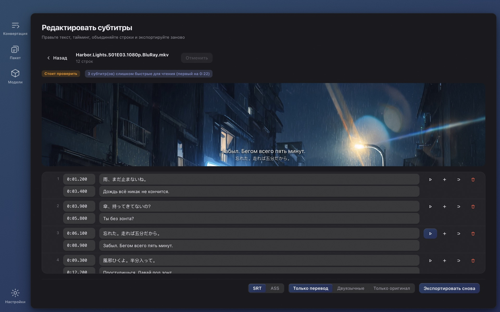

# Wave Subs

[English](./README.md) · [简体中文](./README.zh-CN.md) · [日本語](./README.ja.md) · [한국어](./README.ko.md) · [Français](./README.fr.md) · [Deutsch](./README.de.md) · **Русский** · [Bahasa Indonesia](./README.id.md) · [Bahasa Melayu](./README.ms.md) · [Tiếng Việt](./README.vi.md) · [ไทย](./README.th.md)

**Не нашли субтитры к видео?** Wave Subs создаёт субтитры SRT / ASS из любого видео с помощью локального ИИ и переводит их на ваш язык. Распознавание, тайминг, перевод, текст на экране и редактирование — всё выполняется на вашем компьютере: ничего не загружается, аккаунт не нужен, программа бесплатна и открыта. macOS (Apple Silicon) и Windows.

**Сайт:** https://wavesubs.com (11 языков) · [Скачать](https://github.com/jason-jm/wavesubs/releases/latest) · [История изменений](CHANGELOG.md) (англ.) · [Политика конфиденциальности](https://wavesubs.com/en/privacy.html) (англ.)

## Как это работает

1. **Перетащите видео, файл субтитров или целую папку.** MKV, MP4, MOV, TS, AVI и всё, что читает ffmpeg, включая аудиофайлы. Если в видео уже есть текстовая дорожка субтитров, она обнаруживается и используется напрямую.
2. **Локальный ИИ распознаёт диалоги и выравнивает их.** whisper.cpp распознаёт речь на вашем компьютере с автоопределением языка. Затем каждая реплика привязывается к моменту, когда она действительно произнесена.
3. **Переведите и экспортируйте.** Локальная модель Qwen3 переводит на ваш язык (или облачный сервис, если вы его подключите). Результат записывается в SRT или ASS рядом с видео вместе с оценкой качества, которая подсказывает, на какие строки стоит взглянуть.

Двухчасовой фильм распознаётся примерно за 3–6 минут с Large v3 Turbo на Mac с чипом M плюс несколько минут локального перевода. Перетащите целый сезон и дайте программе поработать.

## Что вы получаете

### Три источника субтитров

- **Распознавание речи.** Семейство моделей Whisper (от Tiny до Large v3) через whisper.cpp с ускорением Metal на Apple Silicon. Распознавание охватывает почти 100 языков, которые поддерживает Whisper. Язык речи определяется голосованием пяти 20-секундных фрагментов из мест с самой плотной речью, поэтому вступительная песня не может пометить целую серию не тем языком; язык можно задать и вручную.
- **Встроенные дорожки субтитров.** Текстовые дорожки в файлах MKV / MP4 обнаруживаются и используются вместо распознавания (быстрее и точно); если дорожек несколько, вы выбираете нужную для каждого файла. Графические субтитры (PGS, VobSub, DVB) источником быть не могут.
- **Внешние файлы субтитров.** 18 форматов, среди них SRT, ASS / SSA, WebVTT, SAMI, MicroDVD, SubViewer, MPL2, VPlayer, JACOsub, RealText, STL, PJS, LRC, TTML / DFXP и SBV. Кодировка файла определяется автоматически (UTF-8, UTF-16, GBK, Big5, Shift-JIS, EUC-KR, Windows-1252).

### Тайминг, который следует за речью

- Границы каждой реплики выравниваются по реальной речи с помощью детектора голосовой активности (Silero VAD) и анализа громкости. Параметры откалиброваны по официальным субтитрам шести полнометражных фильмов, а не подобраны на глаз.
- Строки, которые Whisper выдумывает там, где никто не говорит, удаляются, реплики из одних ♪ отбрасываются, заикающиеся повторы (やばいやばいやばい) сворачиваются.
- Длинные реплики делятся по естественным границам, для японского есть отдельные правила.

### Перевод

- **29 языков перевода:** русский, английский, китайский (упрощённый и традиционный), японский, корейский, французский, немецкий, испанский, португальский, итальянский, нидерландский, украинский, польский, чешский, венгерский, шведский, датский, норвежский, финский, греческий, турецкий, иврит, арабский, хинди, тайский, вьетнамский, индонезийский и малайский. При первом запуске целевым становится язык системы.
- **По умолчанию локально.** Модели Qwen3 от 1.7B до 32B работают на вашем компьютере через llama.cpp и скачиваются прямо в приложении. Бесплатно, офлайн, без лимитов.
- **Облако по желанию.** Любой OpenAI-совместимый API с вашим собственным ключом; есть быстрые пресеты для OpenAI, Anthropic Claude, Google Gemini, DeepSeek, Qwen, Zhipu GLM, Moonshot, Volcano Ark, SiliconFlow, OpenRouter и Azure OpenAI. Ключ хранится в зашифрованном виде в хранилище учётных данных системы. Отправляется только текст субтитров, никогда не видео.
- **Глоссарий.** Закрепите перевод имён и терминов один раз, и весь сезон останется единообразным. Подставляются только те записи, которые встречаются в текущей партии, а глоссарий действует и на диалоги, и на текст на экране.
- **Одно имя — одно написание.** Финальный проход группирует каждое повторяющееся имя собственное и заменяет редкие варианты написания на основной, чтобы персонаж не был «Вебер» в третьей серии и «Веббер» в четвёртой.
- **Сделано для субтитров, а не для абзацев.** Строки переводятся партиями с якорями выравнивания, поэтому перевод никогда не сползёт на соседнюю строку; половина фразы остаётся половиной фразы; искажённая расшифровка всё равно получает наиболее правдоподобный перевод, а не пустоту; модель, вернувшая исходный текст без перевода, отлавливается на каждом круге повторных попыток.
- **Вывод:** только перевод, двуязычно или только оригинал, в SRT или ASS.

### Текст на экране

Включите «Переводить текст на экране» — и вывески, записки, СМС и пузыри чатов, объявления, документы, титульные карточки, названия серий и таблички с именами тоже считываются с изображения и переводятся.

- Используется распознавание текста, встроенное в систему: Vision на macOS, Windows.Media.Ocr на Windows. Дополнительную модель скачивать не нужно; 24-минутная серия занимает на две-три минуты дольше, параллельно с распознаванием речи.
- Каждый перевод размещается рядом с оригиналом: сразу под ним, затем сбоку, затем вверху кадра, и поверх оригинала только в крайнем случае. Он никогда не заходит в область, занятую субтитром диалога, а шрифт уменьшается прежде, чем что-то будет закрыто. Только экран, целиком заполненный текстом (письмо, переписка, документ), заменяется непрозрачной плашкой.
- Что остаётся за кадром: начальные и финальные титры (включая списки актёров и актёров озвучки), вшитые в изображение субтитры, логотипы каналов и водяные знаки, плотные мелкие подписи вроде отметок на карте и корешков книг, табличка на двери, повторяющаяся весь фильм, искажённые распознаванием смайлики и переводы, совпадающие с оригиналом.
- В ASS текст размещается на месте оригинала, в SRT — вверху. В редакторе субтитры речи и текст на экране находятся на отдельных вкладках, а один и тот же файл всегда даёт один и тот же результат.

### Редактор с видеопревью

- Правьте текст и тайминг в таблице; вставка, удаление, объединение, отмена; изменения сохраняются автоматически.
- Нажмите на любую строку, чтобы услышать, как именно она произнесена. Форматы, которые браузер не воспроизводит (HEVC, DTS, TrueHD), показываются через встроенный ffmpeg.
- Замечания о качестве кликабельны. Строки, у которых вы изменили оригинал, помечаются, и повторный перевод затрагивает только их.
- Экспортируйте снова в любой момент: SRT или ASS, только перевод, двуязычно или только оригинал.

### Отчёт о качестве для каждого файла

Каждый готовый файл получает вердикт (проверки пройдены, стоит просмотреть, найдены проблемы) с причинами: покрытие речи, пропуски, слишком длинные реплики, слишком высокая скорость чтения, отсутствующие переводы, исходный текст, оставшийся в переводе, перевёрнутый тайминг. Пороги взяты из измерений на полнометражных фильмах, и каждое замечание ведёт к строке в редакторе.

### Целый сезон за раз

- Перетащите папку. Файлы обрабатываются по очереди; одна ошибка не останавливает партию; отменить можно в любой момент.
- Все файлы следуют общим настройкам, и любому файлу можно задать свой источник субтитров, звуковую дорожку, язык, сервис перевода или формат.
- Прогресс показывает текущий этап и оценку оставшегося времени; карточка завершения сообщает, какое устройство выполняло распознавание (GPU Apple серии M, GPU с Vulkan или CPU).
- Ничего не делается дважды. Распознавание кэшируется по идентичности файла и всем влияющим параметрам, поэтому повторный экспорт или смена формата занимают секунды. Перевод используется повторно, только если совпадают движок и модель, целевой язык, версия промпта и глоссарий; иначе он выполняется заново целиком, и старый результат никогда не подмешивается.

### Модели скачиваются в приложении

- При первом запуске страница «Конвертировать» рекомендует модель для вашего компьютера и предлагает «Скачать и продолжить»; начать можно сразу после загрузки.
- Страница «Модели» помечает каждую модель как подходящую, допустимую или слишком тяжёлую для вашей памяти и показывает её точность для вашего языка (см. ниже). Загрузка идёт с Hugging Face или ModelScope (в материковом Китае он пробуется первым), проверяется по SHA-256, а если все источники недоступны, приложение показывает прямые ссылки, чтобы вы скачали файл сами и положили его в папку моделей.

### Интерфейс

32 языка интерфейса (арабский, бенгальский, китайский упрощённый и традиционный, чешский, датский, нидерландский, английский, финский, французский, немецкий, греческий, иврит, хинди, венгерский, индонезийский, итальянский, японский, корейский, малайский, норвежский, персидский, польский, португальский, румынский, русский, испанский, шведский, тайский, турецкий, украинский, вьетнамский), светлая и тёмная тема, десять цветовых палитр, полная поддержка фокуса с клавиатуры. При запуске приложение один раз проверяет наличие новой версии (переключатель в настройках это отключает) и предлагает кнопку загрузки; копиям, установленным через Homebrew или Scoop, вместо неё показывается команда обновления.

## Выбор модели распознавания

Модели Whisper различаются по языкам гораздо сильнее, чем по размеру. В таблице — сохранение смысла: доля распознанных строк, смысл которых остался верным, оценённая вслепую на 50 предложениях из 30-минутного фрагмента английского фильма («В центре внимания»), немецкого фильма («Воздушный шар») и японского сериала (NHK, «13 князей Камакуры»), пропущенных через реальный конвейер продукта. Корейский и путунхуа в открытых тестах находятся на одном уровне с японским; испанский, итальянский и португальский чуть лучше немецкого, французский, нидерландский и польский чуть хуже.

| Модель | Загрузка | Память в работе | Английский | Европейские языки | Японский · корейский · китайский |
|---|---|---|---|---|---|
| Tiny | 75 МБ | 0,5 ГБ | 68 % | 49 % | 37 % |
| Base | 142 МБ | 0,7 ГБ | 79 % | 61 % | 57 % |
| Small | 466 МБ | 1,2 ГБ | 92 % | 81 % | 66 % |
| Medium | 1,5 ГБ | 2,6 ГБ | 91 % | 81 % | 79 % |
| Large v3 Turbo | 1,6 ГБ | 2,2 ГБ | 95 % | 96 % | 89 % |
| Large v3 | 3,0 ГБ | 4,5 ГБ | 96 % | 94 % | 88 % |

Приложение помечает 85 % и выше как *рекомендуется*, 75 % — *можно использовать*, 60 % — *на грани*, а всё ниже — *не советуем*. Коротко: для английского достаточно Small, для европейских языков он приемлем, а японскому, корейскому и китайскому нужен Large v3 Turbo или лучше. Large v3 Turbo на полных фильмах отстаёт от Large v3 менее чем на один пункт, работая примерно втрое быстрее, поэтому на большинстве компьютеров он рекомендуется по умолчанию.

| Ваш компьютер | Распознавание | Перевод | Примечание |
|---|---|---|---|
| Mac 8 ГБ | Small или Large v3 Turbo | Qwen3 1.7B | Работает; для Turbo закройте другие программы |
| Mac 16 ГБ | Large v3 Turbo | Qwen3 8B | Баланс качества и скорости по умолчанию |
| Mac 32 ГБ | Large v3 | Qwen3 14B | Лучшее распознавание, точнее перевод |
| Mac 48 ГБ и больше | Large v3 | Qwen3 32B | Лучшее качество перевода, медленнее |
| ПК Windows 16 ГБ | Large v3 Turbo | Qwen3 4B | Распознавание на CPU; ожидайте в несколько раз больше времени, чем на Apple Silicon |
| ПК Windows 32 ГБ | Large v3 Turbo | Qwen3 8B | Большие модели работают; заложите время |

Локальные модели перевода: Qwen3 1.7B (загрузка 1,8 ГБ, память 2,5 ГБ), 4B (2,4 ГБ, 3,5 ГБ), 8B (4,9 ГБ, 6 ГБ), 14B (9,0 ГБ, 10,5 ГБ), 32B (19,7 ГБ, 22 ГБ). Распознавание и перевод выполняются по очереди, никогда одновременно.

## Измеренная точность

По корпусу из 70 полнометражных фильмов (эталон — официальные дорожки субтитров и известные фансаб-релизы; 36 японских, 21 английский, 13 других), сентябрь 2026:

- **Распознавание (Whisper Large v3):** английский, 19 фильмов, средняя доля ошибок по словам 17,4 % (документальные фильмы и интервью около 6 %, официальные сериалы 10–13 %). Японский, 18 фильмов, доля ошибок по символам 19,1 %, на уровне чтений 13,8 %; около трети «ошибок» — варианты написания (分かった / わかった). Официальные немецкие, норвежские и итальянские субтитры — сжатые пересказы, их нельзя оценивать дословно.
- **Перевод (японский → китайский, локальный Qwen3):** при человеческой расшифровке на входе точность сохранения смысла составляет 93,5 % для 8B, 94,4 % для 14B и 93,9 % для 32B, так что 8B по умолчанию — надёжный выбор. Сквозной результат (распознавание → перевод) — около 83–85 %; почти весь разрыв объясняется ошибками распознавания.
- **Тайминг:** F1 покадровой маски 81,8 %; 57 % начал реплик попадают в ±250 мс от человеческих субтитров. Человеческие субтитры из разных релизов сами расходятся на 100–300 мс по опережению.

## Конфиденциальность

Нет аккаунта, нет аналитики, нет сервера. Видео никогда не покидает ваш компьютер; распознавание, выравнивание, перевод, текст на экране и редактирование выполняются локально, и после загрузки моделей приложение работает с выключенной сетью.

К сети обращаются ровно три вещи, и каждая под вашим контролем:

1. **Загрузка моделей** с Hugging Face или ModelScope, когда вы запрашиваете модель.
2. **Облачный перевод** — только если вы сами настроили провайдера; он получает текст субтитров и выставляет счёт вам напрямую.
3. **Проверка обновлений** при запуске, которая загружает небольшой JSON-файл из GitHub Release этого репозитория. Её можно отключить в настройках, а сборка для App Store не проверяет вовсе.

Полная политика (англ.): https://wavesubs.com/en/privacy.html

## Требования и установка

| | macOS | Windows |
|---|---|---|
| Требования | macOS 12 и новее, Apple Silicon (M1 и новее) | Windows 10 и новее, x64, рекомендуется 16 ГБ ОЗУ |
| Загрузка | [DMG или ZIP](https://github.com/jason-jm/wavesubs/releases/latest), нотаризовано Apple | [Установщик или портативный ZIP](https://github.com/jason-jm/wavesubs/releases/latest) |
| Пакетный менеджер | `brew install --cask jason-jm/wavesubs/wavesubs` | `scoop bucket add wavesubs https://github.com/jason-jm/scoop-wavesubs` `scoop install wavesubs` |
| Ускорение | Metal (распознавание и перевод) | Распознавание на CPU; перевод на любой видеокарте с драйвером Vulkan, иначе CPU |

ffmpeg, whisper.cpp и llama.cpp входят в комплект: установите и работайте. Модели распознавания речи занимают от 75 МБ до 3 ГБ, локальные модели перевода — от 1,8 до 20 ГБ; и те и другие скачиваются по запросу внутри приложения. Intel Mac не поддерживаются: локальное распознавание зависит от Metal, а на Intel оно было бы слишком медленным.

**Windows:** установщик пока не подписан, поэтому при первом запуске SmartScreen показывает «Система Windows защитила ваш компьютер». Нажмите *Подробнее → Выполнить в любом случае*. Контрольные суммы всех файлов лежат в `SHA256SUMS.txt` на странице релиза. Для текста на экране установите языковой пакет Windows для языка речи с отмеченным пунктом *Оптическое распознавание символов*.

## Известные ограничения

- В Windows распознавание текста на экране слабее, чем в macOS; вертикальный японский текст в основном пропускается.
- Ряд имён вне титров (имена актёров на театральной афише, имена главных ролей, показанные за полминуты до списка съёмочной группы) пока переводится.
- Локальные модели до 8B ненадёжны на именах собственных вроде названий организаций и исторических терминов. Глоссарий — надёжное решение.
- Релиз, в котором перевод текста на экране уже вшит в изображение, покажет оба.
- Нет сборок для Intel Mac и Windows ARM64; распознавание в Windows работает только на CPU.

## Частые вопросы

**Какие видео можно субтитровать?** MKV, MP4, MOV, TS, AVI и другие распространённые форматы; потоки HEVC, DTS и TrueHD, которые браузеры не воспроизводят, тоже подходят, потому что встроенный ffmpeg декодирует всё. Аудиофайлы тоже работают.

**Какие языки?** Распознавание охватывает почти 100 языков Whisper с автоопределением; 29 языков перевода; интерфейс на 32 языках.

**Правда работает без интернета?** Да. Сеть используют только разовая загрузка моделей, облачный перевод, который вы настроили сами, и отключаемая проверка обновлений.

**Насколько точно?** См. разделы *Выбор модели распознавания* и *Измеренная точность* выше. Выбирайте модель по своему языку, и каждый файл приходит с оценкой качества.

**В видео уже есть дорожка субтитров.** Встроенные текстовые дорожки обнаруживаются и используются в первую очередь, сразу переходя к переводу. Исключение — графические дорожки (PGS / VobSub).

**Загрузка моделей не работает в материковом Китае.** Все модели доступны на ModelScope, который приложение пробует первым, если язык системы — упрощённый китайский или часовой пояс находится в Китае. Если все источники недоступны, в ошибке перечислены прямые ссылки для браузера или менеджера загрузок.

**Чем это отличается от онлайн-генераторов субтитров?** Онлайн-сервисы требуют загрузить весь фильм, берут плату за минуту и ограничивают длительность. Wave Subs ничего не загружает, ничего не стоит и не ограничивает длительность; скорость зависит от вашего компьютера.

## Обратная связь и поддержка

- [Сообщения об ошибках и предложения](https://github.com/jason-jm/wavesubs/issues) на GitHub или [форма обратной связи](https://wavesubs.com/ru/feedback.html), если у вас нет аккаунта GitHub. У неудавшейся задачи есть кнопка *Скопировать журнал*; вставьте этот журнал в сообщение.
- [Discussions](https://github.com/jason-jm/wavesubs/discussions) для вопросов и обмена настройками.
- [История изменений](CHANGELOG.md) (англ.) — что изменилось в каждой версии.

## Лицензия

Wave Subs распространяется по [лицензии MIT](./LICENSE). Входящие в комплект сторонние компоненты (ffmpeg под LGPL, whisper.cpp и llama.cpp под MIT, модели Whisper и Qwen и другие) имеют собственные лицензии, перечисленные в [THIRD-PARTY-LICENSES.md](./THIRD-PARTY-LICENSES.md).

*Сборка из исходников, интерфейс командной строки и структура кода описаны в [DEVELOPMENT.md](./DEVELOPMENT.md) (англ.).*
