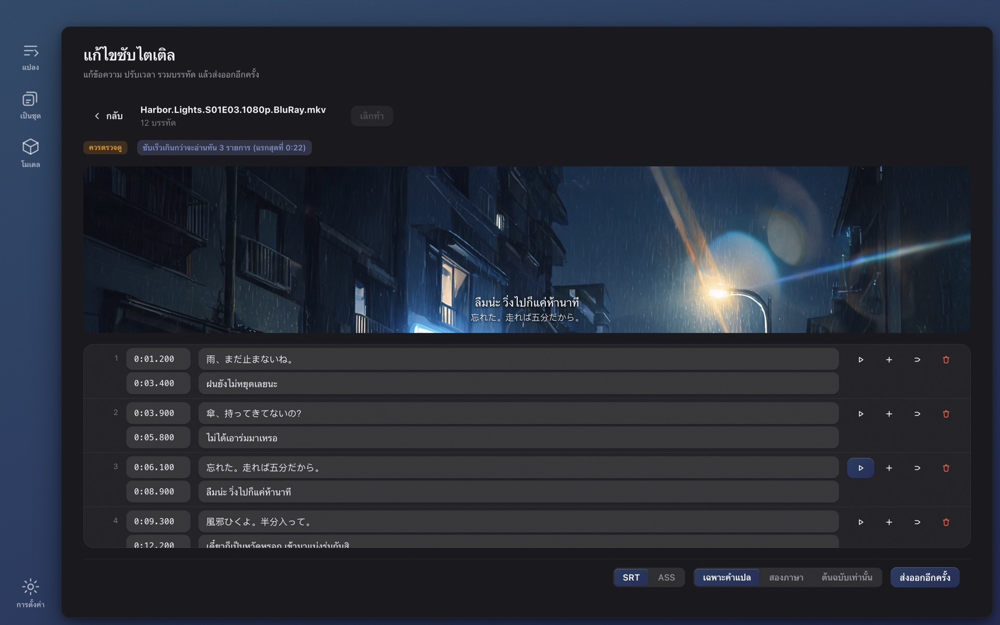

# Wave Subs

[English](./README.md) · [简体中文](./README.zh-CN.md) · [日本語](./README.ja.md) · [한국어](./README.ko.md) · [Français](./README.fr.md) · [Deutsch](./README.de.md) · [Русский](./README.ru.md) · [Bahasa Indonesia](./README.id.md) · [Bahasa Melayu](./README.ms.md) · [Tiếng Việt](./README.vi.md) · **ไทย**

**หาซับไตเติลของวิดีโอไม่เจอ?** Wave Subs สร้างซับไตเติล SRT / ASS จากวิดีโอใดก็ได้ด้วย AI ในเครื่อง แล้วแปลเป็นภาษาของคุณ การจับบทพูด การจัดเวลา การแปล ข้อความบนจอ และการแก้ไข ทำงานทั้งหมดบนคอมพิวเตอร์ของคุณเอง ไม่มีการอัปโหลด ไม่ต้องมีบัญชี ฟรีและโอเพนซอร์ส รองรับ macOS (Apple Silicon) และ Windows

**เว็บไซต์:** https://wavesubs.com (11 ภาษา) · [ดาวน์โหลด](https://github.com/jason-jm/wavesubs/releases/latest) · [บันทึกการเปลี่ยนแปลง](CHANGELOG.md) (ภาษาอังกฤษ) · [นโยบายความเป็นส่วนตัว](https://wavesubs.com/en/privacy.html) (ภาษาอังกฤษ)

## วิธีทำงาน

1. **ลากวิดีโอ ไฟล์ซับ หรือทั้งโฟลเดอร์มาวาง** MKV, MP4, MOV, TS, AVI และทุกอย่างที่ ffmpeg อ่านได้ รวมถึงไฟล์เสียงล้วน ถ้าวิดีโอมีแทร็กซับแบบข้อความอยู่แล้ว จะตรวจพบและใช้ทันที
2. **AI ในเครื่องจับบทพูดแล้วจัดเวลาให้ตรง** whisper.cpp จับเสียงพูดบนเครื่องของคุณพร้อมตรวจภาษาอัตโนมัติ จากนั้นทุกบรรทัดจะถูกขยับให้ตรงกับจังหวะที่พูดจริง
3. **แปลแล้วส่งออก** โมเดล Qwen3 ในเครื่องแปลเป็นภาษาของคุณ (หรือใช้บริการคลาวด์ถ้าคุณเชื่อมต่อเอง) ผลลัพธ์ถูกบันทึกเป็น SRT หรือ ASS ไว้ข้างวิดีโอ พร้อมผลตรวจคุณภาพที่บอกว่าบรรทัดไหนควรดูซ้ำ

หนังสองชั่วโมงใช้เวลาจับบทพูดราว 3–6 นาทีด้วย Large v3 Turbo บน Mac ชิป M บวกอีกไม่กี่นาทีสำหรับการแปลในเครื่อง ลากทั้งซีซันมาวางแล้วปล่อยให้รันได้เลย

## สิ่งที่คุณจะได้

### แหล่งซับไตเติลสามแบบ

- **การจับเสียงพูด** ตระกูลโมเดล Whisper (Tiny ถึง Large v3) ผ่าน whisper.cpp เร่งความเร็วด้วย Metal บน Apple Silicon รองรับเกือบ 100 ภาษาที่ Whisper รู้จัก ภาษาที่พูดถูกตรวจโดยสุ่มช่วง 20 วินาทีห้าช่วงจากจุดที่มีเสียงพูดหนาแน่นที่สุดแล้วให้โหวตกัน เพลงเปิดเรื่องจึงทำให้ทั้งตอนถูกระบุภาษาผิดไม่ได้ และคุณกำหนดภาษาเองได้ด้วย
- **แทร็กซับที่ฝังในไฟล์** แทร็กข้อความในไฟล์ MKV / MP4 จะถูกตรวจพบและใช้ก่อนการจับเสียง (เร็วกว่าและตรงเป๊ะ) ถ้ามีหลายแทร็กคุณเลือกได้ต่อไฟล์ ซับแบบภาพ (PGS, VobSub, DVB) ใช้เป็นแหล่งไม่ได้
- **ไฟล์ซับภายนอก** 18 รูปแบบ รวมถึง SRT, ASS / SSA, WebVTT, SAMI, MicroDVD, SubViewer, MPL2, VPlayer, JACOsub, RealText, STL, PJS, LRC, TTML / DFXP และ SBV ตรวจการเข้ารหัสไฟล์อัตโนมัติ (UTF-8, UTF-16, GBK, Big5, Shift-JIS, EUC-KR, Windows-1252)

### เวลาที่ตามเสียงพูด

- ขอบเขตของแต่ละบรรทัดถูกจัดให้ตรงกับเสียงพูดจริงด้วยการตรวจจับเสียงพูด (Silero VAD) และการวิเคราะห์ความดัง พารามิเตอร์ปรับจูนจากซับทางการของหนังยาวหกเรื่อง ไม่ได้เดา
- บรรทัดที่ Whisper แต่งขึ้นตอนไม่มีใครพูดถูกตัดทิ้ง บรรทัดที่มีแต่ ♪ ถูกลบ และการพูดซ้ำแบบติดอ่าง (やばいやばいやばい) ถูกยุบรวม
- บรรทัดยาวถูกแบ่งตรงรอยต่อที่เป็นธรรมชาติ พร้อมกฎเฉพาะสำหรับภาษาญี่ปุ่น

### การแปล

- **ภาษาปลายทาง 29 ภาษา:** ไทย อังกฤษ จีน (ตัวย่อและตัวเต็ม) ญี่ปุ่น เกาหลี ฝรั่งเศส เยอรมัน สเปน โปรตุเกส อิตาลี ดัตช์ รัสเซีย ยูเครน โปแลนด์ เช็ก ฮังการี สวีเดน เดนมาร์ก นอร์เวย์ ฟินแลนด์ กรีก ตุรกี ฮีบรู อาหรับ ฮินดี เวียดนาม อินโดนีเซีย และมาเลย์ เปิดครั้งแรกจะตั้งภาษาปลายทางเป็นภาษาของระบบ
- **ค่าเริ่มต้นคือในเครื่อง** โมเดล Qwen3 ตั้งแต่ 1.7B ถึง 32B รันบนเครื่องของคุณผ่าน llama.cpp ดาวน์โหลดได้ในแอป ฟรี ออฟไลน์ ไม่จำกัดโควตา
- **คลาวด์ถ้าต้องการ** API ที่เข้ากับ OpenAI ได้ทุกเจ้าด้วยคีย์ของคุณเอง มีค่าตั้งล่วงหน้าสำหรับ OpenAI, Anthropic Claude, Google Gemini, DeepSeek, Qwen, Zhipu GLM, Moonshot, Volcano Ark, SiliconFlow, OpenRouter และ Azure OpenAI คีย์ถูกเก็บแบบเข้ารหัสในที่เก็บข้อมูลรับรองของระบบปฏิบัติการ ส่งออกไปเฉพาะข้อความซับเท่านั้น ไม่ส่งวิดีโอเด็ดขาด
- **อภิธานศัพท์** กำหนดคำแปลของชื่อและศัพท์ครั้งเดียว ทั้งซีซันจะสอดคล้องกัน มีเพียงรายการที่ปรากฏในชุดที่กำลังแปลเท่านั้นที่ถูกใส่เข้าไป และอภิธานศัพท์ใช้กับทั้งบทพูดและข้อความบนจอ
- **หนึ่งชื่อ หนึ่งการสะกด** ขั้นสุดท้ายจะจัดกลุ่มชื่อเฉพาะที่ปรากฏซ้ำ แล้วแก้การสะกดส่วนน้อยให้ตรงกับส่วนใหญ่ ตัวละครจึงไม่เป็น "เวเบอร์" ในตอนที่ 3 แล้วกลายเป็น "เว็บเบอร์" ในตอนที่ 4
- **สร้างมาเพื่อซับ ไม่ใช่ย่อหน้า** แปลเป็นชุดพร้อมจุดยึดสำหรับจัดแนว คำแปลจึงไม่มีทางเลื่อนไปอยู่บรรทัดข้างเคียง ครึ่งประโยคก็ยังคงเป็นครึ่งประโยค ข้อความถอดเสียงที่เพี้ยนก็ยังได้คำแปลที่สมเหตุสมผลที่สุดแทนที่จะเว้นว่าง และเมื่อโมเดลส่งต้นฉบับกลับมาโดยไม่แปล จะถูกจับได้ในทุกรอบที่ลองใหม่
- **ผลลัพธ์:** เฉพาะคำแปล สองภาษา หรือเฉพาะต้นฉบับ เป็น SRT หรือ ASS

### ข้อความบนจอ

เปิด "แปลข้อความบนจอ" แล้วป้าย โน้ต ข้อความและบับเบิลแชต ประกาศ เอกสาร การ์ดชื่อเรื่อง ชื่อตอน และป้ายชื่อบุคคล จะถูกอ่านจากภาพและแปลด้วย

- ใช้การรู้จำข้อความที่มากับระบบปฏิบัติการ: Vision บน macOS และ Windows.Media.Ocr บน Windows ไม่ต้องดาวน์โหลดโมเดลเพิ่ม ตอนละ 24 นาทีใช้เวลานานขึ้นสองถึงสามนาที และทำงานขนานกับการจับเสียงพูด
- คำแปลแต่ละชิ้นถูกวางไว้ข้างต้นฉบับ: ใต้ต้นฉบับก่อน ถัดมาคือด้านข้าง แล้วจึงด้านบนของเฟรม ส่วนการทับต้นฉบับเป็นทางเลือกสุดท้ายเท่านั้น จะไม่ล้ำเข้าไปในพื้นที่ของซับบทพูดเด็ดขาด และตัวอักษรจะย่อลงก่อนที่จะมีอะไรถูกบัง เฉพาะเมื่อทั้งจอเป็นข้อความ (อีเมล เธรดข้อความ เอกสาร) เท่านั้นที่จะถูกแทนด้วยแผ่นทึบ
- สิ่งที่ไม่ถูกนำมาแสดง: เครดิตเปิดและปิดเรื่อง (รวมรายชื่อนักแสดงและนักพากย์) ซับที่ฝังในภาพอยู่แล้ว โลโก้สถานีและลายน้ำ ป้ายเล็กหนาแน่นอย่างสัญลักษณ์บนแผนที่และสันหนังสือ ป้ายประตูที่โผล่ซ้ำตลอดทั้งเรื่อง อีโมติคอนที่ถูกอ่านเพี้ยน และคำแปลที่เหมือนต้นฉบับทุกตัวอักษร
- ใน ASS ข้อความถูกวางที่ตำแหน่งของต้นฉบับ ส่วน SRT วางไว้ด้านบน ตัวแก้ไขแยกซับบทพูดกับข้อความบนจอไว้คนละแท็บ และไฟล์เดียวกันให้ผลเหมือนเดิมเสมอ

### ตัวแก้ไขพร้อมพรีวิววิดีโอ

- แก้ข้อความและเวลาในตาราง แทรก ลบ รวม เลิกทำ บันทึกอัตโนมัติ
- คลิกบรรทัดไหนก็ฟังได้ว่าพูดประโยคนั้นอย่างไร รูปแบบที่เบราว์เซอร์เล่นไม่ได้ (HEVC, DTS, TrueHD) พรีวิวได้ผ่าน ffmpeg ที่มาพร้อมแอป
- ผลตรวจคุณภาพคลิกได้ บรรทัดที่คุณแก้ต้นฉบับจะถูกทำเครื่องหมาย และการแปลใหม่จะแตะเฉพาะบรรทัดเหล่านั้น
- ส่งออกใหม่ได้ทุกเมื่อ: SRT หรือ ASS เฉพาะคำแปล สองภาษา หรือเฉพาะต้นฉบับ

### รายงานคุณภาพของทุกไฟล์

ไฟล์ที่เสร็จแต่ละไฟล์ได้ผลตรวจ (ผ่าน ควรดูซ้ำ พบปัญหา) พร้อมเหตุผล: ความครอบคลุมของเสียงพูด ช่องว่าง บรรทัดยาวเกิน ความเร็วในการอ่านสูงเกิน คำแปลขาดหาย ข้อความต้นฉบับหลงเหลือในคำแปล เวลากลับด้าน เกณฑ์มาจากการวัดบนหนังยาว และทุกรายการลิงก์ไปยังบรรทัดนั้นในตัวแก้ไข

### ทั้งซีซันในครั้งเดียว

- ลากโฟลเดอร์มาวาง ไฟล์ถูกประมวลผลทีละไฟล์ ไฟล์หนึ่งล้มเหลวไม่ทำให้ทั้งชุดหยุด ยกเลิกได้ทุกเมื่อ
- ทุกไฟล์ใช้การตั้งค่าร่วมกัน และไฟล์ไหนก็กำหนดแหล่งซับ แทร็กเสียง ภาษา บริการแปล หรือรูปแบบแยกได้
- ความคืบหน้าแสดงขั้นตอนปัจจุบันและเวลาที่เหลือโดยประมาณ การ์ดเมื่อเสร็จบอกว่าอุปกรณ์ไหนทำการจับเสียง (GPU ของ Apple ชิป M, GPU Vulkan หรือ CPU)
- ไม่มีอะไรทำซ้ำสองครั้ง ผลการจับเสียงถูกแคชตามตัวตนของไฟล์และทุกพารามิเตอร์ที่มีผล การส่งออกใหม่หรือเปลี่ยนรูปแบบจึงใช้เวลาไม่กี่วินาที คำแปลจะถูกใช้ซ้ำก็ต่อเมื่อเอนจินกับโมเดล ภาษาปลายทาง เวอร์ชันของพรอมต์ และอภิธานศัพท์ตรงกันทั้งหมด ไม่เช่นนั้นจะแปลใหม่ทั้งหมด และไม่มีการปนผลลัพธ์เก่าเข้ามา

### โมเดลดาวน์โหลดได้ในแอป

- เปิดครั้งแรก หน้าแปลงจะแนะนำโมเดลที่เหมาะกับเครื่องของคุณและมีปุ่ม "ดาวน์โหลดแล้วทำต่อ" เริ่มได้ทันทีที่ดาวน์โหลดเสร็จ
- หน้าโมเดลระบุแต่ละโมเดลว่าเหมาะ ใช้ได้ หรือหนักเกินไปสำหรับหน่วยความจำของคุณ และบอกว่ามันแม่นแค่ไหนกับภาษาของคุณ (ดูด้านล่าง) ดาวน์โหลดจาก Hugging Face หรือ ModelScope (ลองก่อนในจีนแผ่นดินใหญ่) ตรวจสอบด้วย SHA-256 และถ้าทุกแหล่งล้มเหลว แอปจะแสดง URL ตรงให้คุณดาวน์โหลดเองแล้ววางในโฟลเดอร์โมเดล

### หน้าจอการใช้งาน

32 ภาษาของหน้าจอ (อาหรับ เบงกาลี จีนตัวย่อและตัวเต็ม เช็ก เดนมาร์ก ดัตช์ อังกฤษ ฟินแลนด์ ฝรั่งเศส เยอรมัน กรีก ฮีบรู ฮินดี ฮังการี อินโดนีเซีย อิตาลี ญี่ปุ่น เกาหลี มาเลย์ นอร์เวย์ เปอร์เซีย โปแลนด์ โปรตุเกส โรมาเนีย รัสเซีย สเปน สวีเดน ไทย ตุรกี ยูเครน เวียดนาม) โหมดสว่างและมืด ชุดสีสิบแบบ รองรับโฟกัสด้วยคีย์บอร์ดครบถ้วน แอปตรวจเวอร์ชันใหม่หนึ่งครั้งตอนเปิด (ปิดได้ในการตั้งค่า) และแสดงปุ่มดาวน์โหลด สำเนาที่ติดตั้งผ่าน Homebrew หรือ Scoop จะได้คำสั่งอัปเกรดที่ตรงกันแทน

## การเลือกโมเดลจับบทพูด

โมเดล Whisper ต่างกันตามภาษามากกว่าตามขนาดมาก ตารางนี้แสดงอัตราการรักษาความหมาย: สัดส่วนของบรรทัดที่จับได้โดยความหมายยังถูกต้อง ประเมินแบบไม่รู้ที่มาบน 50 ประโยคจากช่วง 30 นาทีของหนังอังกฤษ (*Spotlight*) หนังเยอรมัน (*Ballon*) และละครญี่ปุ่น (NHK, *The 13 Lords of the Shogun*) ซึ่งรันผ่านไปป์ไลน์จริงของผลิตภัณฑ์ ในการวัดสาธารณะ เกาหลีและจีนกลางอยู่ระดับเดียวกับญี่ปุ่น สเปน อิตาลี และโปรตุเกสดีกว่าเยอรมันเล็กน้อย ส่วนฝรั่งเศส ดัตช์ และโปแลนด์ต่ำกว่าเล็กน้อย

| โมเดล | ขนาดดาวน์โหลด | แรมขณะใช้งาน | อังกฤษ | ภาษายุโรป | ญี่ปุ่น · เกาหลี · จีน |
|---|---|---|---|---|---|
| Tiny | 75 MB | 0.5 GB | 68 % | 49 % | 37 % |
| Base | 142 MB | 0.7 GB | 79 % | 61 % | 57 % |
| Small | 466 MB | 1.2 GB | 92 % | 81 % | 66 % |
| Medium | 1.5 GB | 2.6 GB | 91 % | 81 % | 79 % |
| Large v3 Turbo | 1.6 GB | 2.2 GB | 95 % | 96 % | 89 % |
| Large v3 | 3.0 GB | 4.5 GB | 96 % | 94 % | 88 % |

แอปจะติดป้าย 85 % ขึ้นไปว่า *แนะนำ*, 75 % ว่า *ใช้ได้*, 60 % ว่า *พอไหว* และต่ำกว่านั้นว่า *ไม่แนะนำ* สรุปสั้น ๆ: ภาษาอังกฤษใช้ Small ก็พอ ภาษายุโรป Small ใช้ได้ ส่วนญี่ปุ่น เกาหลี และจีนต้องใช้ Large v3 Turbo ขึ้นไป Large v3 Turbo คุณภาพต่างจาก Large v3 ไม่ถึงหนึ่งแต้มบนหนังยาว แต่เร็วกว่าประมาณสามเท่า จึงเป็นค่าแนะนำเริ่มต้นบนเครื่องส่วนใหญ่

| เครื่องของคุณ | จับบทพูด | แปล | หมายเหตุ |
|---|---|---|---|
| Mac 8 GB | Small หรือ Large v3 Turbo | Qwen3 1.7B | ใช้ได้ ปิดแอปอื่นเมื่อใช้ Turbo |
| Mac 16 GB | Large v3 Turbo | Qwen3 8B | ค่าเริ่มต้นที่สมดุลระหว่างคุณภาพกับความเร็ว |
| Mac 32 GB | Large v3 | Qwen3 14B | จับบทพูดดีที่สุด แปลแม่นขึ้น |
| Mac 48 GB ขึ้นไป | Large v3 | Qwen3 32B | คุณภาพการแปลดีที่สุด แต่ช้ากว่า |
| PC Windows 16 GB | Large v3 Turbo | Qwen3 4B | จับบทพูดด้วย CPU ใช้เวลาหลายเท่าของ Apple Silicon |
| PC Windows 32 GB | Large v3 Turbo | Qwen3 8B | โมเดลใหญ่รันได้ เผื่อเวลาเพิ่ม |

โมเดลแปลในเครื่อง: Qwen3 1.7B (ดาวน์โหลด 1.8 GB, แรม 2.5 GB), 4B (2.4 GB, 3.5 GB), 8B (4.9 GB, 6 GB), 14B (9.0 GB, 10.5 GB), 32B (19.7 GB, 22 GB) การจับบทพูดกับการแปลทำทีละอย่าง ไม่เคยพร้อมกัน

## ความแม่นยำที่วัดได้

จากคลังหนังยาว 70 เรื่อง (ใช้แทร็กซับทางการและแฟนซับที่มีชื่อเสียงเป็นเฉลย ญี่ปุ่น 36 เรื่อง อังกฤษ 21 เรื่อง อื่น ๆ 13 เรื่อง) กันยายน 2026:

- **การจับบทพูด (Whisper Large v3):** อังกฤษ 19 เรื่อง อัตราคำผิดเฉลี่ย 17.4 % (สารคดีและบทสัมภาษณ์ราว 6 % ซีรีส์ทางการ 10–13 %) ญี่ปุ่น 18 เรื่อง อัตราอักขระผิด 19.1 % ระดับการอ่าน 13.8 % ราวหนึ่งในสามของ "ข้อผิดพลาด" เป็นแค่การสะกดต่างกัน (分かった / わかった) ซับทางการเยอรมัน นอร์เวย์ และอิตาลีเป็นการเรียบเรียงใหม่แบบย่อ จึงเทียบคำต่อคำไม่ได้
- **การแปล (ญี่ปุ่น → จีน, Qwen3 ในเครื่อง):** เมื่อป้อนบทถอดเสียงโดยมนุษย์ ความแม่นยำในการรักษาความหมายคือ 8B 93.5 %, 14B 94.4 %, 32B 93.9 % ค่าเริ่มต้น 8B จึงเป็นตัวเลือกที่วางใจได้ แบบครบวงจร (จับบทพูด → แปล) อยู่ราว 83–85 % ส่วนต่างเกือบทั้งหมดมาจากความผิดพลาดในการจับบทพูด
- **การจัดเวลา:** F1 ของมาสก์ระดับเฟรม 81.8 % จุดเริ่มของซับ 57 % อยู่ภายใน ±250 ms จากซับของมนุษย์ ซับของมนุษย์จากคนละรีลีสเองก็ต่างกัน 100–300 ms ในระยะนำหน้า

## ความเป็นส่วนตัว

ไม่มีบัญชี ไม่มีการเก็บสถิติ ไม่มีเซิร์ฟเวอร์ วิดีโอไม่เคยออกจากเครื่องของคุณ การจับบทพูด การจัดเวลา การแปล ข้อความบนจอ และการแก้ไขทำในเครื่องทั้งหมด และเมื่อดาวน์โหลดโมเดลแล้ว แอปทำงานได้แม้ปิดเครือข่าย

มีเพียงสามสิ่งที่ใช้เครือข่าย และทุกอย่างอยู่ในการควบคุมของคุณ:

1. **การดาวน์โหลดโมเดล** จาก Hugging Face หรือ ModelScope เมื่อคุณสั่งดาวน์โหลด
2. **การแปลบนคลาวด์** เฉพาะเมื่อคุณตั้งค่าผู้ให้บริการเอง ผู้ให้บริการได้รับข้อความซับและเรียกเก็บเงินจากคุณโดยตรง
3. **การตรวจอัปเดต** ตอนเปิดแอป ซึ่งดึงไฟล์ JSON ขนาดเล็กจาก GitHub Release ของที่เก็บนี้ ปิดได้ในการตั้งค่า และเวอร์ชัน App Store ไม่ตรวจเลย

นโยบายฉบับเต็ม (ภาษาอังกฤษ): https://wavesubs.com/en/privacy.html

## สเปกที่ต้องใช้และการติดตั้ง

| | macOS | Windows |
|---|---|---|
| สเปก | macOS 12 ขึ้นไป, Apple Silicon (M1 ขึ้นไป) | Windows 10 ขึ้นไป, x64, แนะนำแรม 16 GB |
| ดาวน์โหลด | [DMG หรือ ZIP](https://github.com/jason-jm/wavesubs/releases/latest) ผ่านการรับรองจาก Apple | [ตัวติดตั้งหรือ ZIP แบบพกพา](https://github.com/jason-jm/wavesubs/releases/latest) |
| ตัวจัดการแพ็กเกจ | `brew install --cask jason-jm/wavesubs/wavesubs` | `scoop bucket add wavesubs https://github.com/jason-jm/scoop-wavesubs` `scoop install wavesubs` |
| การเร่งความเร็ว | Metal (จับบทพูดและแปล) | จับบทพูดบน CPU แปลบน GPU ที่มีไดรเวอร์ Vulkan ถ้าไม่มีก็ใช้ CPU |

ffmpeg, whisper.cpp และ llama.cpp มาพร้อมแอป ติดตั้งแล้วใช้ได้เลย โมเดลจับบทพูดมีขนาด 75 MB ถึง 3 GB โมเดลแปลในเครื่อง 1.8 ถึง 20 GB ทั้งคู่ดาวน์โหลดตามต้องการในแอป ไม่รองรับ Mac Intel เพราะการจับบทพูดในเครื่องพึ่ง Metal บน Intel จะช้าเกินกว่าจะใช้งานจริง

**Windows:** ตัวติดตั้งยังไม่ได้ลงนามโค้ด SmartScreen จึงแสดง "Windows protected your PC" เมื่อเปิดครั้งแรก ให้กด *More info → Run anyway* ค่าตรวจสอบของทุกไฟล์อยู่ใน `SHA256SUMS.txt` บนหน้ารีลีส สำหรับข้อความบนจอ ให้ติดตั้งแพ็กภาษาของ Windows สำหรับภาษาที่พูด โดยติ๊ก *Optical character recognition*

## ข้อจำกัดที่ทราบ

- บน Windows การรู้จำข้อความบนจออ่อนกว่า macOS ภาษาญี่ปุ่นแนวตั้งส่วนใหญ่อ่านไม่ได้
- แถวรายชื่อนอกเครดิต (ชื่อนักแสดงบนโปสเตอร์ละครเวที ชื่อนักแสดงนำที่ขึ้นก่อนรายชื่อทีมงานครึ่งนาที) ยังถูกแปลอยู่
- โมเดลในเครื่องขนาดไม่เกิน 8B ไม่น่าเชื่อถือกับชื่อเฉพาะอย่างชื่อองค์กรและศัพท์ประวัติศาสตร์ อภิธานศัพท์คือทางแก้ที่พึ่งได้
- รีลีสที่ฝังคำแปลข้อความบนจอของตัวเองลงในภาพอยู่แล้วจะแสดงทั้งสองอย่าง
- ไม่มีบิลด์สำหรับ Mac Intel หรือ Windows ARM64 การจับบทพูดบน Windows ใช้ CPU เท่านั้น

## คำถามที่พบบ่อย

**ทำซับให้วิดีโอแบบไหนได้บ้าง?** MKV, MP4, MOV, TS, AVI และรูปแบบทั่วไปอื่น ๆ สตรีม HEVC, DTS และ TrueHD ที่เบราว์เซอร์เล่นไม่ได้ก็ใช้ได้ เพราะ ffmpeg ที่มาพร้อมแอปถอดรหัสได้ทุกอย่าง ไฟล์เสียงล้วนก็ใช้ได้

**รองรับภาษาอะไรบ้าง?** จับบทพูดได้เกือบ 100 ภาษาของ Whisper พร้อมตรวจภาษาอัตโนมัติ แปลได้ 29 ภาษา หน้าจอมี 32 ภาษา

**ไม่ต้องต่อเน็ตจริงหรือ?** จริง มีแค่การดาวน์โหลดโมเดลครั้งแรก การแปลบนคลาวด์ที่คุณตั้งค่าเอง และการตรวจอัปเดตที่ปิดได้เท่านั้นที่ใช้เครือข่าย

**แม่นแค่ไหน?** ดู *การเลือกโมเดลจับบทพูด* และ *ความแม่นยำที่วัดได้* ด้านบน เลือกโมเดลตามภาษาของคุณ และทุกไฟล์มาพร้อมผลตรวจคุณภาพ

**วิดีโอมีแทร็กซับอยู่แล้ว** แทร็กข้อความที่ฝังอยู่จะถูกตรวจพบและใช้ก่อน ข้ามไปขั้นแปลทันที ยกเว้นแทร็กแบบภาพ (PGS / VobSub)

**ดาวน์โหลดโมเดลไม่ได้ในจีนแผ่นดินใหญ่** โมเดลทั้งหมดมีบน ModelScope ซึ่งแอปจะลองก่อนเมื่อภาษาระบบเป็นจีนตัวย่อหรือเขตเวลาอยู่ในจีน ถ้าทุกแหล่งล้มเหลว ข้อความแสดงข้อผิดพลาดจะมี URL ตรงสำหรับเบราว์เซอร์หรือโปรแกรมช่วยดาวน์โหลด

**ต่างจากเว็บสร้างซับออนไลน์อย่างไร?** เครื่องมือออนไลน์ให้คุณอัปโหลดหนังทั้งเรื่อง คิดเงินเป็นนาที และจำกัดความยาว Wave Subs ไม่อัปโหลดอะไร ไม่มีค่าใช้จ่าย และไม่จำกัดความยาว ความเร็วขึ้นกับเครื่องของคุณ

## ฟีดแบ็กและการสนับสนุน

- [รายงานบั๊กและขอฟีเจอร์](https://github.com/jason-jm/wavesubs/issues) บน GitHub หรือใช้[แบบฟอร์มฟีดแบ็ก](https://wavesubs.com/th/feedback.html) ถ้าไม่มีบัญชี GitHub งานที่ล้มเหลวมีปุ่ม *คัดลอกล็อก* ให้วางล็อกนั้นในรายงาน
- [Discussions](https://github.com/jason-jm/wavesubs/discussions) สำหรับคำถามและการแชร์การตั้งค่า
- [บันทึกการเปลี่ยนแปลง](CHANGELOG.md) (ภาษาอังกฤษ) สำหรับสิ่งที่เปลี่ยนในแต่ละเวอร์ชัน

## สัญญาอนุญาต

Wave Subs เผยแพร่ภายใต้[สัญญาอนุญาต MIT](./LICENSE) ส่วนประกอบของบุคคลที่สามที่มาพร้อมแอป (ffmpeg ภายใต้ LGPL, whisper.cpp และ llama.cpp ภายใต้ MIT, โมเดล Whisper และ Qwen และอื่น ๆ) มีสัญญาอนุญาตของตัวเอง ดูรายการได้ใน [THIRD-PARTY-LICENSES.md](./THIRD-PARTY-LICENSES.md)

*การบิลด์จากซอร์ส การใช้งานผ่านคอมมานด์ไลน์ และโครงสร้างโค้ด อธิบายไว้ใน [DEVELOPMENT.md](./DEVELOPMENT.md) (ภาษาอังกฤษ)*
