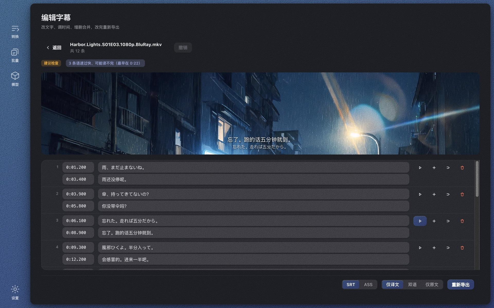

# Wave Subs

**看片找不到字幕？** Wave Subs 用本地 AI 直接从影片生成 SRT / ASS 字幕，并自动翻译到你的语言。识别、对齐、翻译、编辑全部在你自己的电脑上完成——**无需联网，永久免费**。macOS（Apple Silicon）与 Windows。

> **Can't find subtitles for a video?** Wave Subs generates SRT / ASS subtitles from any video with local AI and auto-translates them into your language. Everything runs on your own machine — no internet needed, free forever. macOS (Apple Silicon) and Windows.

[](https://github.com/jason-jm/wavesubs/releases/latest)
[](LICENSE)


[English README](./README.md) · **官网：** https://wavesubs.com （11 种语言，按浏览器语言自动切换） · [下载](https://github.com/jason-jm/wavesubs/releases/latest) · [更新日志](CHANGELOG.md)



## 它做什么

1. **拖进影片** —— MKV / MP4 / MOV / TS 等；影片自带的文本字幕轨会被自动发现并优先使用
2. **本地 AI 识别并对齐** —— whisper.cpp（Apple Silicon 上 Metal 加速）识别对白、自动检测语种；时间轴按真实说话时刻精修，参数用六部整片对照官方字幕校准
3. **翻译并导出** —— 29 种目标语言，默认本地 Qwen3 模型（免费离线），也可接任何 OpenAI 兼容接口；导出 SRT / ASS，附带质检结论

还有：带视频预览的字幕编辑器（HEVC / DTS 也能预览）、整季批量与逐文件设置、术语表、识别与译文分层缓存（换模型严格重翻）、32 种界面语言。

**隐私：** 没有账号、统计、服务器。视频从不上传；只有你自己配置云端翻译时，字幕文本才会发给你选的服务商。

## 安装

| | macOS | Windows |
|---|---|---|
| 下载 | [DMG](https://github.com/jason-jm/wavesubs/releases/latest) | [安装程序或便携 ZIP](https://github.com/jason-jm/wavesubs/releases/latest) |
| 包管理器 | `brew install --cask jason-jm/wavesubs/wavesubs` | `scoop bucket add wavesubs https://github.com/jason-jm/scoop-wavesubs`<br>`scoop install wavesubs` |
| 要求 | macOS 12+，Apple Silicon | Windows 10+，x64，建议 16 GB 内存 |

ffmpeg 与 whisper.cpp 已随包附带。首次启动会引导下载识别模型（1.6～3 GB），之后不再联网。各模型的内存要求见[官网](https://wavesubs.com/#requirements)。

## 平台支持

| | macOS | Windows |
|---|---|---|
| 架构 | Apple Silicon (arm64) | x64 |
| 最低版本 | macOS 12 | Windows 10 |
| 安装包 | DMG | NSIS 安装程序 / 便携 ZIP |
| 随包依赖 | 自编 LGPL ffmpeg + 静态 whisper/llama | 官方预编译 LGPL ffmpeg + whisper/llama |
| 加速 | Metal | CPU（BLAS） |
| 签名 | Developer ID + 公证 | Authenticode |

功能完全一致：三种字幕来源、18 种字幕格式、本地/云端翻译、批量队列与单文件独立设置、
32 种界面语言。Windows 版可以在 macOS 上交叉构建，不需要 Wine。

平台差异只在三处，都在代码里做了分支：
- 窗口外观：macOS 用 `hiddenInset` + 交通灯内嵌侧边栏，Windows 用 `titleBarOverlay`
  （按钮符号颜色跟随深浅色主题）
- 二进制查找：Windows 补 `.exe` 后缀；whisper 与 llama 各占一个目录，
  因为两边带同名不同版本的 `ggml.dll`，而 Windows 找 DLL 以 exe 同目录优先
- 字体栈：两套系统字体都列在同一份 CSS 里

## 环境依赖

```bash
brew install ffmpeg whisper-cpp
npm install
# 下载一个 Whisper 模型（开发期放在项目 models/ 目录）
curl -L -o models/ggml-base.bin \
  https://huggingface.co/ggerganov/whisper.cpp/resolve/main/ggml-base.bin
```

模型可换：`ggml-small.bin` / `ggml-medium.bin` / `ggml-large-v3.bin`（质量更好、更慢），同样放进 `models/`。

## 使用

```bash
# GUI（开发模式）
npm run dev

# CLI：语音识别成原文 SRT（输出到视频同目录）
npm run cli -- /path/to/movie.mkv

# 查看文件里有哪些音轨与字幕轨
npm run cli -- /path/to/movie.mkv --list-tracks

# 用内嵌的第 3 条字幕轨，翻译成中文双语 ASS
npm run cli -- /path/to/movie.mkv --sub-track 3 --translate --content bilingual --format ass

# 直接翻译一个字幕文件（格式与编码自动识别）
npm run cli -- /path/to/movie.chs.ass --translate --target zh

# 类型检查
npm run typecheck
```

## 打包与签名

```bash
npm run dist          # electron-vite build → electron-builder → scripts/sign.ts
```

electron-builder 配了 `identity: null`，签名全部由 `scripts/sign.ts` 从内到外自己做，
身份按这个顺序挑：`WAVESUBS_SIGN_IDENTITY`（或 `CSC_NAME`）→ 钥匙串里的
Developer ID Application → 名字含 `Wave Subs` 的自签名证书 → ad-hoc。

**ad-hoc 签名会让钥匙串反复弹窗**：它的「指定要求」就是可执行文件的 cdhash，
每打一次包就变一次，而钥匙串条目的访问控制记的正是这个要求。于是每次重新打包后，
第一次用云端翻译（safeStorage 解密 API Key）都会弹一次
「Wave Subs 想要使用你储存在钥匙串的 "Wave Subs Safe Storage" 中的机密信息」。

本机开发做一张固定证书就不再弹（一次性）：钥匙串访问 →「证书助理」→「创建证书…」，
名称 `Wave Subs Self-Signed`、身份类型「自签名根证书」、证书类型「代码签名」。
对外分发用 Developer ID Application 证书，用户侧一次都不会弹。

## 从 SubFlow 改名过来的用户数据迁移

产品原名 SubFlow，2026-08-23 更名为 Wave Subs。

`app.getPath('userData')` 是按 `app.getName()` 算的，改名后从
`~/Library/Application Support/subflow` 变成 `.../Wave Subs`。`src/main/migrate.ts`
在启动时（**必须在 `new SettingsStore()` 之前**）把旧设置搬过来，模型目录用 rename
挪过来而不是复制——那是几个 GB。

**只有一样迁不过来：云端 API Key。** safeStorage 的主密钥存在钥匙串条目
`subflow Safe Storage` 里，条目名同样跟着 `app.getName()` 走，改名后 Electron 会另建
一个 `Wave Subs Safe Storage`，密钥全新随机，旧密文在数学上解不开。所以迁移时直接
删掉 `apiKeyEnc` 字段——留着一段永远解不开的密文，只会让设置页显示"已配置"而实际用不了。
删掉之后 `hasApiKey` 如实返回 false，界面上原有的「去配置 Key」提示会自动出现。

## 自检脚本

发布前全部要绿（见 RELEASE.md），每个都测一类「错了不报错、只出坏结果」的静默故障：

| 脚本 | 钉住什么 |
|---|---|
| `check-i18n` | 32 语言键完整、占位符一致 |
| `check-css` | 布局不变量（计算样式级，抓选择器优先级事故） |
| `check-batch` | 批量合并规则 + 按语言自动选轨 |
| `check-cache` | **缓存失效矩阵**：换模型/术语表/提示词必重翻 |
| `check-glossary` | 术语注入与命中过滤；空表提示词逐字节不变 |
| `check-qc` | 质检规则双向（该报的报、不该报的不报） |
| `check-editor` | 编辑操作（时间解析往返、合并、过期标记、撤销） |
| `check-preview` | Range 解析 + 真 ffmpeg 片段生成（含残缺输入） |
| `check-site` | 官网：11 种语言页面、资源、语言自动跳转矩阵 |

## 代码结构

```
src/main/core/        领域核心（与 Electron 无关，可被 CLI 复用）
  jobstore.ts         任务缓存：源阶段/译文分层复用，四元组失效判定
  subtitle/qc.ts      成品质检（覆盖率/漏段/语速/残留…，阈值来自整片基准）
  preview.ts          片段预览：帧序列 + AAC（Chromium 播不了的格式靠它）
  media.ts            ffprobe/ffmpeg 封装：探测、抽音频
  asr/whisperCpp.ts   whisper.cpp 子进程封装（AsrProvider 的首个实现）
  subtitle/           Cue 模型与 SRT 序列化
  pipeline.ts         任务编排：probe → extract → transcribe → write
src/main/index.ts     Electron 主进程 + IPC
src/main/media-protocol.ts  wsmedia:// 媒体协议（Range + 路径白名单）
src/preload/          contextBridge 暴露的类型化 API
src/renderer/         React UI
scripts/cli.ts        命令行入口
```

## 许可

本项目代码以 [MIT 许可证](./LICENSE) 发布。随包分发的第三方组件（ffmpeg LGPL、whisper.cpp / llama.cpp MIT、
Whisper 与 Qwen 模型等）各自的许可见 [THIRD-PARTY-LICENSES.md](./THIRD-PARTY-LICENSES.md)。
