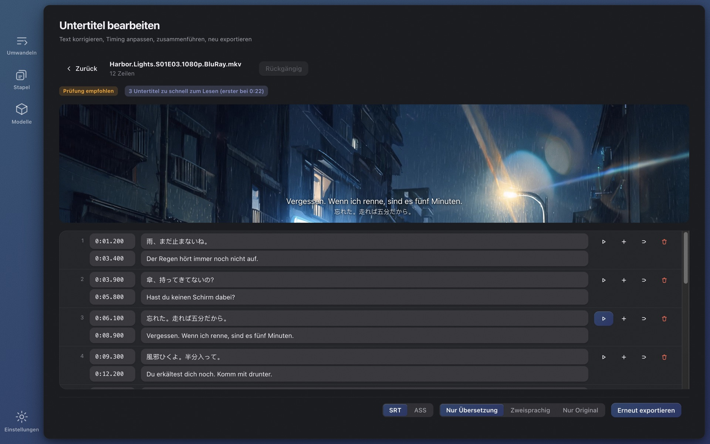

# Wave Subs

[English](../README.md) · [简体中文](./README.zh-CN.md) · [日本語](./README.ja.md) · [한국어](./README.ko.md) · [Français](./README.fr.md) · **Deutsch** · [Русский](./README.ru.md) · [Bahasa Indonesia](./README.id.md) · [Bahasa Melayu](./README.ms.md) · [Tiếng Việt](./README.vi.md) · [ไทย](./README.th.md)

**Keine Untertitel für ein Video gefunden?** Wave Subs erstellt SRT / ASS-Untertitel aus jedem Video mit lokaler KI und übersetzt sie in deine Sprache. Erkennung, Timing, Übersetzung, Text im Bild und Bearbeitung laufen komplett auf deinem eigenen Rechner: Nichts wird hochgeladen, kein Konto ist nötig, und alles ist kostenlos und Open Source. macOS (Apple Silicon) und Windows.

**Website:** https://wavesubs.com (11 Sprachen) · [Download](https://github.com/jason-jm/wavesubs/releases/latest) · [Änderungsprotokoll](../CHANGELOG.md) (Englisch) · [Datenschutzerklärung](https://wavesubs.com/en/privacy.html) (Englisch)

## So funktioniert es

1. **Video, Untertiteldatei oder einen ganzen Ordner ablegen.** MKV, MP4, MOV, TS, AVI und alles andere, was ffmpeg lesen kann, auch reine Audiodateien. Enthält das Video bereits eine Text-Untertitelspur, wird sie erkannt und direkt verwendet.
2. **Lokale KI erkennt die Dialoge und synchronisiert sie.** whisper.cpp erkennt die Sprache auf deinem Rechner mit automatischer Spracherkennung. Jeder Untertitel wird anschließend auf den Moment gesetzt, in dem die Zeile tatsächlich gesprochen wird.
3. **Übersetzen und exportieren.** Ein lokales Qwen3-Modell übersetzt in deine Sprache (oder ein Cloud-Dienst, falls du einen einrichtest). Das Ergebnis wird als SRT oder ASS neben dem Video gespeichert, mit einem Qualitätsurteil, das dir sagt, welche Zeilen einen Blick wert sind.

Ein zweistündiger Film braucht mit Large v3 Turbo auf einem Mac mit M-Chip etwa 3–6 Minuten für die Erkennung plus einige Minuten lokale Übersetzung. Lege eine ganze Staffel ab und lass es laufen.

## Was du bekommst

### Drei Untertitelquellen

- **Spracherkennung.** Die Whisper-Modellfamilie (Tiny bis Large v3) über whisper.cpp, auf Apple Silicon mit Metal beschleunigt. Die Erkennung deckt die knapp 100 Sprachen ab, die Whisper unterstützt. Die gesprochene Sprache wird ermittelt, indem fünf 20-Sekunden-Fenster dort abgetastet werden, wo am dichtesten gesprochen wird, und abstimmen; ein Vorspannlied kann so keine ganze Folge falsch etikettieren. Du kannst die Sprache auch selbst festlegen.
- **Eingebettete Untertitelspuren.** Textspuren in MKV- / MP4-Dateien werden erkannt und der Erkennung vorgezogen (schneller und exakt); bei mehreren Spuren wählst du pro Datei. Bitmap-Untertitel (PGS, VobSub, DVB) taugen nicht als Quelle.
- **Externe Untertiteldateien.** 18 Formate, darunter SRT, ASS / SSA, WebVTT, SAMI, MicroDVD, SubViewer, MPL2, VPlayer, JACOsub, RealText, STL, PJS, LRC, TTML / DFXP und SBV. Die Zeichenkodierung wird automatisch erkannt (UTF-8, UTF-16, GBK, Big5, Shift-JIS, EUC-KR, Windows-1252).

### Timing, das der Sprache folgt

- Anfang und Ende jedes Untertitels werden mit Sprachaktivitätserkennung (Silero VAD) und Lautstärkeanalyse auf die tatsächliche Sprache ausgerichtet. Die Parameter wurden an den offiziellen Untertiteln von sechs Spielfilmen kalibriert, nicht geraten.
- Zeilen, die Whisper erfindet, wo niemand spricht, werden entfernt, reine ♪-Musikzeilen verworfen und stotternde Wiederholungen (やばいやばいやばい) zusammengefasst.
- Lange Zeilen werden an natürlichen Grenzen geteilt, mit eigenen Regeln für Japanisch.

### Übersetzung

- **29 Zielsprachen:** Deutsch, Englisch, Chinesisch (vereinfacht und traditionell), Japanisch, Koreanisch, Französisch, Spanisch, Portugiesisch, Italienisch, Niederländisch, Russisch, Ukrainisch, Polnisch, Tschechisch, Ungarisch, Schwedisch, Dänisch, Norwegisch, Finnisch, Griechisch, Türkisch, Hebräisch, Arabisch, Hindi, Thai, Vietnamesisch, Indonesisch und Malaiisch. Beim ersten Start ist deine Systemsprache das Ziel.
- **Standardmäßig lokal.** Qwen3-Modelle von 1.7B bis 32B laufen über llama.cpp auf deinem Rechner und werden in der App heruntergeladen. Kostenlos, offline, ohne Kontingent.
- **Cloud, wenn du willst.** Jede OpenAI-kompatible API mit deinem eigenen Schlüssel, mit Voreinstellungen für OpenAI, Anthropic Claude, Google Gemini, DeepSeek, Qwen, Zhipu GLM, Moonshot, Volcano Ark, SiliconFlow, OpenRouter und Azure OpenAI. Der Schlüssel wird verschlüsselt im Anmeldedatenspeicher des Betriebssystems abgelegt. Gesendet wird nur der Untertiteltext, nie das Video.
- **Glossar.** Lege die Übersetzung von Namen und Begriffen einmal fest, und eine ganze Staffel bleibt konsistent. Nur die Einträge, die im aktuellen Stapel vorkommen, werden eingespeist, und das Glossar gilt für Dialoge und Text im Bild gleichermaßen.
- **Ein Name, eine Schreibweise.** Ein abschließender Durchlauf gruppiert jeden wiederkehrenden Eigennamen und ersetzt Minderheitsschreibweisen durch die Mehrheit, damit eine Figur nicht in Folge 3 „Weber“ und in Folge 4 „Webber“ heißt.
- **Gemacht für Untertitel, nicht für Absätze.** Zeilen werden in Stapeln mit Ausrichtungsankern übersetzt, sodass eine Übersetzung nie auf die Nachbarzeile rutscht; ein halber Satz bleibt ein halber Satz; verstümmelte Transkripte bekommen trotzdem die plausibelste Übersetzung statt einer Lücke; ein Modell, das den Quelltext unübersetzt zurückgibt, wird in jeder Wiederholungsrunde abgefangen.
- **Ausgabe:** nur Übersetzung, zweisprachig oder nur Original, als SRT oder ASS.

### Text im Bild

Schalte „Text im Bild übersetzen“ ein, und Schilder, Notizen, Textnachrichten und Chatblasen, Aushänge, Dokumente, Titelkarten, Episodentitel und Namensschilder werden ebenfalls aus dem Bild gelesen und übersetzt.

- Nutzt die Texterkennung des Betriebssystems: Vision auf macOS, Windows.Media.Ocr auf Windows. Kein zusätzliches Modell zum Herunterladen; eine 24-Minuten-Folge dauert zwei bis drei Minuten länger, parallel zur Spracherkennung.
- Jede Übersetzung steht neben dem Original: direkt darunter, dann daneben, dann am oberen Bildrand und über dem Original nur als letzter Ausweg. Sie betritt nie den Bereich des Dialoguntertitels, und die Schrift schrumpft, bevor etwas verdeckt wird. Nur ein ganzer Bildschirm voller Text (eine E-Mail, ein Chatverlauf, ein Dokument) wird durch eine deckende Fläche ersetzt.
- Was draußen bleibt: Vor- und Abspann (einschließlich Besetzungs- und Sprecherlisten), ins Bild eingebrannte Untertitel, Senderlogos und Wasserzeichen, dichte Beschriftungen wie Kartenmarkierungen und Buchrücken, ein Türschild, das sich durch einen ganzen Film wiederholt, von der Erkennung entstellte Emoticons und Übersetzungen, die mit dem Original identisch sind.
- In der ASS-Ausgabe steht der Text an der Stelle des Originals; SRT setzt ihn nach oben. Der Editor hält Dialoguntertitel und Text im Bild in getrennten Reitern, und dieselbe Datei liefert immer dasselbe Ergebnis.

### Ein Editor mit Videovorschau

- Text und Timing in einer Tabelle bearbeiten; einfügen, löschen, zusammenführen, rückgängig machen; Änderungen werden automatisch gespeichert.
- Klicke auf eine Zeile, um genau zu hören, wie sie gesprochen wurde. Formate, die ein Browser nicht abspielt (HEVC, DTS, TrueHD), werden über das mitgelieferte ffmpeg in der Vorschau gezeigt.
- Qualitätsbefunde sind anklickbar. Zeilen, deren Original du bearbeitet hast, werden markiert, und eine Neuübersetzung berührt nur diese Zeilen.
- Jederzeit erneut exportieren: SRT oder ASS, nur Übersetzung, zweisprachig oder nur Original.

### Ein Qualitätsbericht für jede Datei

Jede fertige Datei bekommt ein Urteil (Prüfungen bestanden, sehenswert, Probleme gefunden) mit Begründung: Sprachabdeckung, Lücken, überlange Zeilen, zu hohe Lesegeschwindigkeit, fehlende Übersetzungen, im Übersetzten verbliebener Quelltext, vertauschtes Timing. Die Schwellenwerte stammen aus Messungen an ganzen Filmen, und jeder Befund verweist auf die Zeile im Editor.

### Eine ganze Staffel auf einmal

- Lege einen Ordner ab. Die Dateien werden nacheinander verarbeitet; ein Fehler stoppt den Stapel nicht; jederzeit abbrechen.
- Alle Dateien folgen den gemeinsamen Einstellungen, und jede Datei kann Untertitelquelle, Tonspur, Sprache, Übersetzungsdienst oder Format überschreiben.
- Der Fortschritt zeigt die aktuelle Phase und die geschätzte Restzeit; die Abschlusskarte verrät, welches Gerät die Erkennung gemacht hat (Apple-M-GPU, Vulkan-GPU oder CPU).
- Nichts wird zweimal gemacht. Die Erkennung wird nach Dateiidentität und jedem beeinflussenden Parameter zwischengespeichert, sodass erneutes Exportieren oder ein Formatwechsel Sekunden dauert. Eine Übersetzung wird nur wiederverwendet, wenn Engine und Modell, Zielsprache, Prompt-Version und Glossar alle übereinstimmen; sonst wird sie vollständig neu gemacht, und alte Ausgabe wird nie vermischt.

### Modelle, in der App heruntergeladen

- Beim ersten Start empfiehlt die Seite Konvertieren ein Modell für deinen Rechner und bietet „Herunterladen und fortfahren“ an; du kannst starten, sobald der Download fertig ist.
- Die Seite Modelle kennzeichnet jedes Modell als passend, nutzbar oder zu schwer für deinen Arbeitsspeicher und zeigt, wie genau es für deine Sprache ist (siehe unten). Downloads kommen von Hugging Face oder ModelScope (in Festlandchina zuerst versucht), werden per SHA-256 geprüft, und wenn jede Quelle scheitert, listet die App direkte URLs, damit du die Datei selbst holen und in den Modellordner legen kannst.

### Oberfläche

32 Oberflächensprachen (Arabisch, Bengalisch, Chinesisch vereinfacht und traditionell, Tschechisch, Dänisch, Niederländisch, Englisch, Finnisch, Französisch, Deutsch, Griechisch, Hebräisch, Hindi, Ungarisch, Indonesisch, Italienisch, Japanisch, Koreanisch, Malaiisch, Norwegisch, Persisch, Polnisch, Portugiesisch, Rumänisch, Russisch, Spanisch, Schwedisch, Thai, Türkisch, Ukrainisch, Vietnamesisch), heller und dunkler Modus, zehn Farbpaletten, vollständiger Tastaturfokus. Die App prüft einmal beim Start auf eine neue Version (ein Schalter in den Einstellungen deaktiviert das) und bietet einen Download-Knopf; über Homebrew oder Scoop installierte Kopien bekommen stattdessen den passenden Aktualisierungsbefehl.

## Ein Erkennungsmodell wählen

Die Whisper-Modelle unterscheiden sich weit stärker nach Sprache als nach Größe. Die Tabelle zeigt den Bedeutungserhalt: den Anteil erkannter Zeilen, deren Sinn intakt blieb, blind beurteilt an je 50 Sätzen aus einem 30-minütigen Ausschnitt eines englischen Films (*Spotlight*), eines deutschen Films (*Ballon*) und einer japanischen Serie (NHK, *The 13 Lords of the Shogun*), verarbeitet mit der echten Produkt-Pipeline. Koreanisch und Mandarin liegen in öffentlichen Benchmarks auf derselben Stufe wie Japanisch; Spanisch, Italienisch und Portugiesisch schneiden etwas besser ab als Deutsch, Französisch, Niederländisch und Polnisch etwas schlechter.

| Modell | Download | RAM im Betrieb | Englisch | Europäische Sprachen | Japanisch · Koreanisch · Chinesisch |
|---|---|---|---|---|---|
| Tiny | 75 MB | 0,5 GB | 68 % | 49 % | 37 % |
| Base | 142 MB | 0,7 GB | 79 % | 61 % | 57 % |
| Small | 466 MB | 1,2 GB | 92 % | 81 % | 66 % |
| Medium | 1,5 GB | 2,6 GB | 91 % | 81 % | 79 % |
| Large v3 Turbo | 1,6 GB | 2,2 GB | 95 % | 96 % | 89 % |
| Large v3 | 3,0 GB | 4,5 GB | 96 % | 94 % | 88 % |

Die App kennzeichnet ab 85 % *empfohlen*, ab 75 % *nutzbar*, ab 60 % *grenzwertig* und alles darunter *nicht empfohlen*. Kurz: Für Englisch reicht Small, für europäische Sprachen ist es nutzbar, und Japanisch, Koreanisch und Chinesisch wollen Large v3 Turbo oder besser. Large v3 Turbo liegt bei ganzen Filmen qualitativ innerhalb eines Punkts von Large v3 und läuft etwa dreimal so schnell; es ist daher auf den meisten Rechnern die Standardempfehlung.

| Dein Rechner | Erkennung | Übersetzung | Hinweis |
|---|---|---|---|
| Mac 8 GB | Small oder Large v3 Turbo | Qwen3 1.7B | Funktioniert; für Turbo andere Apps schließen |
| Mac 16 GB | Large v3 Turbo | Qwen3 8B | Die Standardbalance aus Qualität und Tempo |
| Mac 32 GB | Large v3 | Qwen3 14B | Beste Erkennung, genauere Übersetzung |
| Mac ab 48 GB | Large v3 | Qwen3 32B | Beste Übersetzungsqualität, langsamer |
| Windows-PC 16 GB | Large v3 Turbo | Qwen3 4B | CPU-Erkennung; rechne mit einem Vielfachen der Apple-Silicon-Zeit |
| Windows-PC 32 GB | Large v3 Turbo | Qwen3 8B | Große Modelle laufen; Zeit einplanen |

Lokale Übersetzungsmodelle: Qwen3 1.7B (1,8 GB Download, 2,5 GB RAM), 4B (2,4 GB, 3,5 GB), 8B (4,9 GB, 6 GB), 14B (9,0 GB, 10,5 GB), 32B (19,7 GB, 22 GB). Erkennung und Übersetzung laufen nacheinander, nie gleichzeitig.

## Gemessene Genauigkeit

Aus einem Korpus von 70 Spielfilmen (offizielle Untertitelspuren und bekannte Fansub-Veröffentlichungen als Referenz; 36 japanisch, 21 englisch, 13 andere), September 2026:

- **Erkennung (Whisper Large v3):** Englisch, 19 Filme, durchschnittliche Wortfehlerrate 17,4 % (Dokumentationen und Interviews etwa 6 %, offizielle Serien 10–13 %). Japanisch, 18 Filme, Zeichenfehlerrate 19,1 %, auf Lesungsebene 13,8 %; etwa ein Drittel der „Fehler“ sind Schreibvarianten (分かった / わかった). Offizielle deutsche, norwegische und italienische Untertitel sind verdichtete Umschreibungen und lassen sich nicht wörtlich bewerten.
- **Übersetzung (Japanisch → Chinesisch, lokales Qwen3):** Mit einem menschlichen Transkript als Eingabe liegt die Bedeutungstreue bei 93,5 % für 8B, 94,4 % für 14B und 93,9 % für 32B; die Standardwahl 8B ist also solide. Ende zu Ende (Erkennung → Übersetzung) sind es etwa 83–85 %; fast der gesamte Abstand kommt aus Erkennungsfehlern.
- **Timing:** F1 der Bild-für-Bild-Maske 81,8 %; 57 % der Untertitelanfänge liegen innerhalb von ±250 ms des menschlichen Untertitels. Menschliche Untertitel verschiedener Veröffentlichungen unterscheiden sich selbst um 100–300 ms im Vorlauf.

## Datenschutz

Es gibt kein Konto, keine Statistik und keinen Server. Das Video verlässt deinen Rechner nie; Erkennung, Synchronisation, Übersetzung, Text im Bild und Bearbeitung laufen lokal, und sobald die Modelle heruntergeladen sind, funktioniert die App ohne Netz.

Genau drei Dinge berühren das Netzwerk, und jedes davon liegt in deiner Hand:

1. **Modell-Downloads** von Hugging Face oder ModelScope, wenn du ein Modell anforderst.
2. **Cloud-Übersetzung**, nur wenn du selbst einen Anbieter einrichtest; er erhält den Untertiteltext und rechnet direkt mit dir ab.
3. **Die Aktualisierungsprüfung** beim Start, die eine kleine JSON-Datei aus dem GitHub-Release dieses Repositorys holt. Sie lässt sich in den Einstellungen abschalten, und die App-Store-Version prüft gar nicht.

Vollständige Erklärung (Englisch): https://wavesubs.com/en/privacy.html

## Voraussetzungen und Installation

| | macOS | Windows |
|---|---|---|
| Voraussetzungen | macOS 12 oder neuer, Apple Silicon (ab M1) | Windows 10 oder neuer, x64, 16 GB RAM empfohlen |
| Download | [DMG oder ZIP](https://github.com/jason-jm/wavesubs/releases/latest), von Apple beglaubigt | [Installer oder portables ZIP](https://github.com/jason-jm/wavesubs/releases/latest) |
| Paketmanager | `brew install --cask jason-jm/wavesubs/wavesubs` | `scoop bucket add wavesubs https://github.com/jason-jm/scoop-wavesubs` `scoop install wavesubs` |
| Beschleunigung | Metal (Erkennung und Übersetzung) | Erkennung auf der CPU; Übersetzung auf jeder GPU mit Vulkan-Treiber, sonst CPU |

ffmpeg, whisper.cpp und llama.cpp sind enthalten: installieren und loslegen. Spracherkennungsmodelle sind 75 MB bis 3 GB groß, lokale Übersetzungsmodelle 1,8 bis 20 GB; beide werden bei Bedarf in der App heruntergeladen. Intel-Macs werden nicht unterstützt: Die lokale Erkennung hängt von Metal ab, und auf Intel wäre sie zu langsam, um nützlich zu sein.

**Windows:** Der Installer ist noch nicht signiert, daher zeigt SmartScreen beim ersten Start „Der Computer wurde durch Windows geschützt“. Klicke auf *Weitere Informationen → Trotzdem ausführen*. Prüfsummen für jede Datei stehen in `SHA256SUMS.txt` auf der Release-Seite. Für Text im Bild installiere das Windows-Sprachpaket der gesprochenen Sprache mit angehakter *Optischer Zeichenerkennung*.

## Bekannte Einschränkungen

- Unter Windows ist die Texterkennung im Bild schwächer als unter macOS; vertikales Japanisch wird meist übersehen.
- Eine Reihe von Namen außerhalb des Abspanns (Schauspielernamen auf einem Theaterplakat, Hauptdarsteller eine halbe Minute vor dem Stab) wird noch übersetzt.
- Lokale Modelle bis 8B sind bei Eigennamen wie Institutionsnamen und historischen Begriffen nicht zuverlässig. Das Glossar ist die verlässliche Lösung.
- Eine Veröffentlichung, die ihre eigene Übersetzung des Texts im Bild bereits eingebrannt hat, zeigt beides.
- Keine Builds für Intel-Macs oder Windows ARM64; die Erkennung unter Windows läuft nur auf der CPU.

## Häufige Fragen

**Welche Videos kann es untertiteln?** MKV, MP4, MOV, TS, AVI und andere gängige Formate; auch HEVC-, DTS- und TrueHD-Streams, die Browser nicht abspielen, weil das mitgelieferte ffmpeg alles dekodiert. Reine Audiodateien funktionieren ebenfalls.

**Welche Sprachen?** Die Erkennung deckt die knapp 100 Sprachen von Whisper mit automatischer Erkennung ab; 29 Zielsprachen für die Übersetzung; Oberfläche in 32 Sprachen.

**Geht es wirklich ohne Internet?** Ja. Nur der einmalige Modell-Download, eine selbst eingerichtete Cloud-Übersetzung und die optionale Aktualisierungsprüfung nutzen das Netz.

**Wie genau ist es?** Siehe *Ein Erkennungsmodell wählen* und *Gemessene Genauigkeit* oben. Wähle das Modell nach deiner Sprache, und jede Datei kommt mit einem Qualitätsurteil.

**Das Video hat schon eine Untertitelspur.** Eingebettete Textspuren werden erkannt und bevorzugt, es geht direkt zur Übersetzung. Bitmap-Spuren (PGS / VobSub) sind die Ausnahme.

**Modell-Downloads scheitern in Festlandchina.** Alle Modelle gibt es bei ModelScope, das die App zuerst versucht, wenn die Systemsprache vereinfachtes Chinesisch ist oder die Zeitzone in China liegt. Scheitert jede Quelle, listet die Fehlermeldung direkte URLs für einen Browser oder Download-Manager.

**Was unterscheidet es von Online-Untertitelgeneratoren?** Online-Werkzeuge verlangen den Upload des ganzen Films, rechnen pro Minute ab und begrenzen die Länge. Wave Subs lädt nichts hoch, kostet nichts und hat keine Längenbegrenzung; das Tempo hängt von deinem Rechner ab.

## Feedback und Support

- [Fehlerberichte und Funktionswünsche](https://github.com/jason-jm/wavesubs/issues) auf GitHub oder das [Feedback-Formular](https://wavesubs.com/de/feedback.html), wenn du kein GitHub-Konto hast. Eine fehlgeschlagene Aufgabe hat einen Knopf *Protokoll kopieren*; füge dieses Protokoll in den Bericht ein.
- [Discussions](https://github.com/jason-jm/wavesubs/discussions) für Fragen und Konfigurationen.
- [Änderungsprotokoll](../CHANGELOG.md) (Englisch) für die Änderungen jeder Version.

## Lizenz

Wave Subs steht unter der [MIT-Lizenz](../LICENSE). Die mitgelieferten Drittkomponenten (ffmpeg unter LGPL, whisper.cpp und llama.cpp unter MIT, die Whisper- und Qwen-Modelle und weitere) haben ihre eigenen Lizenzen, aufgelistet in [THIRD-PARTY-LICENSES.md](../THIRD-PARTY-LICENSES.md).

*Bauen aus dem Quellcode, die Kommandozeile und die Codestruktur sind in [DEVELOPMENT.md](../DEVELOPMENT.md) beschrieben (Englisch).*
