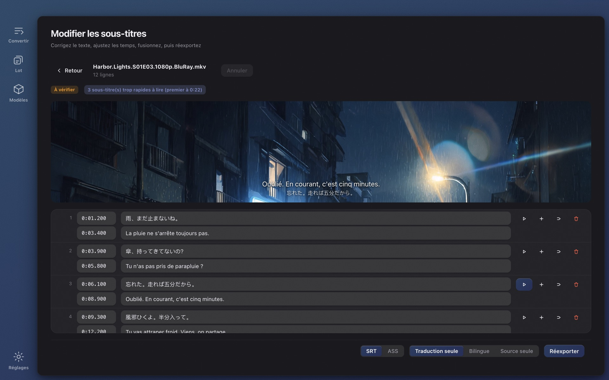

# Wave Subs

[English](../README.md) · [简体中文](./README.zh-CN.md) · [日本語](./README.ja.md) · [한국어](./README.ko.md) · **Français** · [Deutsch](./README.de.md) · [Русский](./README.ru.md) · [Bahasa Indonesia](./README.id.md) · [Bahasa Melayu](./README.ms.md) · [Tiếng Việt](./README.vi.md) · [ไทย](./README.th.md)

**Pas de sous-titres pour une vidéo ?** Wave Subs génère des sous-titres SRT / ASS à partir de n'importe quelle vidéo grâce à une IA locale et les traduit dans votre langue. Reconnaissance, minutage, traduction, texte à l'écran et édition : tout se passe sur votre ordinateur. Rien n'est envoyé, aucun compte n'est nécessaire, et c'est gratuit et open source. macOS (Apple Silicon) et Windows.

**Site web :** https://wavesubs.com (11 langues) · [Télécharger](https://github.com/jason-jm/wavesubs/releases/latest) · [Journal des modifications](../CHANGELOG.md) (anglais) · [Politique de confidentialité](https://wavesubs.com/en/privacy.html) (anglais)

## Fonctionnement

1. **Déposez une vidéo, un fichier de sous-titres ou un dossier entier.** MKV, MP4, MOV, TS, AVI et tout ce que ffmpeg sait lire, fichiers audio compris. Si la vidéo contient déjà une piste de sous-titres texte, elle est détectée et utilisée directement.
2. **L'IA locale reconnaît les dialogues et les synchronise.** whisper.cpp reconnaît la parole sur votre machine avec détection automatique de la langue. Chaque réplique est ensuite calée sur l'instant où elle est vraiment prononcée.
3. **Traduisez et exportez.** Un modèle Qwen3 local traduit dans votre langue (ou un service cloud, si vous en branchez un). Le résultat est écrit en SRT ou ASS à côté de la vidéo, avec un verdict de qualité qui indique les lignes à vérifier.

Un film de deux heures se reconnaît en 3 à 6 minutes environ avec Large v3 Turbo sur un Mac à puce M, plus quelques minutes de traduction locale. Déposez une saison entière et laissez tourner.

## Ce que vous obtenez

### Trois sources de sous-titres

- **Reconnaissance vocale.** La famille de modèles Whisper (de Tiny à Large v3) via whisper.cpp, accélérée par Metal sur Apple Silicon. La reconnaissance couvre la centaine de langues prises en charge par Whisper. La langue parlée est détectée en échantillonnant cinq fenêtres de 20 secondes là où la parole est la plus dense, puis par vote : un générique d'ouverture ne peut pas faire étiqueter tout un épisode de travers. Vous pouvez aussi fixer la langue vous-même.
- **Pistes de sous-titres intégrées.** Les pistes texte des fichiers MKV / MP4 sont détectées et préférées à la reconnaissance (plus rapide et exact) ; vous choisissez la piste par fichier s'il y en a plusieurs. Les sous-titres bitmap (PGS, VobSub, DVB) ne peuvent pas servir de source.
- **Fichiers de sous-titres externes.** 18 formats, dont SRT, ASS / SSA, WebVTT, SAMI, MicroDVD, SubViewer, MPL2, VPlayer, JACOsub, RealText, STL, PJS, LRC, TTML / DFXP et SBV. L'encodage est détecté automatiquement (UTF-8, UTF-16, GBK, Big5, Shift-JIS, EUC-KR, Windows-1252).

### Un minutage qui suit la parole

- Les bornes de chaque réplique sont alignées sur la parole réelle grâce à la détection d'activité vocale (Silero VAD) et à l'analyse du volume. Les paramètres ont été calibrés sur les sous-titres officiels de six longs métrages, pas devinés.
- Les lignes que Whisper invente quand personne ne parle sont supprimées, les répliques ne contenant que des ♪ sont retirées, et les répétitions bégayées (やばいやばいやばい) sont réduites.
- Les répliques trop longues sont coupées à des frontières naturelles, avec des règles propres au japonais.

### Traduction

- **29 langues cibles :** français, anglais, chinois (simplifié et traditionnel), japonais, coréen, allemand, espagnol, portugais, italien, néerlandais, russe, ukrainien, polonais, tchèque, hongrois, suédois, danois, norvégien, finnois, grec, turc, hébreu, arabe, hindi, thaï, vietnamien, indonésien et malais. Au premier lancement, la cible est la langue de votre système.
- **Local par défaut.** Les modèles Qwen3, de 1.7B à 32B, tournent sur votre machine via llama.cpp et se téléchargent dans l'application. Gratuit, hors ligne, sans quota.
- **Le cloud si vous le souhaitez.** N'importe quelle API compatible OpenAI avec votre propre clé, avec des préréglages pour OpenAI, Anthropic Claude, Google Gemini, DeepSeek, Qwen, Zhipu GLM, Moonshot, Volcano Ark, SiliconFlow, OpenRouter et Azure OpenAI. La clé est stockée chiffrée dans le coffre d'identifiants du système. Seul le texte des sous-titres est envoyé, jamais la vidéo.
- **Glossaire.** Fixez une fois la traduction des noms et des termes, et toute une saison reste cohérente. Seules les entrées présentes dans le lot en cours sont injectées, et le glossaire s'applique aussi bien aux dialogues qu'au texte à l'écran.
- **Un nom, une graphie.** Une passe finale regroupe chaque nom propre récurrent et aligne les graphies minoritaires sur la majoritaire : un personnage n'est pas « Weber » dans l'épisode 3 et « Webber » dans l'épisode 4.
- **Conçu pour des sous-titres, pas pour des paragraphes.** Les lignes sont traduites par lots avec des ancres d'alignement, donc une traduction ne peut jamais glisser sur la ligne voisine ; une demi-phrase reste une demi-phrase ; une transcription abîmée reçoit tout de même la traduction la plus plausible plutôt qu'un blanc ; un modèle qui renvoie la source telle quelle est intercepté à chaque nouvelle tentative.
- **Sortie :** traduction seule, bilingue ou source seule, en SRT ou ASS.

### Texte à l'écran

Activez « Traduire le texte à l'écran » et les panneaux, notes, SMS et bulles de discussion, affiches, documents, cartons de titre, titres d'épisode et plaques de nom sont lus sur l'image et traduits eux aussi.

- Utilise la reconnaissance de texte intégrée au système : Vision sur macOS, Windows.Media.Ocr sur Windows. Aucun modèle supplémentaire à télécharger ; un épisode de 24 minutes prend deux à trois minutes de plus, en parallèle de la reconnaissance vocale.
- Chaque traduction est placée à côté de l'original : juste en dessous, puis à côté, puis en haut de l'image, et par-dessus l'original seulement en dernier recours. Elle n'entre jamais dans l'espace occupé par le sous-titre du dialogue, et la taille du texte diminue avant que quoi que ce soit ne soit recouvert. Seul un écran entier de texte (un e-mail, un fil de messages, un document) est remplacé par un cartouche opaque.
- Ce qui reste à l'écart : génériques de début et de fin (listes des acteurs et des doubleurs comprises), sous-titres incrustés dans l'image, logos de chaînes et filigranes, petites étiquettes denses comme les repères d'une carte ou les dos de livres, une plaque de porte qui revient tout au long d'un film, les émoticônes déformées par la reconnaissance, et les traductions identiques à l'original.
- En ASS, le texte est positionné à l'endroit de l'original ; en SRT, il est placé en haut. L'éditeur sépare sous-titres de dialogue et texte à l'écran dans deux onglets, et le même fichier donne toujours le même résultat.

### Un éditeur avec aperçu vidéo

- Modifiez texte et minutage dans un tableau ; insérez, supprimez, fusionnez, annulez ; les modifications sont enregistrées automatiquement.
- Cliquez sur une ligne pour entendre exactement comment elle a été dite. Les formats qu'un navigateur ne lit pas (HEVC, DTS, TrueHD) sont prévisualisés grâce au ffmpeg intégré.
- Les constats de qualité sont cliquables. Les lignes dont vous avez modifié la source sont marquées, et une retraduction ne touche que celles-ci.
- Réexportez à tout moment : SRT ou ASS, traduction seule, bilingue ou source seule.

### Un rapport de qualité pour chaque fichier

Chaque fichier terminé reçoit un verdict (vérifications réussies, à relire, problèmes détectés) accompagné des raisons : couverture de la parole, trous, répliques trop longues, vitesse de lecture excessive, traductions manquantes, texte source resté dans la traduction, minutage inversé. Les seuils viennent de mesures sur des films entiers, et chaque constat renvoie à la ligne dans l'éditeur.

### Une saison entière d'un coup

- Déposez un dossier. Les fichiers sont traités l'un après l'autre ; un échec n'arrête pas le lot ; annulez à tout moment.
- Tous les fichiers suivent les réglages communs, et chacun peut remplacer la source de sous-titres, la piste audio, la langue, le service de traduction ou le format.
- La progression affiche l'étape en cours et le temps restant estimé ; la carte de fin indique quel périphérique a fait la reconnaissance (GPU Apple série M, GPU Vulkan ou CPU).
- Rien n'est fait deux fois. La reconnaissance est mise en cache par identité du fichier et par chaque paramètre qui l'influence, donc réexporter ou changer de format prend quelques secondes. Une traduction n'est réutilisée que si le moteur et le modèle, la langue cible, la version du prompt et le glossaire correspondent tous ; sinon elle est entièrement refaite, sans jamais mélanger l'ancien résultat.

### Des modèles téléchargés dans l'application

- Au premier lancement, la page Convertir recommande un modèle adapté à votre machine et propose « Télécharger et continuer » ; vous démarrez dès la fin du téléchargement.
- La page Modèles indique pour chaque modèle s'il est adapté, utilisable ou trop lourd pour votre mémoire, et sa précision dans votre langue (voir ci-dessous). Les téléchargements viennent de Hugging Face ou de ModelScope (essayé en premier en Chine continentale), sont vérifiés par SHA-256, et si toutes les sources échouent, l'application liste des URL directes pour récupérer le fichier vous-même et le déposer dans le dossier des modèles.

### Interface

32 langues d'interface (arabe, bengali, chinois simplifié et traditionnel, tchèque, danois, néerlandais, anglais, finnois, français, allemand, grec, hébreu, hindi, hongrois, indonésien, italien, japonais, coréen, malais, norvégien, persan, polonais, portugais, roumain, russe, espagnol, suédois, thaï, turc, ukrainien, vietnamien), mode clair et sombre, dix palettes de couleurs, focus clavier complet. L'application vérifie une fois au lancement si une nouvelle version existe (un interrupteur dans les Réglages le désactive) et propose un bouton de téléchargement ; les copies installées via Homebrew ou Scoop reçoivent à la place la commande de mise à jour correspondante.

## Choisir un modèle de reconnaissance

Les modèles Whisper diffèrent bien plus selon la langue que selon la taille. Le tableau montre la rétention du sens : la part des lignes reconnues dont le sens est resté intact, jugée à l'aveugle sur 50 phrases d'un extrait de 30 minutes d'un film anglais (*Spotlight*), d'un film allemand (*Ballon*) et d'une série japonaise (NHK, *The 13 Lords of the Shogun*), passés dans le pipeline réel du produit. Dans les évaluations publiques, le coréen et le mandarin se situent au même niveau que le japonais ; l'espagnol, l'italien et le portugais font un peu mieux que l'allemand, le français, le néerlandais et le polonais un peu moins bien.

| Modèle | Téléchargement | RAM utilisée | Anglais | Langues européennes | Japonais · Coréen · Chinois |
|---|---|---|---|---|---|
| Tiny | 75 Mo | 0,5 Go | 68 % | 49 % | 37 % |
| Base | 142 Mo | 0,7 Go | 79 % | 61 % | 57 % |
| Small | 466 Mo | 1,2 Go | 92 % | 81 % | 66 % |
| Medium | 1,5 Go | 2,6 Go | 91 % | 81 % | 79 % |
| Large v3 Turbo | 1,6 Go | 2,2 Go | 95 % | 96 % | 89 % |
| Large v3 | 3,0 Go | 4,5 Go | 96 % | 94 % | 88 % |

L'application marque *recommandé* à partir de 85 %, *utilisable* à partir de 75 %, *limite* à partir de 60 % et *déconseillé* en dessous. En bref : Small suffit pour l'anglais, reste utilisable pour les langues européennes, et le japonais, le coréen et le chinois demandent Large v3 Turbo ou mieux. Large v3 Turbo est à un point de Large v3 en qualité sur des films entiers tout en étant environ trois fois plus rapide ; c'est la recommandation par défaut sur la plupart des machines.

| Votre machine | Reconnaissance | Traduction | Remarques |
|---|---|---|---|
| Mac 8 Go | Small ou Large v3 Turbo | Qwen3 1.7B | Fonctionne ; fermez les autres applications pour Turbo |
| Mac 16 Go | Large v3 Turbo | Qwen3 8B | L'équilibre par défaut entre qualité et vitesse |
| Mac 32 Go | Large v3 | Qwen3 14B | Meilleure reconnaissance, traduction plus précise |
| Mac 48 Go et plus | Large v3 | Qwen3 32B | Meilleure qualité de traduction, plus lent |
| PC Windows 16 Go | Large v3 Turbo | Qwen3 4B | Reconnaissance sur CPU ; comptez plusieurs fois le temps d'Apple Silicon |
| PC Windows 32 Go | Large v3 Turbo | Qwen3 8B | Les gros modèles tournent ; prévoyez du temps |

Modèles de traduction locale : Qwen3 1.7B (1,8 Go à télécharger, 2,5 Go de RAM), 4B (2,4 Go, 3,5 Go), 8B (4,9 Go, 6 Go), 14B (9,0 Go, 10,5 Go), 32B (19,7 Go, 22 Go). Reconnaissance et traduction s'enchaînent, jamais en même temps.

## Précision mesurée

Sur un corpus de 70 longs métrages (pistes de sous-titres officielles et fansubs reconnus comme référence ; 36 japonais, 21 anglais, 13 autres), septembre 2026 :

- **Reconnaissance (Whisper Large v3) :** anglais, 19 films, taux d'erreur sur les mots moyen de 17,4 % (documentaires et entretiens vers 6 %, séries officielles 10–13 %). Japonais, 18 films, taux d'erreur sur les caractères de 19,1 %, 13,8 % au niveau de la lecture ; environ un tiers des « erreurs » sont des variantes d'écriture (分かった / わかった). Les sous-titres officiels allemands, norvégiens et italiens sont des réécritures condensées et ne peuvent pas être notés mot à mot.
- **Traduction (japonais → chinois, Qwen3 local) :** avec une transcription humaine en entrée, la précision de préservation du sens est de 93,5 % pour 8B, 94,4 % pour 14B et 93,9 % pour 32B ; le 8B par défaut est donc un choix sûr. De bout en bout (reconnaissance → traduction), on est vers 83–85 % ; presque tout l'écart vient des erreurs de reconnaissance.
- **Minutage :** F1 du masque image par image 81,8 % ; 57 % des débuts de réplique tombent à ±250 ms du sous-titre humain. Les sous-titres humains de différentes éditions diffèrent eux-mêmes de 100 à 300 ms d'avance.

## Confidentialité

Pas de compte, pas de statistiques, pas de serveur. La vidéo ne quitte jamais votre ordinateur ; reconnaissance, synchronisation, traduction, texte à l'écran et édition tournent en local, et une fois les modèles téléchargés, l'application fonctionne sans réseau.

Exactement trois choses touchent au réseau, et chacune dépend de vous :

1. **Le téléchargement des modèles**, depuis Hugging Face ou ModelScope, quand vous demandez un modèle.
2. **La traduction cloud**, seulement si vous configurez vous-même un fournisseur ; il reçoit le texte des sous-titres et vous facture directement.
3. **La vérification de mise à jour** au lancement, qui récupère un petit fichier JSON dans la Release GitHub de ce dépôt. Elle se désactive dans les Réglages, et la version App Store ne vérifie rien du tout.

Politique complète (anglais) : https://wavesubs.com/en/privacy.html

## Configuration requise et installation

| | macOS | Windows |
|---|---|---|
| Configuration | macOS 12 ou ultérieur, Apple Silicon (M1 et suivants) | Windows 10 ou ultérieur, x64, 16 Go de RAM conseillés |
| Téléchargement | [DMG ou ZIP](https://github.com/jason-jm/wavesubs/releases/latest), notarisé par Apple | [Installateur ou ZIP portable](https://github.com/jason-jm/wavesubs/releases/latest) |
| Gestionnaire de paquets | `brew install --cask jason-jm/wavesubs/wavesubs` | `scoop bucket add wavesubs https://github.com/jason-jm/scoop-wavesubs` `scoop install wavesubs` |
| Accélération | Metal (reconnaissance et traduction) | Reconnaissance sur le CPU ; traduction sur tout GPU doté d'un pilote Vulkan, sinon CPU |

ffmpeg, whisper.cpp et llama.cpp sont inclus : installez et c'est parti. Les modèles de reconnaissance vocale font de 75 Mo à 3 Go, les modèles de traduction locale de 1,8 à 20 Go ; les deux se téléchargent à la demande dans l'application. Les Mac Intel ne sont pas pris en charge : la reconnaissance locale dépend de Metal, et sur Intel elle serait trop lente pour être utile.

**Windows :** l'installateur n'est pas encore signé, donc SmartScreen affiche « Windows a protégé votre ordinateur » au premier lancement. Cliquez sur *Informations complémentaires → Exécuter quand même*. Les sommes de contrôle de chaque fichier sont dans `SHA256SUMS.txt` sur la page de la version. Pour le texte à l'écran, installez le pack de langue Windows de la langue parlée en cochant *Reconnaissance optique de caractères*.

## Limites connues

- Sous Windows, la reconnaissance du texte à l'écran est plus faible que sous macOS ; le japonais vertical est en grande partie manqué.
- Une rangée de noms hors du générique (noms d'acteurs sur une affiche de théâtre, têtes d'affiche montrées une demi-minute avant le générique technique) est encore traduite.
- Les modèles locaux jusqu'à 8B ne sont pas fiables sur les noms propres comme les noms d'institutions et les termes historiques. Le glossaire est la solution sûre.
- Une édition qui incruste déjà sa propre traduction du texte à l'écran affichera les deux.
- Pas de version pour Mac Intel ni Windows ARM64 ; sous Windows, la reconnaissance se fait uniquement sur CPU.

## Questions fréquentes

**Quelles vidéos peut-il sous-titrer ?** MKV, MP4, MOV, TS, AVI et les autres formats courants ; les flux HEVC, DTS et TrueHD que les navigateurs ne lisent pas passent aussi, parce que le ffmpeg intégré décode tout. Les fichiers audio seuls fonctionnent également.

**Quelles langues ?** La reconnaissance couvre la centaine de langues de Whisper, avec détection automatique ; 29 langues cibles pour la traduction ; interface en 32 langues.

**Ça marche vraiment sans internet ?** Oui. Seuls le téléchargement initial des modèles, la traduction cloud que vous configurez vous-même et la vérification de mise à jour facultative utilisent le réseau.

**Quelle précision ?** Voir *Choisir un modèle de reconnaissance* et *Précision mesurée* ci-dessus. Choisissez le modèle selon votre langue, et chaque fichier arrive avec un verdict de qualité.

**La vidéo a déjà une piste de sous-titres.** Les pistes texte intégrées sont détectées et préférées, en passant directement à la traduction. Les pistes bitmap (PGS / VobSub) sont l'exception.

**Le téléchargement des modèles échoue en Chine continentale.** Tous les modèles sont disponibles sur ModelScope, que l'application essaie en premier quand la langue du système est le chinois simplifié ou que le fuseau horaire est en Chine. Si toutes les sources échouent, l'erreur liste des URL directes pour un navigateur ou un gestionnaire de téléchargement.

**Quelle différence avec les générateurs de sous-titres en ligne ?** Les outils en ligne vous font envoyer tout le film, facturent à la minute et limitent la durée. Wave Subs n'envoie rien, ne coûte rien et n'a pas de limite de durée ; la vitesse dépend de votre machine.

## Retours et assistance

- [Rapports de bug et demandes de fonctionnalités](https://github.com/jason-jm/wavesubs/issues) sur GitHub, ou le [formulaire de retour](https://wavesubs.com/fr/feedback.html) si vous n'avez pas de compte GitHub. Une tâche échouée propose un bouton *Copier le journal* : collez ce journal dans votre rapport.
- [Discussions](https://github.com/jason-jm/wavesubs/discussions) pour les questions et les configurations.
- [Journal des modifications](../CHANGELOG.md) (anglais) pour ce qui a changé à chaque version.

## Licence

Wave Subs est publié sous [licence MIT](../LICENSE). Les composants tiers inclus (ffmpeg sous LGPL, whisper.cpp et llama.cpp sous MIT, les modèles Whisper et Qwen, et d'autres) ont leurs propres licences, listées dans [THIRD-PARTY-LICENSES.md](../THIRD-PARTY-LICENSES.md).

*La compilation depuis les sources, l'interface en ligne de commande et l'organisation du code sont décrites dans [DEVELOPMENT.md](../DEVELOPMENT.md) (anglais).*
