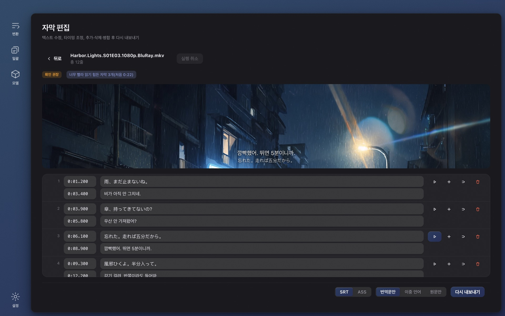

# Wave Subs

[English](../README.md) · [简体中文](./README.zh-CN.md) · [日本語](./README.ja.md) · **한국어** · [Français](./README.fr.md) · [Deutsch](./README.de.md) · [Русский](./README.ru.md) · [Bahasa Indonesia](./README.id.md) · [Bahasa Melayu](./README.ms.md) · [Tiếng Việt](./README.vi.md) · [ไทย](./README.th.md)

**자막을 못 찾겠다면?** Wave Subs는 로컬 AI로 영상에서 바로 SRT / ASS 자막을 만들고 내 언어로 번역합니다. 인식, 타이밍, 번역, 화면 속 텍스트, 편집이 모두 내 컴퓨터 안에서 끝납니다. 업로드 없음, 계정 불필요, 무료 오픈소스. macOS(Apple Silicon)와 Windows.

**웹사이트:** https://wavesubs.com (11개 언어) · [다운로드](https://github.com/jason-jm/wavesubs/releases/latest) · [변경 내역](../CHANGELOG.md)(영어) · [개인정보 처리방침](https://wavesubs.com/en/privacy.html)(영어)

## 사용 방법

1. **영상, 자막 파일, 또는 폴더 전체를 끌어다 놓습니다.** MKV, MP4, MOV, TS, AVI 등 ffmpeg가 읽는 모든 형식, 오디오만 있는 파일도 됩니다. 영상에 텍스트 자막 트랙이 있으면 자동으로 찾아 바로 사용합니다.
2. **로컬 AI가 대사를 인식하고 맞춥니다.** whisper.cpp가 내 컴퓨터에서 음성을 인식하고 언어를 자동 감지합니다. 모든 자막은 실제로 말한 순간에 맞춰집니다.
3. **번역하고 내보냅니다.** 로컬 Qwen3 모델이 내 언어로 번역하고(원하면 클라우드 서비스를 직접 연결할 수도 있습니다), 결과는 SRT 또는 ASS로 영상 옆에 저장됩니다. 어떤 줄을 확인해야 하는지 알려주는 품질 판정이 함께 나옵니다.

M 시리즈 Mac에서 2시간 영화를 Large v3 Turbo로 인식하는 데 약 3~6분, 로컬 번역에 몇 분이 더 걸립니다. 시즌 전체를 넣고 돌려 두세요.

## 제공 기능

### 세 가지 자막 소스

- **음성 인식.** whisper.cpp로 실행되는 Whisper 모델군(Tiny부터 Large v3까지), Apple Silicon에서는 Metal 가속. Whisper가 지원하는 약 100개 언어를 인식합니다. 말하는 언어는 음성이 가장 밀집된 다섯 곳에서 20초씩 표본을 뽑아 투표로 정하므로 오프닝 음악 때문에 한 회 전체가 잘못 판정되지 않습니다. 언어를 직접 지정할 수도 있습니다.
- **내장 자막 트랙.** MKV / MP4 안의 텍스트 트랙을 찾아 인식보다 우선 사용합니다(더 빠르고 정확). 여러 개면 파일마다 선택합니다. 비트맵 자막(PGS, VobSub, DVB)은 소스로 쓸 수 없습니다.
- **외부 자막 파일.** SRT, ASS / SSA, WebVTT, SAMI, MicroDVD, SubViewer, MPL2, VPlayer, JACOsub, RealText, STL, PJS, LRC, TTML / DFXP, SBV 등 18개 형식. 파일 인코딩은 자동 감지(UTF-8, UTF-16, GBK, Big5, Shift-JIS, EUC-KR, Windows-1252).

### 말소리를 따라가는 타이밍

- 음성 활동 감지(Silero VAD)와 음량 분석으로 각 자막의 시작과 끝을 실제 발화에 맞춥니다. 매개변수는 장편 영화 여섯 편의 공식 자막으로 보정한 것이지 추측이 아닙니다.
- 아무도 말하지 않는 곳에서 Whisper가 지어낸 줄은 제거하고, 음표만 있는 ♪ 줄은 버리며, 더듬는 반복(やばいやばいやばい)은 접습니다.
- 긴 줄은 자연스러운 경계에서 나누며, 일본어에는 가나 / 한자 경계를 쓰는 전용 규칙이 있습니다.

### 번역

- **29개 대상 언어:** 한국어, 영어, 일본어, 중국어(간체·번체), 프랑스어, 독일어, 스페인어, 포르투갈어, 이탈리아어, 네덜란드어, 러시아어, 우크라이나어, 폴란드어, 체코어, 헝가리어, 스웨덴어, 덴마크어, 노르웨이어, 핀란드어, 그리스어, 터키어, 히브리어, 아랍어, 힌디어, 태국어, 베트남어, 인도네시아어, 말레이어. 첫 실행 시 대상 언어는 시스템 언어가 됩니다.
- **기본은 로컬.** Qwen3 1.7B부터 32B까지 llama.cpp로 내 컴퓨터에서 실행하며 앱 안에서 내려받습니다. 무료, 오프라인, 한도 없음.
- **원하면 클라우드.** 내 키로 OpenAI 호환 API를 연결합니다. OpenAI, Anthropic Claude, Google Gemini, DeepSeek, Qwen, Zhipu GLM, Moonshot, Volcano Ark, SiliconFlow, OpenRouter, Azure OpenAI 빠른 입력 프리셋 제공. 키는 운영체제의 자격 증명 저장소로 암호화해 보관합니다. 자막 텍스트만 전송되며 영상은 절대 보내지 않습니다.
- **용어집.** 이름과 용어의 번역을 한 번 정하면 시즌 전체가 일관됩니다. 현재 배치에 등장하는 항목만 주입되며, 대사와 화면 속 텍스트에 똑같이 적용됩니다.
- **한 이름, 한 표기.** 마지막 단계에서 반복 등장하는 고유명사를 묶어 소수 표기를 다수 표기로 바꿉니다. 3화에서는 "웨버", 4화에서는 "웨버르"가 되는 일이 없습니다.
- **문단이 아니라 자막을 위해.** 배치 번역에는 정렬 앵커가 있어 번역이 옆줄로 밀리지 않습니다. 반 문장은 반 문장으로 남고, 뭉개진 전사도 빈칸 대신 가장 그럴듯한 뜻으로 번역되며, 원문을 그대로 돌려주는 모델 출력은 모든 재시도 라운드에서 걸러집니다.
- **출력:** 번역만, 이중 언어, 또는 원문만. SRT 또는 ASS.

### 화면 속 텍스트

"화면 속 텍스트 번역"을 켜면 간판, 메모, 문자 메시지와 채팅 말풍선, 안내문, 문서, 타이틀 카드, 회차 제목, 이름표까지 화면에서 읽어 번역합니다.

- 운영체제에 내장된 문자 인식을 사용합니다: macOS의 Vision, Windows의 Windows.Media.Ocr. 추가 모델 다운로드 없음. 24분짜리 한 회에 2~3분이 더 걸리며 음성 인식과 병렬로 진행됩니다.
- 번역문은 원문 옆에 배치됩니다: 먼저 바로 아래, 다음은 옆, 그다음은 화면 위쪽, 원문 위에 덮는 것은 최후의 수단입니다. 대사 자막이 차지하는 영역에는 절대 들어가지 않고, 무언가를 가리기 전에 글자를 먼저 줄입니다. 이메일, 메시지 화면, 문서처럼 화면 전체가 글자인 경우에만 불투명한 판으로 원문을 대체합니다.
- 내보내지 않는 것: 오프닝과 엔딩 크레딧(출연진·성우 목록 포함), 영상에 구워진 자막, 방송사 로고와 워터마크, 지도 표기나 책등 같은 빽빽한 작은 글자, 영화 내내 반복해서 나오는 문 표지판, 인식이 망가뜨린 이모티콘, 원문과 똑같은 번역문.
- ASS 출력에서는 원문 위치에, SRT에서는 위쪽에 놓입니다. 편집기에서는 음성 자막과 화면 속 텍스트가 별도 탭이며, 같은 파일은 항상 같은 결과를 냅니다.

### 영상 미리보기가 있는 편집기

- 표에서 텍스트와 타이밍을 편집하고 삽입, 삭제, 병합, 실행 취소, 자동 저장.
- 아무 줄이나 클릭하면 그 대사를 정확히 어떻게 말했는지 들을 수 있습니다. 브라우저가 재생하지 못하는 형식(HEVC, DTS, TrueHD)은 내장 ffmpeg로 미리보기.
- 품질 검사 결과는 클릭하면 해당 줄로 이동합니다. 원문을 고친 줄은 표시되며, 다시 번역할 때 그 줄만 처리합니다.
- 언제든 다시 내보내기: SRT 또는 ASS, 번역만 · 이중 언어 · 원문만.

### 파일마다 품질 보고서

완료된 파일마다 판정(통과 / 검토 권장 / 문제 발견)과 이유가 붙습니다: 음성 커버리지, 빈 구간, 너무 긴 줄, 너무 빠른 읽기 속도, 빠진 번역, 번역에 남은 원문, 뒤바뀐 타이밍. 기준값은 장편 영화 벤치마크에서 나왔고, 각 항목은 편집기의 해당 줄로 연결됩니다.

### 시즌 전체를 한 번에

- 폴더를 끌어다 놓으세요. 파일은 차례로 처리되고, 하나가 실패해도 배치는 멈추지 않으며, 언제든 취소할 수 있습니다.
- 모든 파일이 공통 설정을 따르고, 어떤 파일이든 자막 소스, 오디오 트랙, 언어, 번역 서비스, 형식을 따로 지정할 수 있습니다.
- 진행 상황에는 현재 단계와 예상 남은 시간이 표시되고, 완료 카드에는 인식에 쓰인 장치(Apple M 시리즈 GPU, Vulkan GPU, CPU)가 표시됩니다.
- 같은 일을 두 번 하지 않습니다. 인식 결과는 파일 신원과 영향을 주는 모든 매개변수로 캐시되어 다시 내보내기나 형식 변경은 몇 초면 됩니다. 번역은 엔진과 모델, 대상 언어, 프롬프트 버전, 용어집이 모두 같을 때만 재사용되고, 아니면 전부 다시 하며 예전 결과가 섞이는 일은 없습니다.

### 모델은 앱 안에서 다운로드

- 첫 실행 시 변환 페이지가 내 컴퓨터에 맞는 모델을 추천하고 "다운로드 후 계속"을 제안합니다. 다운로드가 끝나는 즉시 시작할 수 있습니다.
- 모델 페이지는 메모리에 따라 각 모델을 적합 / 사용 가능 / 너무 무거움으로 표시하고, 내 언어에서 얼마나 정확한지도 보여 줍니다(아래 참조). 다운로드는 Hugging Face 또는 ModelScope(중국 본토에서 우선)에서 받아 SHA-256으로 검증하며, 모든 소스가 실패하면 직접 URL을 보여 주므로 파일을 받아 모델 폴더에 넣으면 됩니다.

### 인터페이스

32개 인터페이스 언어(아랍어, 벵골어, 중국어 간체·번체, 체코어, 덴마크어, 네덜란드어, 영어, 핀란드어, 프랑스어, 독일어, 그리스어, 히브리어, 힌디어, 헝가리어, 인도네시아어, 이탈리아어, 일본어, 한국어, 말레이어, 노르웨이어, 페르시아어, 폴란드어, 포르투갈어, 루마니아어, 러시아어, 스페인어, 스웨덴어, 태국어, 터키어, 우크라이나어, 베트남어), 라이트·다크 모드, 열 가지 색상 팔레트, 완전한 키보드 포커스. 앱은 실행 시 한 번 새 버전을 확인하고(설정에서 끌 수 있음) 다운로드 버튼을 제공하며, Homebrew나 Scoop으로 설치한 경우에는 해당 업그레이드 명령을 대신 보여 줍니다.

## 인식 모델 고르기

Whisper 모델의 차이는 크기보다 언어에 따라 훨씬 큽니다. 아래 표는 의미 보존율입니다. 인식된 줄 가운데 의미가 온전히 남은 비율로, 영어 영화 《스포트라이트》, 독일어 영화 《발룬》, 일본어 NHK 대하드라마 《가마쿠라도노의 13인》에서 각각 30분을 잘라 실제 제품 파이프라인으로 처리한 뒤 50문장씩 블라인드 평가했습니다. 공개 벤치마크에서 한국어와 중국어(보통화)는 일본어와 같은 등급이고, 스페인어·이탈리아어·포르투갈어는 독일어보다 조금 낫고 프랑스어·네덜란드어·폴란드어는 조금 떨어집니다.

| 모델 | 다운로드 | 사용 메모리 | 영어 | 유럽 언어 | 일본어 · 한국어 · 중국어 |
|---|---|---|---|---|---|
| Tiny | 75 MB | 0.5 GB | 68 % | 49 % | 37 % |
| Base | 142 MB | 0.7 GB | 79 % | 61 % | 57 % |
| Small | 466 MB | 1.2 GB | 92 % | 81 % | 66 % |
| Medium | 1.5 GB | 2.6 GB | 91 % | 81 % | 79 % |
| Large v3 Turbo | 1.6 GB | 2.2 GB | 95 % | 96 % | 89 % |
| Large v3 | 3.0 GB | 4.5 GB | 96 % | 94 % | 88 % |

앱에서는 85 % 이상을 *추천*, 75 % 이상을 *사용 가능*, 60 % 이상을 *아쉬움*, 그 아래를 *비추천*으로 표시합니다. 요약하면 영어는 Small로 충분하고, 유럽 언어는 Small이 사용 가능한 수준이며, 일본어·한국어·중국어는 Large v3 Turbo 이상이 필요합니다. Large v3 Turbo는 장편 영화에서 Large v3와 품질 차이가 1포인트 이내인데 속도는 약 3배 빠르므로 대부분의 기기에서 기본 추천입니다.

| 내 컴퓨터 | 인식 | 번역 | 비고 |
|---|---|---|---|
| Mac 8 GB | Small 또는 Large v3 Turbo | Qwen3 1.7B | 동작함. Turbo를 쓸 때는 다른 앱을 닫아 두세요 |
| Mac 16 GB | Large v3 Turbo | Qwen3 8B | 기본 추천, 품질과 속도의 균형점 |
| Mac 32 GB | Large v3 | Qwen3 14B | 최고의 인식 품질, 더 정확한 번역 |
| Mac 48 GB 이상 | Large v3 | Qwen3 32B | 최고의 번역 품질, 속도는 느림 |
| Windows PC 16 GB | Large v3 Turbo | Qwen3 4B | CPU 인식. Apple Silicon의 몇 배 시간이 걸림 |
| Windows PC 32 GB | Large v3 Turbo | Qwen3 8B | 큰 모델도 돌지만 시간을 넉넉히 |

로컬 번역 모델: Qwen3 1.7B(다운로드 1.8 GB, 메모리 2.5 GB), 4B(2.4 GB, 3.5 GB), 8B(4.9 GB, 6 GB), 14B(9.0 GB, 10.5 GB), 32B(19.7 GB, 22 GB). 인식과 번역은 차례로 실행되며 동시에 메모리를 차지하지 않습니다.

## 실측 정확도

2026년 9월, 장편 70편 코퍼스(공식 자막 트랙과 잘 알려진 팬섭을 정답으로 사용, 일본어 36편, 영어 21편, 기타 13편) 기준:

- **인식(Whisper Large v3):** 영어 19편 평균 단어 오류율 17.4 %(다큐멘터리와 인터뷰는 약 6 %, 공식 드라마 시리즈는 10~13 %). 일본어 18편 문자 오류율 19.1 %, 읽기 단위로는 13.8 %. "오류"의 약 3분의 1은 표기 차이(分かった / わかった)입니다. 독일어, 노르웨이어, 이탈리아어 공식 자막은 축약해 다시 쓴 것이라 축자 비교가 불가능합니다.
- **번역(일본어→중국어, 로컬 Qwen3):** 사람이 만든 전사를 입력하면 의미 보존 정확도가 8B 93.5 %, 14B 94.4 %, 32B 93.9 %로, 기본값인 8B로 충분합니다. 엔드투엔드(인식→번역)는 약 83~85 %이며 차이는 거의 전부 인식 오류에서 나옵니다.
- **타이밍:** 프레임 단위 마스크 F1 81.8 %, 자막 시작점의 57 %가 사람 자막의 ±250 ms 안에 들어옵니다. 서로 다른 릴리스의 사람 자막끼리도 선행량이 100~300 ms 차이 납니다.

## 개인정보

계정도, 통계도, 서버도 없습니다. 영상은 내 컴퓨터를 떠나지 않으며, 인식·정렬·번역·화면 속 텍스트·편집이 모두 로컬에서 실행되고, 모델을 내려받은 뒤에는 네트워크를 꺼도 동작합니다.

네트워크를 쓰는 것은 정확히 세 가지뿐이고, 모두 내가 결정합니다:

1. **모델 다운로드.** 내가 요청할 때 Hugging Face 또는 ModelScope에서.
2. **클라우드 번역.** 내가 직접 제공자를 설정한 경우에만. 자막 텍스트를 받으며, 요금은 그 제공자가 직접 청구합니다.
3. **실행 시 업데이트 확인.** 이 저장소의 GitHub Release에서 작은 JSON 파일을 받습니다. 설정에서 끌 수 있고, App Store 버전은 아예 확인하지 않습니다.

전문(영어): https://wavesubs.com/en/privacy.html

## 요구 사양과 설치

| | macOS | Windows |
|---|---|---|
| 요구 사양 | macOS 12 이상, Apple Silicon(M1 이후) | Windows 10 이상, x64, 16 GB 메모리 권장 |
| 다운로드 | [DMG 또는 ZIP](https://github.com/jason-jm/wavesubs/releases/latest), Apple 공증 완료 | [설치 프로그램 또는 포터블 ZIP](https://github.com/jason-jm/wavesubs/releases/latest) |
| 패키지 관리자 | `brew install --cask jason-jm/wavesubs/wavesubs` | `scoop bucket add wavesubs https://github.com/jason-jm/scoop-wavesubs` `scoop install wavesubs` |
| 가속 | Metal(인식과 번역) | 인식은 CPU. 번역은 Vulkan 드라이버가 있는 GPU, 없으면 CPU |

ffmpeg, whisper.cpp, llama.cpp가 내장되어 있어 설치 후 바로 쓸 수 있습니다. 음성 인식 모델은 75 MB~3 GB, 로컬 번역 모델은 1.8~20 GB이며 둘 다 앱 안에서 필요할 때 내려받습니다. Intel Mac은 지원하지 않습니다. 로컬 인식이 Metal에 의존해 Intel에서는 실용적이지 않을 만큼 느립니다.

**Windows:** 설치 프로그램에 아직 코드 서명이 없어 처음 실행할 때 SmartScreen이 "Windows의 PC 보호" 창을 띄웁니다. *추가 정보 → 실행*을 누르세요. 모든 파일의 체크섬은 릴리스 페이지의 `SHA256SUMS.txt`에 있습니다. 화면 속 텍스트를 쓰려면 말하는 언어의 Windows 언어 팩을 *광학 문자 인식*을 체크한 채 설치하세요.

## 알려진 제한

- Windows의 화면 속 텍스트 인식은 macOS보다 약하며 세로쓰기 일본어는 대부분 놓칩니다.
- 크레딧 밖에 늘어선 이름들(연극 포스터의 배우 이름, 스태프 롤보다 30초쯤 먼저 단독으로 나오는 주연 표기)은 여전히 번역됩니다.
- 8B 이하 로컬 모델은 기관명이나 역사 용어 같은 고유명사에 불안정합니다. 용어집이 확실한 해결책입니다.
- 화면 속 텍스트 번역을 이미 영상에 구워 넣은 릴리스에서는 둘 다 표시됩니다.
- Intel Mac과 Windows ARM64 빌드는 없으며, Windows 인식은 CPU 전용입니다.

## 자주 묻는 질문

**어떤 영상에 자막을 만들 수 있나요?** MKV, MP4, MOV, TS, AVI 등 일반 형식. 브라우저가 재생하지 못하는 HEVC, DTS, TrueHD도 내장 ffmpeg가 모두 디코딩하므로 문제없습니다. 오디오만 있는 파일도 됩니다.

**어떤 언어를 지원하나요?** 인식은 Whisper가 지원하는 약 100개 언어를 자동 감지하고, 번역 대상은 29개, 인터페이스는 32개 언어입니다.

**정말 인터넷 없이 되나요?** 네. 처음 한 번의 모델 다운로드, 직접 설정한 클라우드 번역, 끌 수 있는 업데이트 확인만 네트워크를 씁니다.

**얼마나 정확한가요?** 위의 *인식 모델 고르기*와 *실측 정확도*를 보세요. 언어에 맞춰 모델을 고르면 되고, 모든 파일에 품질 판정이 붙습니다.

**영상에 이미 자막 트랙이 있어요.** 내장된 텍스트 트랙을 찾아 우선 사용하고 바로 번역으로 넘어갑니다. 비트맵 트랙(PGS / VobSub)은 예외입니다.

**중국 본토에서 모델 다운로드가 실패해요.** 모든 모델은 ModelScope에서 받을 수 있으며, 시스템 언어가 중국어 간체이거나 시간대가 중국이면 먼저 시도합니다. 모든 소스가 실패하면 오류에 브라우저나 다운로드 관리자용 직접 URL이 나옵니다.

**온라인 자막 생성기와 무엇이 다른가요?** 온라인 도구는 영화 전체를 올리게 하고 분 단위로 과금하며 길이 제한이 있습니다. Wave Subs는 아무것도 올리지 않고, 비용이 없고, 길이 제한도 없습니다. 속도는 내 컴퓨터에 달려 있습니다.

## 피드백과 지원

- [버그 신고와 기능 제안](https://github.com/jason-jm/wavesubs/issues)은 GitHub에서, GitHub 계정이 없으면 [피드백 폼](https://wavesubs.com/ko/feedback.html)으로. 실패한 작업에는 *로그 복사* 버튼이 있으니 그 로그를 신고에 붙여 주세요.
- 질문과 설정 공유는 [Discussions](https://github.com/jason-jm/wavesubs/discussions)에서.
- 버전별 변경 사항은 [변경 내역](../CHANGELOG.md)(영어)에서.

## 라이선스

Wave Subs는 [MIT 라이선스](../LICENSE)로 배포됩니다. 내장된 서드파티 구성 요소(LGPL의 ffmpeg, MIT의 whisper.cpp와 llama.cpp, Whisper와 Qwen 모델 등)는 각자의 라이선스를 따르며 [THIRD-PARTY-LICENSES.md](../THIRD-PARTY-LICENSES.md)에 정리되어 있습니다.

*소스 빌드, 명령줄 사용법, 코드 구조는 [DEVELOPMENT.md](../DEVELOPMENT.md)(영어)를 보세요.*
