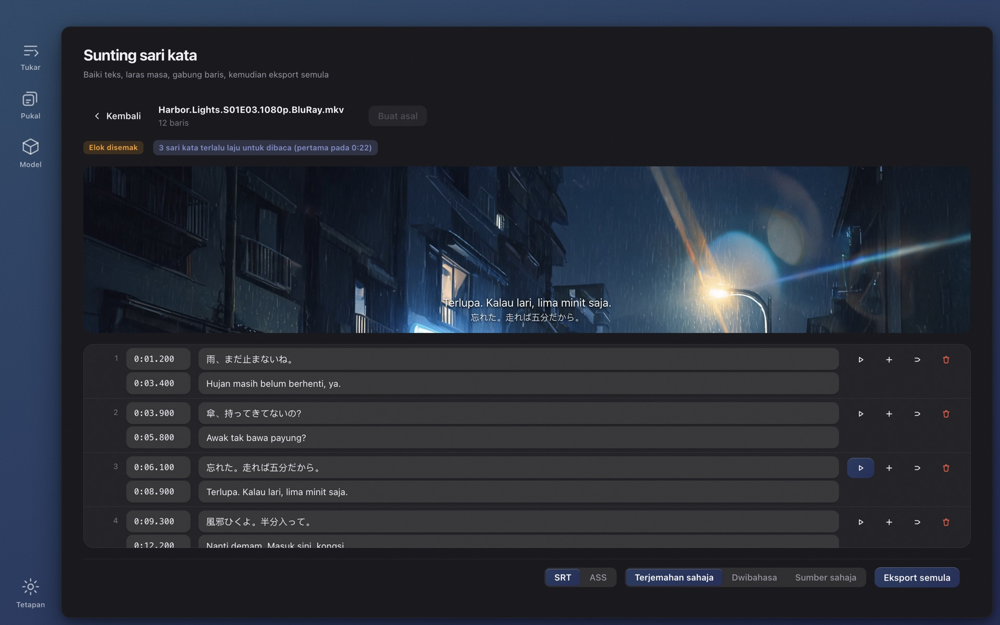

# Wave Subs

[English](../README.md) · [简体中文](./README.zh-CN.md) · [日本語](./README.ja.md) · [한국어](./README.ko.md) · [Français](./README.fr.md) · [Deutsch](./README.de.md) · [Русский](./README.ru.md) · [Bahasa Indonesia](./README.id.md) · **Bahasa Melayu** · [Tiếng Việt](./README.vi.md) · [ไทย](./README.th.md)

**Tidak jumpa sari kata untuk sesebuah video?** Wave Subs menjana sari kata SRT / ASS daripada mana-mana video dengan AI tempatan dan menterjemahnya ke bahasa anda. Pengecaman, pemasaan, terjemahan, teks pada skrin dan penyuntingan semuanya berjalan pada komputer anda sendiri: tiada apa yang dimuat naik, tiada akaun diperlukan, percuma dan sumber terbuka. macOS (Apple Silicon) dan Windows.

**Laman web:** https://wavesubs.com (11 bahasa) · [Muat turun](https://github.com/jason-jm/wavesubs/releases/latest) · [Log perubahan](../CHANGELOG.md) (Inggeris) · [Dasar privasi](https://wavesubs.com/en/privacy.html) (Inggeris)

## Cara ia berfungsi

1. **Seret video, fail sari kata atau satu folder penuh.** MKV, MP4, MOV, TS, AVI dan apa sahaja yang boleh dibaca ffmpeg, termasuk fail audio sahaja. Jika video sudah mempunyai trek sari kata teks, ia dikesan dan digunakan terus.
2. **AI tempatan mengecam dialog dan menjajarkannya.** whisper.cpp mengecam pertuturan pada komputer anda dengan pengesanan bahasa automatik. Setiap baris kemudian diselaraskan dengan saat ia benar-benar dituturkan.
3. **Terjemah dan eksport.** Model Qwen3 tempatan menterjemah ke bahasa anda (atau perkhidmatan awan, jika anda memasangnya). Hasilnya ditulis sebagai SRT atau ASS di sebelah video, bersama penilaian kualiti yang memberitahu baris mana yang patut dilihat.

Filem dua jam mengambil kira-kira 3–6 minit untuk dikecam dengan Large v3 Turbo pada Mac siri M, ditambah beberapa minit terjemahan tempatan. Seret satu musim dan biarkan ia berjalan.

## Apa yang anda dapat

### Tiga sumber sari kata

- **Pengecaman suara.** Keluarga model Whisper (Tiny hingga Large v3) melalui whisper.cpp, dipercepat Metal pada Apple Silicon. Pengecaman meliputi hampir 100 bahasa yang disokong Whisper. Bahasa yang dituturkan dikesan dengan mengambil lima cuplikan 20 saat di bahagian pertuturan paling padat dan mengundi, jadi lagu pembukaan tidak boleh melabelkan satu episod dengan salah; anda juga boleh menetapkan bahasa sendiri.
- **Trek sari kata terbenam.** Trek teks di dalam fail MKV / MP4 dikesan dan diutamakan berbanding pengecaman (lebih pantas dan tepat); anda memilih trek bagi setiap fail jika ada beberapa. Sari kata bitmap (PGS, VobSub, DVB) tidak boleh dijadikan sumber.
- **Fail sari kata luaran.** 18 format, termasuk SRT, ASS / SSA, WebVTT, SAMI, MicroDVD, SubViewer, MPL2, VPlayer, JACOsub, RealText, STL, PJS, LRC, TTML / DFXP dan SBV. Pengekodan fail dikesan secara automatik (UTF-8, UTF-16, GBK, Big5, Shift-JIS, EUC-KR, Windows-1252).

### Pemasaan yang mengikut pertuturan

- Sempadan setiap baris dijajarkan dengan pertuturan sebenar menggunakan pengesanan aktiviti suara (Silero VAD) dan analisis kelantangan. Parameternya ditentukur dengan sari kata rasmi enam filem penuh, bukan diteka.
- Baris yang direka Whisper apabila tiada sesiapa bercakap dibuang, baris ♪ muzik sahaja digugurkan, dan ulangan tergagap (やばいやばいやばい) dipadatkan.
- Baris panjang dipecahkan pada sempadan semula jadi, dengan peraturan khusus untuk bahasa Jepun.

### Terjemahan

- **29 bahasa sasaran:** Melayu, Inggeris, Cina (ringkas dan tradisional), Jepun, Korea, Perancis, Jerman, Sepanyol, Portugis, Itali, Belanda, Rusia, Ukraine, Poland, Czech, Hungary, Sweden, Denmark, Norway, Finland, Greek, Turki, Ibrani, Arab, Hindi, Thai, Vietnam dan Indonesia. Pada pelancaran pertama, sasarannya ialah bahasa sistem anda.
- **Tempatan secara lalai.** Model Qwen3 dari 1.7B hingga 32B berjalan pada komputer anda melalui llama.cpp, dimuat turun di dalam aplikasi. Percuma, luar talian, tanpa kuota.
- **Awan jika anda mahu.** Mana-mana API serasi OpenAI dengan kunci anda sendiri, dengan praset isi pantas untuk OpenAI, Anthropic Claude, Google Gemini, DeepSeek, Qwen, Zhipu GLM, Moonshot, Volcano Ark, SiliconFlow, OpenRouter dan Azure OpenAI. Kunci disimpan secara tersulit dalam storan kelayakan sistem pengendalian. Hanya teks sari kata dihantar, bukan videonya.
- **Glosari.** Tetapkan terjemahan nama dan istilah sekali, dan seluruh musim kekal konsisten. Hanya entri yang muncul dalam kelompok semasa disuntik, dan glosari terpakai untuk dialog dan teks pada skrin sama rata.
- **Satu nama, satu ejaan.** Peringkat akhir mengumpulkan setiap nama khas yang berulang dan menyamakan ejaan minoriti dengan majoriti, supaya seorang watak tidak menjadi "Weber" dalam episod 3 dan "Webber" dalam episod 4.
- **Dibuat untuk sari kata, bukan perenggan.** Baris diterjemah secara kelompok dengan sauh penjajaran supaya terjemahan tidak pernah tergelincir ke baris jiran; separuh ayat kekal separuh ayat; transkrip yang rosak tetap mendapat terjemahan paling munasabah dan bukannya kosong; model yang memulangkan sumber tanpa diterjemah ditangkap pada setiap pusingan cubaan semula.
- **Output:** terjemahan sahaja, dwibahasa atau sumber sahaja, sebagai SRT atau ASS.

### Teks pada skrin

Hidupkan "Terjemah teks pada skrin" dan papan tanda, nota, mesej teks dan gelembung sembang, notis, dokumen, kad tajuk, tajuk episod dan papan nama turut dibaca daripada gambar dan diterjemah.

- Menggunakan pengecaman teks terbina dalam sistem pengendalian: Vision pada macOS, Windows.Media.Ocr pada Windows. Tiada model tambahan untuk dimuat turun; episod 24 minit mengambil dua hingga tiga minit lebih lama, selari dengan pengecaman suara.
- Setiap terjemahan diletakkan di sebelah teks asal: terus di bawahnya, kemudian di sisinya, kemudian di bahagian atas bingkai, dan menutupi teks asal hanya sebagai jalan terakhir. Ia tidak pernah memasuki ruang yang diduduki sari kata dialog, dan saiz huruf mengecil sebelum apa-apa ditutup. Hanya skrin yang penuh teks (e-mel, bebenang mesej, dokumen) diganti dengan plat legap.
- Yang tidak dimasukkan: kredit pembukaan dan penutup (termasuk senarai pelakon dan pelakon suara), sari kata yang sudah terbakar dalam gambar, logo stesen dan tera air, label padat seperti penanda peta dan tulang buku, papan pintu yang berulang sepanjang filem, emotikon yang rosak semasa pengecaman, dan terjemahan yang sama dengan teks asal.
- Dalam output ASS teks diletakkan pada kedudukan asal; SRT meletakkannya di atas. Editor memisahkan sari kata pertuturan dan teks pada skrin dalam tab berasingan, dan fail yang sama sentiasa menghasilkan keputusan yang sama.

### Editor dengan pratonton video

- Sunting teks dan pemasaan dalam jadual; sisip, padam, gabung, buat asal; perubahan disimpan secara automatik.
- Klik mana-mana baris untuk mendengar tepat bagaimana ia dituturkan. Format yang tidak boleh dimainkan pelayar (HEVC, DTS, TrueHD) dipratonton melalui ffmpeg yang disertakan.
- Penemuan kualiti boleh diklik. Baris yang sumbernya anda sunting ditanda, dan terjemahan semula hanya menyentuh baris tersebut.
- Eksport semula pada bila-bila masa: SRT atau ASS, terjemahan sahaja, dwibahasa atau sumber sahaja.

### Laporan kualiti untuk setiap fail

Setiap fail yang siap mendapat penilaian (lulus, patut disemak, ada masalah) berserta sebabnya: liputan pertuturan, jurang, baris terlalu panjang, kelajuan bacaan terlalu tinggi, terjemahan hilang, teks sumber tertinggal dalam terjemahan, pemasaan terbalik. Ambangnya datang daripada penanda aras filem penuh, dan setiap penemuan dipautkan ke barisnya dalam editor.

### Satu musim sekali gus

- Seret satu folder. Fail diproses satu demi satu; satu kegagalan tidak menghentikan kelompok; batalkan pada bila-bila masa.
- Semua fail mengikut tetapan kongsi, dan mana-mana fail boleh mengatasi sumber sari kata, trek audio, bahasa, perkhidmatan terjemahan atau format.
- Kemajuan menunjukkan peringkat semasa dan anggaran masa berbaki; kad siap memberitahu peranti mana yang melakukan pengecaman (GPU Apple siri M, GPU Vulkan atau CPU).
- Tiada apa yang dibuat dua kali. Pengecaman disimpan dalam cache mengikut identiti fail dan setiap parameter yang mempengaruhinya, jadi mengeksport semula atau menukar format mengambil beberapa saat sahaja. Terjemahan diguna semula hanya apabila enjin dan model, bahasa sasaran, versi gesaan dan glosari semuanya sepadan; jika tidak, ia dibuat semula sepenuhnya, dan output lama tidak pernah dicampur.

### Model dimuat turun di dalam aplikasi

- Pada pelancaran pertama, halaman Tukar mengesyorkan model untuk komputer anda dan menawarkan "Muat turun dan teruskan"; anda boleh mula sebaik sahaja muat turun selesai.
- Halaman Model melabelkan setiap model sesuai, boleh digunakan atau terlalu berat untuk memori anda dan menunjukkan setepat mana ia untuk bahasa anda (lihat di bawah). Muat turun datang daripada Hugging Face atau ModelScope (dicuba dahulu di tanah besar China), disahkan dengan SHA-256, dan jika semua sumber gagal, aplikasi menyenaraikan URL terus supaya anda boleh mengambil fail itu sendiri dan meletakkannya dalam folder model.

### Antara muka

32 bahasa antara muka (Arab, Bengali, Cina ringkas dan tradisional, Czech, Denmark, Belanda, Inggeris, Finland, Perancis, Jerman, Greek, Ibrani, Hindi, Hungary, Indonesia, Itali, Jepun, Korea, Melayu, Norway, Parsi, Poland, Portugis, Romania, Rusia, Sepanyol, Sweden, Thai, Turki, Ukraine, Vietnam), mod cerah dan gelap, sepuluh palet warna, fokus papan kekunci penuh. Aplikasi menyemak versi baharu sekali semasa pelancaran (suis dalam Tetapan mematikannya) dan menawarkan butang muat turun; salinan yang dipasang dengan Homebrew atau Scoop mendapat arahan naik taraf yang sepadan.

## Memilih model pengecaman

Model Whisper jauh lebih berbeza mengikut bahasa berbanding saiz. Jadual ini menunjukkan pengekalan makna: bahagian baris yang dikecam dengan makna kekal utuh, dinilai secara buta pada 50 ayat daripada cebisan 30 minit sebuah filem Inggeris (*Spotlight*), filem Jerman (*Ballon*) dan drama Jepun (NHK, *The 13 Lords of the Shogun*), dijalankan melalui saluran produk sebenar. Korea dan Mandarin berada pada tahap yang sama dengan Jepun dalam penanda aras awam; Sepanyol, Itali dan Portugis sedikit lebih baik daripada Jerman, manakala Perancis, Belanda dan Poland sedikit lebih rendah.

| Model | Muat turun | RAM semasa digunakan | Inggeris | Bahasa Eropah | Jepun · Korea · Cina |
|---|---|---|---|---|---|
| Tiny | 75 MB | 0.5 GB | 68 % | 49 % | 37 % |
| Base | 142 MB | 0.7 GB | 79 % | 61 % | 57 % |
| Small | 466 MB | 1.2 GB | 92 % | 81 % | 66 % |
| Medium | 1.5 GB | 2.6 GB | 91 % | 81 % | 79 % |
| Large v3 Turbo | 1.6 GB | 2.2 GB | 95 % | 96 % | 89 % |
| Large v3 | 3.0 GB | 4.5 GB | 96 % | 94 % | 88 % |

Aplikasi melabelkan 85 % ke atas sebagai *disyorkan*, 75 % *boleh digunakan*, 60 % *sekadar boleh*, dan yang lebih rendah *tidak disyorkan*. Ringkasnya: Small mencukupi untuk bahasa Inggeris, boleh digunakan untuk bahasa Eropah, dan Jepun, Korea serta Cina memerlukan Large v3 Turbo atau lebih baik. Large v3 Turbo hanya terpaut satu mata daripada Large v3 pada filem penuh sambil berjalan kira-kira tiga kali lebih pantas, jadi ia syor lalai pada kebanyakan mesin.

| Komputer anda | Pengecaman | Terjemahan | Nota |
|---|---|---|---|
| Mac 8 GB | Small atau Large v3 Turbo | Qwen3 1.7B | Berfungsi; tutup aplikasi lain untuk Turbo |
| Mac 16 GB | Large v3 Turbo | Qwen3 8B | Keseimbangan lalai antara kualiti dan kelajuan |
| Mac 32 GB | Large v3 | Qwen3 14B | Pengecaman terbaik, terjemahan lebih tepat |
| Mac 48 GB ke atas | Large v3 | Qwen3 32B | Kualiti terjemahan terbaik, lebih perlahan |
| PC Windows 16 GB | Large v3 Turbo | Qwen3 4B | Pengecaman pada CPU; jangkakan beberapa kali ganda masa Apple Silicon |
| PC Windows 32 GB | Large v3 Turbo | Qwen3 8B | Model besar boleh jalan; peruntukkan masa tambahan |

Model terjemahan tempatan: Qwen3 1.7B (muat turun 1.8 GB, RAM 2.5 GB), 4B (2.4 GB, 3.5 GB), 8B (4.9 GB, 6 GB), 14B (9.0 GB, 10.5 GB), 32B (19.7 GB, 22 GB). Pengecaman dan terjemahan berjalan bergilir, tidak pernah serentak.

## Ketepatan yang diukur

Daripada korpus 70 filem penuh (trek sari kata rasmi dan keluaran fansub terkenal sebagai rujukan; 36 Jepun, 21 Inggeris, 13 lain), September 2026:

- **Pengecaman (Whisper Large v3):** Inggeris, 19 filem, purata kadar ralat perkataan 17.4 % (dokumentari dan temu bual sekitar 6 %, siri rasmi 10–13 %). Jepun, 18 filem, kadar ralat aksara 19.1 %, pada peringkat bacaan 13.8 %; kira-kira satu pertiga "ralat" ialah variasi ejaan (分かった / わかった). Sari kata rasmi Jerman, Norway dan Itali ialah tulisan semula yang dipadatkan dan tidak boleh diskor perkataan demi perkataan.
- **Terjemahan (Jepun → Cina, Qwen3 tempatan):** dengan transkrip manusia sebagai input, ketepatan pengekalan makna ialah 93.5 % untuk 8B, 94.4 % untuk 14B dan 93.9 % untuk 32B, jadi 8B lalai ialah pilihan yang selamat. Hujung ke hujung (pengecaman → terjemahan) kira-kira 83–85 %; hampir semua jurangnya datang daripada ralat pengecaman.
- **Pemasaan:** F1 topeng peringkat bingkai 81.8 %; 57 % permulaan baris jatuh dalam ±250 ms daripada sari kata manusia. Sari kata manusia daripada keluaran berbeza sendiri berbeza 100–300 ms dalam masa dahuluan.

## Privasi

Tiada akaun, tiada analitik dan tiada pelayan. Video tidak pernah meninggalkan komputer anda; pengecaman, penjajaran, terjemahan, teks pada skrin dan penyuntingan semuanya berjalan secara tempatan, dan setelah model dimuat turun aplikasi berfungsi dengan rangkaian dimatikan.

Tepat tiga perkara yang menyentuh rangkaian, dan setiap satu di bawah kawalan anda:

1. **Muat turun model**, daripada Hugging Face atau ModelScope, apabila anda meminta model.
2. **Terjemahan awan**, hanya jika anda mengkonfigurasi penyedia sendiri; ia menerima teks sari kata, dan penyedia itu mengecaj anda secara terus.
3. **Semakan kemas kini** semasa pelancaran, yang mengambil fail JSON kecil daripada GitHub Release repositori ini. Ia boleh dimatikan dalam Tetapan, dan binaan App Store tidak menyemak langsung.

Dasar penuh (Inggeris): https://wavesubs.com/en/privacy.html

## Keperluan dan pemasangan

| | macOS | Windows |
|---|---|---|
| Keperluan | macOS 12 atau lebih baharu, Apple Silicon (M1 ke atas) | Windows 10 atau lebih baharu, x64, RAM 16 GB disyorkan |
| Muat turun | [DMG atau ZIP](https://github.com/jason-jm/wavesubs/releases/latest), dinotari Apple | [Pemasang atau ZIP mudah alih](https://github.com/jason-jm/wavesubs/releases/latest) |
| Pengurus pakej | `brew install --cask jason-jm/wavesubs/wavesubs` | `scoop bucket add wavesubs https://github.com/jason-jm/scoop-wavesubs` `scoop install wavesubs` |
| Pecutan | Metal (pengecaman dan terjemahan) | Pengecaman pada CPU; terjemahan pada mana-mana GPU dengan pemacu Vulkan, jika tidak CPU |

ffmpeg, whisper.cpp dan llama.cpp disertakan: pasang dan terus guna. Model pengecaman suara bersaiz 75 MB hingga 3 GB, model terjemahan tempatan 1.8 hingga 20 GB; kedua-duanya dimuat turun mengikut keperluan di dalam aplikasi. Mac Intel tidak disokong: pengecaman tempatan bergantung pada Metal, dan pada Intel ia terlalu perlahan untuk berguna.

**Windows:** pemasang belum ditandatangani, jadi SmartScreen memaparkan "Windows protected your PC" pada pelancaran pertama. Klik *More info → Run anyway*. Jumlah semak untuk setiap fail ada dalam `SHA256SUMS.txt` di halaman keluaran. Untuk teks pada skrin, pasang pek bahasa Windows bagi bahasa yang dituturkan dengan *Optical character recognition* ditanda.

## Batasan yang diketahui

- Di Windows, pengecaman teks pada skrin lebih lemah daripada di macOS; teks Jepun menegak kebanyakannya terlepas.
- Deretan nama di luar kredit (nama pelakon pada poster teater, nama pelakon utama yang dipaparkan setengah minit sebelum senarai krew) masih diterjemah.
- Model tempatan hingga 8B tidak boleh dipercayai untuk nama khas seperti nama institusi dan istilah sejarah. Glosari ialah penyelesaian yang pasti.
- Keluaran yang sudah membakar terjemahan teks pada skrinnya sendiri ke dalam gambar akan menunjukkan kedua-duanya.
- Tiada binaan untuk Mac Intel atau Windows ARM64; pengecaman di Windows hanya menggunakan CPU.

## Soalan lazim

**Video apa yang boleh diberi sari kata?** MKV, MP4, MOV, TS, AVI dan format biasa lain; strim HEVC, DTS dan TrueHD yang tidak boleh dimainkan pelayar pun boleh, kerana ffmpeg yang disertakan menyahkod semuanya. Fail audio sahaja juga berfungsi.

**Bahasa apa?** Pengecaman meliputi hampir 100 bahasa Whisper dengan pengesanan automatik; 29 bahasa sasaran terjemahan; antara muka dalam 32 bahasa.

**Betul-betul berfungsi tanpa internet?** Ya. Hanya muat turun model sekali, terjemahan awan yang anda pasang sendiri, dan semakan kemas kini pilihan yang menggunakan rangkaian.

**Setepat mana?** Lihat *Memilih model pengecaman* dan *Ketepatan yang diukur* di atas. Pilih model mengikut bahasa anda, dan setiap fail datang dengan penilaian kualiti.

**Video sudah ada trek sari kata.** Trek teks terbenam dikesan dan diutamakan, terus ke terjemahan. Trek bitmap (PGS / VobSub) adalah pengecualian.

**Muat turun model gagal di tanah besar China.** Semua model tersedia daripada ModelScope, yang dicuba aplikasi dahulu apabila bahasa sistem ialah Cina ringkas atau zon waktu berada di China. Jika semua sumber gagal, ralat menyenaraikan URL terus untuk pelayar atau pengurus muat turun.

**Apa bezanya dengan penjana sari kata dalam talian?** Alat dalam talian memerlukan anda memuat naik seluruh filem, mengecaj setiap minit dan mengehadkan tempoh. Wave Subs tidak memuat naik apa-apa, tidak mengenakan bayaran dan tiada had tempoh; kelajuan bergantung pada komputer anda.

## Maklum balas dan sokongan

- [Laporan pepijat dan permintaan ciri](https://github.com/jason-jm/wavesubs/issues) di GitHub, atau [borang maklum balas](https://wavesubs.com/ms/feedback.html) jika anda tiada akaun GitHub. Tugas yang gagal mempunyai butang *Salin log*; tampalkan log itu ke dalam laporan.
- [Discussions](https://github.com/jason-jm/wavesubs/discussions) untuk soalan dan perkongsian tetapan.
- [Log perubahan](../CHANGELOG.md) (Inggeris) untuk apa yang berubah dalam setiap versi.

## Lesen

Wave Subs dikeluarkan di bawah [Lesen MIT](../LICENSE). Komponen pihak ketiga yang disertakan (ffmpeg di bawah LGPL, whisper.cpp dan llama.cpp di bawah MIT, model Whisper dan Qwen, dan lain-lain) membawa lesen masing-masing, disenaraikan dalam [THIRD-PARTY-LICENSES.md](../THIRD-PARTY-LICENSES.md).

*Membina daripada sumber, antara muka baris arahan dan susun atur kod diterangkan dalam [DEVELOPMENT.md](../DEVELOPMENT.md) (Inggeris).*
