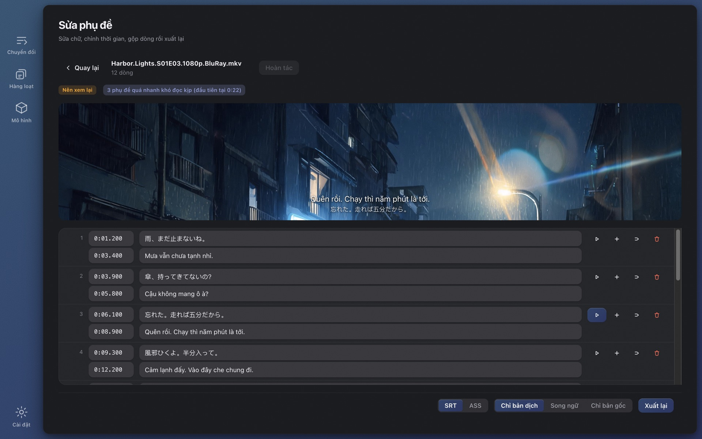

# Wave Subs

[English](../README.md) · [简体中文](./README.zh-CN.md) · [日本語](./README.ja.md) · [한국어](./README.ko.md) · [Français](./README.fr.md) · [Deutsch](./README.de.md) · [Русский](./README.ru.md) · [Bahasa Indonesia](./README.id.md) · [Bahasa Melayu](./README.ms.md) · **Tiếng Việt** · [ไทย](./README.th.md)

**Không tìm thấy phụ đề cho một video?** Wave Subs tạo phụ đề SRT / ASS từ bất kỳ video nào bằng AI cục bộ và dịch sang ngôn ngữ của bạn. Nhận dạng, căn thời gian, dịch, chữ trên màn hình và chỉnh sửa đều chạy ngay trên máy của bạn: không tải lên gì cả, không cần tài khoản, miễn phí và mã nguồn mở. macOS (Apple Silicon) và Windows.

**Trang web:** https://wavesubs.com (11 ngôn ngữ) · [Tải về](https://github.com/jason-jm/wavesubs/releases/latest) · [Nhật ký thay đổi](../CHANGELOG.md) (tiếng Anh) · [Chính sách quyền riêng tư](https://wavesubs.com/en/privacy.html) (tiếng Anh)

## Cách hoạt động

1. **Kéo vào một video, một tệp phụ đề hoặc cả thư mục.** MKV, MP4, MOV, TS, AVI và bất cứ thứ gì ffmpeg đọc được, kể cả tệp chỉ có âm thanh. Nếu video đã có rãnh phụ đề dạng chữ, nó được phát hiện và dùng ngay.
2. **AI cục bộ nhận dạng lời thoại và căn chỉnh.** whisper.cpp nhận dạng giọng nói trên máy bạn với tự động phát hiện ngôn ngữ. Sau đó mỗi dòng được khớp đúng vào khoảnh khắc câu đó thực sự được nói.
3. **Dịch và xuất.** Mô hình Qwen3 cục bộ dịch sang ngôn ngữ của bạn (hoặc dịch vụ đám mây, nếu bạn tự kết nối). Kết quả được ghi thành SRT hoặc ASS ngay cạnh video, kèm đánh giá chất lượng cho biết dòng nào đáng xem lại.

Một bộ phim hai tiếng mất khoảng 3–6 phút để nhận dạng với Large v3 Turbo trên Mac chip M, cộng vài phút dịch cục bộ. Kéo cả một mùa vào rồi để nó chạy.

## Bạn nhận được gì

### Ba nguồn phụ đề

- **Nhận dạng giọng nói.** Họ mô hình Whisper (từ Tiny đến Large v3) qua whisper.cpp, tăng tốc Metal trên Apple Silicon. Nhận dạng gần 100 ngôn ngữ mà Whisper hỗ trợ. Ngôn ngữ được nói được phát hiện bằng cách lấy năm đoạn 20 giây ở những chỗ nhiều lời thoại nhất rồi bỏ phiếu, nên nhạc mở đầu không thể làm cả tập bị gắn sai ngôn ngữ; bạn cũng có thể tự chọn ngôn ngữ.
- **Rãnh phụ đề có sẵn.** Rãnh chữ trong tệp MKV / MP4 được phát hiện và ưu tiên hơn nhận dạng (nhanh hơn và chính xác); bạn chọn rãnh cho từng tệp khi có nhiều rãnh. Phụ đề dạng ảnh (PGS, VobSub, DVB) không dùng được làm nguồn.
- **Tệp phụ đề ngoài.** 18 định dạng, gồm SRT, ASS / SSA, WebVTT, SAMI, MicroDVD, SubViewer, MPL2, VPlayer, JACOsub, RealText, STL, PJS, LRC, TTML / DFXP và SBV. Bảng mã tệp được tự nhận diện (UTF-8, UTF-16, GBK, Big5, Shift-JIS, EUC-KR, Windows-1252).

### Thời gian bám theo lời nói

- Điểm đầu và cuối mỗi dòng được căn theo lời nói thực bằng phát hiện hoạt động giọng nói (Silero VAD) và phân tích độ lớn âm. Các tham số được hiệu chỉnh theo phụ đề chính thức của sáu bộ phim dài, không phải đoán.
- Những dòng Whisper bịa ra khi không ai nói bị loại, dòng chỉ có ♪ bị bỏ, và các lặp lại kiểu lắp bắp (やばいやばいやばい) được gộp lại.
- Dòng dài được tách tại ranh giới tự nhiên, có quy tắc riêng cho tiếng Nhật.

### Dịch

- **29 ngôn ngữ đích:** Việt, Anh, Trung (giản thể và phồn thể), Nhật, Hàn, Pháp, Đức, Tây Ban Nha, Bồ Đào Nha, Ý, Hà Lan, Nga, Ukraina, Ba Lan, Séc, Hungary, Thụy Điển, Đan Mạch, Na Uy, Phần Lan, Hy Lạp, Thổ Nhĩ Kỳ, Do Thái, Ả Rập, Hindi, Thái, Indonesia và Mã Lai. Lần mở đầu tiên, ngôn ngữ đích mặc định là ngôn ngữ hệ thống.
- **Mặc định chạy cục bộ.** Các mô hình Qwen3 từ 1.7B đến 32B chạy trên máy bạn qua llama.cpp, tải ngay trong ứng dụng. Miễn phí, ngoại tuyến, không giới hạn.
- **Đám mây nếu bạn muốn.** Bất kỳ API tương thích OpenAI nào với khóa của riêng bạn, có sẵn mẫu điền nhanh cho OpenAI, Anthropic Claude, Google Gemini, DeepSeek, Qwen, Zhipu GLM, Moonshot, Volcano Ark, SiliconFlow, OpenRouter và Azure OpenAI. Khóa được lưu mã hóa trong kho thông tin xác thực của hệ điều hành. Chỉ gửi văn bản phụ đề, không bao giờ gửi video.
- **Bảng thuật ngữ.** Cố định cách dịch tên và thuật ngữ một lần, cả mùa sẽ nhất quán. Chỉ những mục xuất hiện trong lô hiện tại được đưa vào, và bảng thuật ngữ áp dụng cho cả lời thoại lẫn chữ trên màn hình.
- **Một tên, một cách viết.** Bước cuối gom mọi danh từ riêng lặp lại và sửa cách viết thiểu số theo cách viết đa số, để một nhân vật không là "Weber" ở tập 3 rồi "Webber" ở tập 4.
- **Làm cho phụ đề, không phải cho đoạn văn.** Các dòng được dịch theo lô với neo căn chỉnh nên bản dịch không bao giờ trượt sang dòng bên cạnh; nửa câu vẫn là nửa câu; bản ghi lỗi vẫn nhận được bản dịch hợp lý nhất thay vì để trống; mô hình trả lại nguyên văn không dịch sẽ bị chặn ở mọi vòng thử lại.
- **Đầu ra:** chỉ bản dịch, song ngữ, hoặc chỉ bản gốc, dạng SRT hoặc ASS.

### Chữ trên màn hình

Bật "Dịch chữ trên màn hình" và biển hiệu, ghi chú, tin nhắn và bong bóng chat, thông báo, tài liệu, thẻ tiêu đề, tên tập và bảng tên cũng được đọc từ hình ảnh và dịch.

- Dùng nhận dạng chữ tích hợp của hệ điều hành: Vision trên macOS, Windows.Media.Ocr trên Windows. Không cần tải thêm mô hình; một tập 24 phút mất thêm hai đến ba phút, chạy song song với nhận dạng giọng nói.
- Mỗi bản dịch được đặt cạnh bản gốc: ngay bên dưới, rồi bên cạnh, rồi ở đầu khung hình, và chỉ đè lên bản gốc khi không còn cách nào khác. Nó không bao giờ lấn vào vùng phụ đề lời thoại, và chữ sẽ thu nhỏ trước khi che bất cứ thứ gì. Chỉ khi cả màn hình là chữ (email, chuỗi tin nhắn, tài liệu) thì mới thay bằng một tấm nền đục.
- Những gì bị loại: phần giới thiệu và danh đề cuối phim (kể cả danh sách diễn viên và diễn viên lồng tiếng), phụ đề đã in cứng vào hình, logo đài và hình mờ, nhãn dày đặc như ký hiệu bản đồ và gáy sách, biển cửa lặp lại suốt phim, biểu tượng cảm xúc bị nhận dạng sai, và bản dịch trùng với bản gốc.
- Trong đầu ra ASS, chữ được đặt đúng vị trí bản gốc; SRT đặt ở phía trên. Trình chỉnh sửa tách phụ đề lời thoại và chữ trên màn hình thành hai thẻ, và cùng một tệp luôn cho cùng một kết quả.

### Trình chỉnh sửa có xem trước video

- Sửa chữ và thời gian trong bảng; chèn, xóa, gộp, hoàn tác; thay đổi được lưu tự động.
- Bấm vào dòng nào cũng nghe được chính xác câu đó được nói thế nào. Các định dạng trình duyệt không phát được (HEVC, DTS, TrueHD) được xem trước qua ffmpeg đi kèm.
- Các phát hiện về chất lượng bấm được. Những dòng bạn đã sửa bản gốc được đánh dấu, và dịch lại chỉ đụng đến những dòng đó.
- Xuất lại bất cứ lúc nào: SRT hoặc ASS, chỉ bản dịch, song ngữ hoặc chỉ bản gốc.

### Báo cáo chất lượng cho từng tệp

Mỗi tệp hoàn thành nhận một đánh giá (đạt, nên xem lại, có vấn đề) kèm lý do: độ phủ lời thoại, khoảng trống, dòng quá dài, tốc độ đọc quá nhanh, thiếu bản dịch, còn sót chữ gốc trong bản dịch, thời gian bị đảo. Ngưỡng lấy từ các thước đo trên phim dài, và mỗi phát hiện liên kết đến dòng trong trình chỉnh sửa.

### Cả mùa trong một lần

- Kéo một thư mục vào. Các tệp được xử lý lần lượt; một tệp lỗi không dừng cả lô; hủy bất cứ lúc nào.
- Mọi tệp theo thiết lập chung, và tệp nào cũng có thể ghi đè nguồn phụ đề, rãnh âm thanh, ngôn ngữ, dịch vụ dịch hoặc định dạng.
- Tiến trình hiển thị giai đoạn hiện tại và thời gian còn lại ước tính; thẻ hoàn thành cho biết thiết bị nào đã nhận dạng (GPU Apple dòng M, GPU Vulkan hay CPU).
- Không làm gì hai lần. Kết quả nhận dạng được lưu đệm theo danh tính tệp và mọi tham số ảnh hưởng, nên xuất lại hay đổi định dạng chỉ mất vài giây. Bản dịch chỉ được dùng lại khi công cụ và mô hình, ngôn ngữ đích, phiên bản prompt và bảng thuật ngữ đều khớp; nếu không sẽ làm lại toàn bộ, và kết quả cũ không bao giờ bị trộn vào.

### Mô hình tải ngay trong ứng dụng

- Lần mở đầu tiên, trang Chuyển đổi đề xuất mô hình phù hợp với máy bạn và có nút "Tải về và tiếp tục"; bạn có thể bắt đầu ngay khi tải xong.
- Trang Mô hình gắn nhãn từng mô hình là phù hợp, dùng được hay quá nặng so với bộ nhớ của bạn và cho biết độ chính xác với ngôn ngữ của bạn (xem bên dưới). Tải từ Hugging Face hoặc ModelScope (ưu tiên thử trước ở Trung Quốc đại lục), kiểm tra bằng SHA-256, và nếu mọi nguồn đều lỗi, ứng dụng liệt kê URL trực tiếp để bạn tự tải rồi bỏ vào thư mục mô hình.

### Giao diện

32 ngôn ngữ giao diện (Ả Rập, Bengal, Trung giản thể và phồn thể, Séc, Đan Mạch, Hà Lan, Anh, Phần Lan, Pháp, Đức, Hy Lạp, Do Thái, Hindi, Hungary, Indonesia, Ý, Nhật, Hàn, Mã Lai, Na Uy, Ba Tư, Ba Lan, Bồ Đào Nha, Romania, Nga, Tây Ban Nha, Thụy Điển, Thái, Thổ Nhĩ Kỳ, Ukraina, Việt), chế độ sáng và tối, mười bảng màu, hỗ trợ tiêu điểm bàn phím đầy đủ. Ứng dụng kiểm tra phiên bản mới một lần khi khởi động (có công tắc tắt trong Cài đặt) và đưa ra nút tải; bản cài bằng Homebrew hoặc Scoop nhận lệnh nâng cấp tương ứng.

## Chọn mô hình nhận dạng

Các mô hình Whisper khác nhau theo ngôn ngữ nhiều hơn theo kích thước. Bảng dưới là tỷ lệ giữ nghĩa: phần dòng nhận dạng được mà nghĩa vẫn nguyên vẹn, chấm mù trên 50 câu từ đoạn 30 phút của một phim tiếng Anh (*Spotlight*), một phim tiếng Đức (*Ballon*) và một phim truyền hình Nhật (NHK, *The 13 Lords of the Shogun*), chạy qua đúng quy trình của sản phẩm. Tiếng Hàn và tiếng Quan Thoại cùng hạng với tiếng Nhật trong các thước đo công khai; tiếng Tây Ban Nha, Ý và Bồ Đào Nha tốt hơn tiếng Đức một chút, còn tiếng Pháp, Hà Lan và Ba Lan kém hơn một chút.

| Mô hình | Dung lượng tải | RAM khi chạy | Tiếng Anh | Ngôn ngữ châu Âu | Nhật · Hàn · Trung |
|---|---|---|---|---|---|
| Tiny | 75 MB | 0,5 GB | 68 % | 49 % | 37 % |
| Base | 142 MB | 0,7 GB | 79 % | 61 % | 57 % |
| Small | 466 MB | 1,2 GB | 92 % | 81 % | 66 % |
| Medium | 1,5 GB | 2,6 GB | 91 % | 81 % | 79 % |
| Large v3 Turbo | 1,6 GB | 2,2 GB | 95 % | 96 % | 89 % |
| Large v3 | 3,0 GB | 4,5 GB | 96 % | 94 % | 88 % |

Ứng dụng gắn nhãn từ 85 % trở lên là *nên dùng*, 75 % là *dùng được*, 60 % là *tạm được*, thấp hơn là *không nên dùng*. Nói ngắn gọn: tiếng Anh dùng Small là đủ, ngôn ngữ châu Âu Small dùng được, còn tiếng Nhật, Hàn, Trung cần Large v3 Turbo trở lên. Large v3 Turbo chỉ kém Large v3 chưa đến một điểm trên phim dài mà chạy nhanh gấp khoảng ba lần, nên là đề xuất mặc định trên hầu hết máy.

| Máy của bạn | Nhận dạng | Dịch | Ghi chú |
|---|---|---|---|
| Mac 8 GB | Small hoặc Large v3 Turbo | Qwen3 1.7B | Chạy được; đóng ứng dụng khác khi dùng Turbo |
| Mac 16 GB | Large v3 Turbo | Qwen3 8B | Cân bằng mặc định giữa chất lượng và tốc độ |
| Mac 32 GB | Large v3 | Qwen3 14B | Nhận dạng tốt nhất, dịch chính xác hơn |
| Mac 48 GB trở lên | Large v3 | Qwen3 32B | Chất lượng dịch tốt nhất, chậm hơn |
| PC Windows 16 GB | Large v3 Turbo | Qwen3 4B | Nhận dạng bằng CPU; mất gấp vài lần thời gian của Apple Silicon |
| PC Windows 32 GB | Large v3 Turbo | Qwen3 8B | Mô hình lớn chạy được; cần thêm thời gian |

Mô hình dịch cục bộ: Qwen3 1.7B (tải 1,8 GB, RAM 2,5 GB), 4B (2,4 GB, 3,5 GB), 8B (4,9 GB, 6 GB), 14B (9,0 GB, 10,5 GB), 32B (19,7 GB, 22 GB). Nhận dạng và dịch chạy lần lượt, không bao giờ cùng lúc.

## Độ chính xác đo được

Từ kho 70 phim dài (rãnh phụ đề chính thức và các bản fansub nổi tiếng làm chuẩn; 36 tiếng Nhật, 21 tiếng Anh, 13 ngôn ngữ khác), tháng 9 năm 2026:

- **Nhận dạng (Whisper Large v3):** tiếng Anh, 19 phim, tỷ lệ lỗi từ trung bình 17,4 % (phim tài liệu và phỏng vấn khoảng 6 %, phim bộ chính thức 10–13 %). Tiếng Nhật, 18 phim, tỷ lệ lỗi ký tự 19,1 %, ở mức cách đọc 13,8 %; khoảng một phần ba số "lỗi" chỉ là khác cách viết (分かった / わかった). Phụ đề chính thức tiếng Đức, Na Uy và Ý là bản viết lại rút gọn nên không chấm được từng chữ.
- **Dịch (Nhật → Trung, Qwen3 cục bộ):** với bản ghi do người làm làm đầu vào, độ chính xác giữ nghĩa là 93,5 % với 8B, 94,4 % với 14B và 93,9 % với 32B, nên 8B mặc định là lựa chọn an toàn. Toàn tuyến (nhận dạng → dịch) khoảng 83–85 %; gần như toàn bộ chênh lệch đến từ lỗi nhận dạng.
- **Thời gian:** F1 mặt nạ theo khung hình 81,8 %; 57 % điểm bắt đầu nằm trong ±250 ms so với phụ đề người làm. Phụ đề người làm từ các bản phát hành khác nhau cũng lệch nhau 100–300 ms về độ sớm.

## Quyền riêng tư

Không tài khoản, không thống kê, không máy chủ. Video không bao giờ rời khỏi máy bạn; nhận dạng, căn chỉnh, dịch, chữ trên màn hình và chỉnh sửa đều chạy cục bộ, và sau khi tải mô hình xong, ứng dụng hoạt động khi tắt mạng.

Chỉ đúng ba thứ dùng đến mạng, và mỗi thứ đều do bạn quyết định:

1. **Tải mô hình**, từ Hugging Face hoặc ModelScope, khi bạn yêu cầu.
2. **Dịch đám mây**, chỉ khi bạn tự cấu hình nhà cung cấp; họ nhận văn bản phụ đề và tính phí trực tiếp với bạn.
3. **Kiểm tra cập nhật** khi khởi động, lấy một tệp JSON nhỏ từ GitHub Release của kho này. Có thể tắt trong Cài đặt, và bản App Store hoàn toàn không kiểm tra.

Chính sách đầy đủ (tiếng Anh): https://wavesubs.com/en/privacy.html

## Yêu cầu và cài đặt

| | macOS | Windows |
|---|---|---|
| Yêu cầu | macOS 12 trở lên, Apple Silicon (M1 trở lên) | Windows 10 trở lên, x64, khuyến nghị 16 GB RAM |
| Tải về | [DMG hoặc ZIP](https://github.com/jason-jm/wavesubs/releases/latest), đã được Apple công chứng | [Trình cài đặt hoặc ZIP di động](https://github.com/jason-jm/wavesubs/releases/latest) |
| Trình quản lý gói | `brew install --cask jason-jm/wavesubs/wavesubs` | `scoop bucket add wavesubs https://github.com/jason-jm/scoop-wavesubs` `scoop install wavesubs` |
| Tăng tốc | Metal (nhận dạng và dịch) | Nhận dạng trên CPU; dịch trên GPU có driver Vulkan, không có thì CPU |

ffmpeg, whisper.cpp và llama.cpp đã đi kèm: cài là dùng. Mô hình nhận dạng giọng nói từ 75 MB đến 3 GB, mô hình dịch cục bộ từ 1,8 đến 20 GB; cả hai được tải theo nhu cầu ngay trong ứng dụng. Không hỗ trợ Mac Intel: nhận dạng cục bộ dựa vào Metal, trên Intel sẽ quá chậm để dùng được.

**Windows:** trình cài đặt chưa được ký số nên SmartScreen hiện "Windows protected your PC" khi chạy lần đầu. Bấm *More info → Run anyway*. Mã kiểm tra của mọi tệp nằm trong `SHA256SUMS.txt` trên trang phát hành. Để dùng chữ trên màn hình, cài gói ngôn ngữ Windows cho ngôn ngữ được nói và tích *Optical character recognition*.

## Hạn chế đã biết

- Trên Windows, nhận dạng chữ trên màn hình yếu hơn macOS; tiếng Nhật viết dọc hầu như bị bỏ sót.
- Một dãy tên ngoài phần danh đề (tên diễn viên trên áp phích kịch, tên vai chính hiện nửa phút trước danh sách ê-kíp) vẫn bị dịch.
- Mô hình cục bộ đến 8B không đáng tin với danh từ riêng như tên tổ chức và thuật ngữ lịch sử. Bảng thuật ngữ là cách khắc phục chắc chắn.
- Bản phát hành đã in cứng bản dịch chữ trên màn hình của riêng nó vào hình sẽ hiện cả hai.
- Không có bản cho Mac Intel hay Windows ARM64; nhận dạng trên Windows chỉ dùng CPU.

## Câu hỏi thường gặp

**Làm phụ đề được cho video nào?** MKV, MP4, MOV, TS, AVI và các định dạng phổ biến khác; luồng HEVC, DTS và TrueHD mà trình duyệt không phát được cũng ổn, vì ffmpeg đi kèm giải mã được tất cả. Tệp chỉ có âm thanh cũng dùng được.

**Ngôn ngữ nào?** Nhận dạng gần 100 ngôn ngữ của Whisper với tự phát hiện; 29 ngôn ngữ đích để dịch; giao diện 32 ngôn ngữ.

**Thật sự không cần internet?** Có. Chỉ lần tải mô hình đầu tiên, dịch đám mây do bạn tự cấu hình, và kiểm tra cập nhật tùy chọn mới dùng mạng.

**Chính xác đến đâu?** Xem *Chọn mô hình nhận dạng* và *Độ chính xác đo được* ở trên. Chọn mô hình theo ngôn ngữ của bạn, và mỗi tệp đều kèm đánh giá chất lượng.

**Video đã có rãnh phụ đề rồi.** Rãnh chữ có sẵn được phát hiện và ưu tiên, đi thẳng đến bước dịch. Rãnh dạng ảnh (PGS / VobSub) là ngoại lệ.

**Tải mô hình lỗi ở Trung Quốc đại lục.** Mọi mô hình đều có trên ModelScope, ứng dụng thử nguồn này trước khi ngôn ngữ hệ thống là tiếng Trung giản thể hoặc múi giờ ở Trung Quốc. Nếu mọi nguồn đều lỗi, thông báo lỗi liệt kê URL trực tiếp cho trình duyệt hoặc trình quản lý tải.

**Khác gì các công cụ tạo phụ đề trực tuyến?** Công cụ trực tuyến bắt bạn tải cả phim lên, tính tiền theo phút và giới hạn thời lượng. Wave Subs không tải lên gì, không tốn phí và không giới hạn thời lượng; tốc độ tùy vào máy của bạn.

## Phản hồi và hỗ trợ

- [Báo lỗi và đề xuất tính năng](https://github.com/jason-jm/wavesubs/issues) trên GitHub, hoặc [biểu mẫu phản hồi](https://wavesubs.com/vi/feedback.html) nếu bạn không có tài khoản GitHub. Tác vụ thất bại có nút *Sao chép nhật ký*; dán nhật ký đó vào báo cáo.
- [Discussions](https://github.com/jason-jm/wavesubs/discussions) để hỏi đáp và chia sẻ thiết lập.
- [Nhật ký thay đổi](../CHANGELOG.md) (tiếng Anh) để xem mỗi phiên bản thay đổi gì.

## Giấy phép

Wave Subs phát hành theo [Giấy phép MIT](../LICENSE). Các thành phần bên thứ ba đi kèm (ffmpeg theo LGPL, whisper.cpp và llama.cpp theo MIT, các mô hình Whisper và Qwen, và những thành phần khác) có giấy phép riêng, liệt kê trong [THIRD-PARTY-LICENSES.md](../THIRD-PARTY-LICENSES.md).

*Việc dựng từ mã nguồn, giao diện dòng lệnh và cấu trúc mã được mô tả trong [DEVELOPMENT.md](../DEVELOPMENT.md) (tiếng Anh).*
